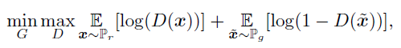
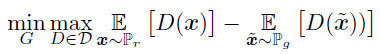
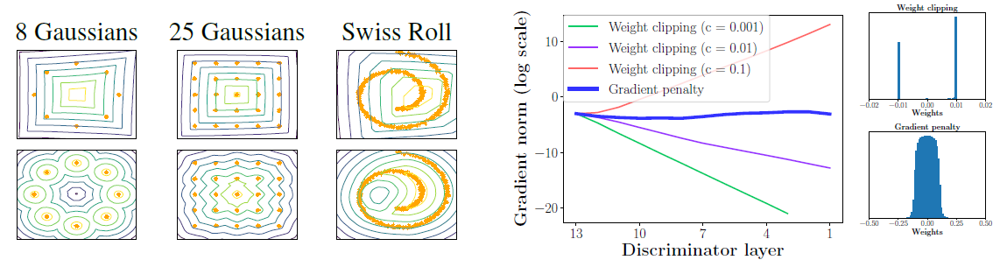
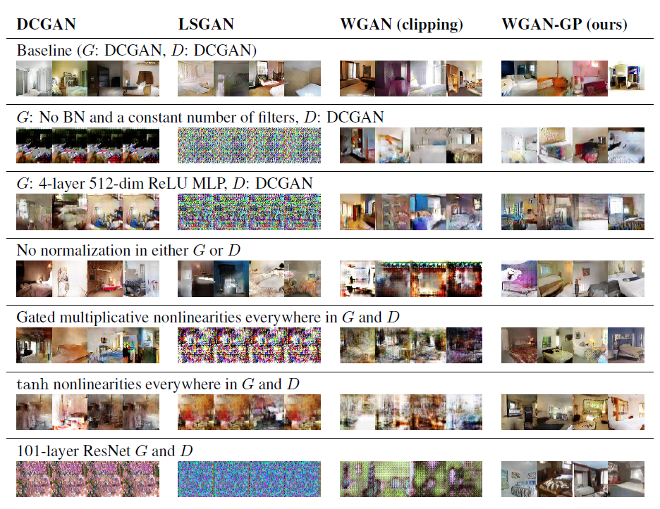
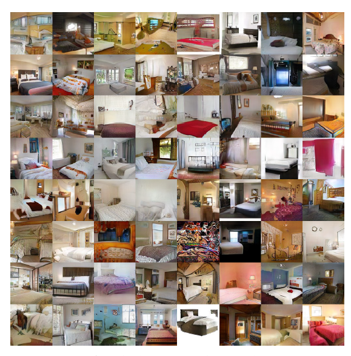

# WGAN-GP 논문

Wasserstein GAN (WGAN)은 GAN의 문제점 중 하나인 mode collapse를 해결하고 안정적인 학습을 가능하게 하는 방법으로, Wasserstein 거리를 사용하는 방식을 도입한 모델입니다. 이전의 GAN에서는 JS-divergence와 KL-divergence를 사용하여 생성자와 실제 데이터 분포 사이의 차이를 계산했지만, WGAN에서는 Wasserstein 거리를 사용하므로써 분포 간의 차이를 더 정확하게 계산할 수 있습니다.

WGAN에서는 Wasserstein 거리를 최소화하는 방향으로 생성자를 학습시킵니다. 이때, 판별자는 임의의 함수가 아니라 Lipschitz 연속 함수여야 합니다. 하지만, 이 조건을 강제하면서 모델을 학습시키는 것은 어렵기 때문에, 이 논문에서는 가중치 클리핑(Weight Clipping)을 도입하였습니다. 이 방법은 판별자의 가중치 값을 일정한 범위 내에서 고정시켜, Lipschitz 연속 함수의 조건을 만족시키는 것입니다.

하지만 가중치 클리핑은 학습 과정에서 불안정성을 유발시키는 원인 중 하나입니다. 이러한 문제를 해결하기 위해, 이 논문에서는 gradient penalty를 도입하여 안정적인 학습을 가능하게 했습니다. Gradient penalty는 판별자의 gradient를 일정한 범위 내로 제한하여 Lipschitz 연속 함수의 조건을 만족시키는 것입니다.

이 논문에서는 WGAN-GP(Wasserstein GAN with Gradient Penalty)라는 모델을 제안하였습니다. 이 모델은 가중치 클리핑과 gradient penalty를 모두 사용하여 안정적인 학습을 가능하게 합니다. 또한, 이 모델은 기존의 WGAN에 비해 더욱 안정적이고 효과적인 학습을 할 수 있게 되었습니다.

WGAN-GP의 학습 방법은 다음과 같습니다. 우선, 생성자는 무작위 노이즈 벡터를 입력으로 받아 가짜 이미지를 생성합니다. 이 가짜 이미지와 실제 이미지를 판별자에게 입력으로 주고, 판별자는 이 두 이미지가 얼마나 실제와 가까운지를 계산하여 출력합니다. 이때, 판별자의 출력값을 최대화하는 방향으로 실제 이미지의 판별 결과를 학습시키고, 가짜 이미지의 판별 결과를 최소화하는 방향으로 생성자를 학습시킵니다.

이때, 가중치 클리핑과 gradient penalty를 적용하는 방법은 다음과 같습니다. 먼저, 가중치 클리핑은 판별자의 가중치 값을 일정한 범위 내에서 고정시키는 것입니다. 이를 통해 판별자가 Lipschitz 연속 함수의 조건을 만족시킬 수 있게 됩니다. 그러나 가중치 클리핑은 학습 과정에서 불안정성을 유발시키는 원인 중 하나입니다. 이러한 문제를 해결하기 위해, gradient penalty를 도입합니다. Gradient penalty는 판별자의 gradient를 일정한 범위 내로 제한하여 Lipschitz 연속 함수의 조건을 만족시키는 것입니다.

WGAN-GP에서는 생성자와 판별자의 아키텍처를 일반적인 CNN에서 벗어나서, fully connected layer와 batch normalization을 사용하지 않고, convolutional layer와 instance normalization을 사용하였습니다. 이를 통해 생성된 이미지의 퀄리티를 높이는 데에 성공하였습니다.

WGAN-GP의 손실 함수는 다음과 같이 정의됩니다.

$L_{WGAN-GP}(D,G) = E_{x \sim p_{data}}[D(x)] - E_{z \sim p_{z}}[D(G(z))] + \lambda E_{\tilde{x} \sim p_{\tilde{x}}}[(||\nabla_{\tilde{x}}D(\tilde{x})||_2 - 1)^2]$

여기서 첫 번째 항은 실제 이미지의 판별 결과를 최대화하는 항이며, 두 번째 항은 가짜 이미지의 판별 결과를 최소화하는 항입니다. 세 번째 항은 gradient penalty를 나타내며, $\tilde{x}$는 실제 이미지와 가짜 이미지의 비율을 조절하는 매개변수입니다. $\lambda$는 gradient penalty의 강도를 조절하는 하이퍼파라미터입니다.

WGAN-GP는 mode collapse 문제를 해결하고 안정적인 학습을 가능하게 하여, 다양한 이미지를 생성하는 데에 성공하였습니다. 이 모델은 현재까지도 GAN 모델의 대표적인 방법 중 하나로 평가되고 있습니다.


### Mini batch
배치는 컴퓨터의 데이터 처리 형태의 하나로, 처리해야 할 데이터를 일정 기간 동안 일정량 정리하여 처리하는 것을 의미합니다. 컴퓨터 시스템에서 처리의 대상이 되는 데이터를 일 단위나 월 단위마다 모아두고 그것을 하나로 종합하여 처리하는 것을 배치 처리, 또는 일괄처리라고 합니다. 인공지능이 학습을 할 때 거대한 양의 데이터를 한꺼번에 학습하지 않고 단위 별로 쪼개서 하는 것을 미니 배치라고 합니다. 미니 배치로 학습하는 이유는 데이터가 많아질 때 길어지는 시간이나 데이터의 손실을 줄이기 위해서입니다.


### Instance normalization
Instance normalization은 주로 이미지 생성 분야에서 사용되는 정규화 방법 중 하나로, 각 샘플의 feature map에서 평균과 분산을 구하여 정규화하는 방법입니다.

기존의 Batch Normalization은 하나의 미니배치 단위로 평균과 분산을 구해 정규화하는 방법이었습니다. 하지만 생성자에서는 미니배치가 없기 때문에, Batch Normalization을 사용하기 어려웠습니다. 이를 해결하기 위해 각 샘플에 대해 평균과 분산을 구하여 정규화하는 Instance Normalization이 제안되었습니다.

Instance normalization은 각 샘플의 평균과 분산을 구하는 것으로, 채널 간의 상관 관계를 고려하지 않습니다. 이를 통해 채널 간의 상관 관계를 유지하면서, 이미지의 일관된 특성을 유지할 수 있습니다. 이는 이미지 생성 분야에서 매우 유용한 방법 중 하나로, 최근에는 GAN 모델을 학습시키는 데에 널리 사용되고 있습니다.


### Lipschitz 
Lipschitz 연속성(Lipschitz continuity)은 수학에서 함수의 안정성(stability)과 연관된 개념 중 하나입니다. 함수의 안정성이란 입력값이 조금만 바뀌어도 출력값이 크게 변하지 않는 것을 의미합니다. 예를 들어, 함수 f(x) = x^2는 x가 조금만 변해도 출력값이 크게 변하므로, 안정적이지 않습니다. 반면 함수 f(x) = 2x는 x가 변하더라도 출력값이 일정하게 변하기 때문에, 안정적입니다.

Lipschitz 연속성은 함수의 기울기를 제한하는 것으로, 함수 f(x)가 k-Lipschitz 연속 함수이다는 것은 모든 x, y에 대해 |f(x) - f(y)| ≤ k|x - y|를 만족하는 k가 존재한다는 것을 의미합니다. 이를 간단히 말하면, 함수의 기울기가 얼마 이상 커지지 않는다는 것입니다.

GAN에서는 판별자와 생성자가 각각 함수로 구현되어 있으며, 이 함수들이 Lipschitz 연속성을 만족하지 않으면 안정적인 학습이 어렵습니다. 따라서 WGAN과 같은 몇몇 GAN 모델에서는 Lipschitz 연속성을 강제하기 위해 판별자와 생성자의 가중치를 일정한 범위로 제한하거나, 그래디언트 패널티(gradient penalty)를 사용합니다. 이를 통해 안정적인 학습을 가능하게 하고, 좀 더 안정적이고 다양한 이미지를 생성할 수 있게 됩니다.


### Weight Clipping
Weight Clipping은 GAN 모델에서 판별자의 가중치 값을 일정한 범위로 제한하는 방법입니다. WGAN과 WGAN-GP에서 Lipschitz 제약 조건을 강제하기 위해 사용되었습니다.

GAN 모델에서 판별자의 출력값은 0에서 1 사이의 값을 갖게 되며, 이를 위해 시그모이드 함수를 사용합니다. 하지만 이 때문에 판별자의 가중치 값이 커지게 되면, 시그모이드 함수의 미분 값이 0에 가까워져, 학습이 어려워지거나 불안정해질 수 있습니다.

이를 방지하기 위해 Weight Clipping은 판별자의 가중치 값을 일정한 범위 내에서 고정시키는 것입니다. 예를 들어, 가중치를 -0.01에서 0.01 사이로 제한하는 방법이 있습니다. 이를 통해 판별자가 Lipschitz 연속성을 만족하도록 하며, 안정적인 학습을 가능하게 합니다.

그러나 Weight Clipping은 판별자의 학습을 제한하는 원인이 될 수 있으며, 이를 보완하기 위해 gradient penalty를 사용하는 WGAN-GP가 제안되었습니다. Gradient penalty는 가중치 제한 없이 Lipschitz 제약 조건을 강제하는 방법으로, 안정적인 학습을 가능하게 하며, Weight Clipping으로 인한 불안정성을 해결할 수 있습니다.


### 본편

# Abstract

GAN은 파워풀한 생성 모델이지만, 학습의 불안정성을 겪는다. 최근에 제안된 Wasserstein GAN (WGAN)은 GAN의 안정적인 학습으로 진전했지만, 가끔 아직도 안좋은 샘플들을 생성하거나 수렴에 실패하기도 한다. 우리는 이러한 문제를 바람직하지 않은 behavior로 이끌 수 있는 critic에 Lipschitz constraint를 부과하기 위해 WGAN에서 weight clipping을 사용하기 때문이라고 발견했다. 우리는 가중치를 clipping 하는 것의 대안을 제안한다: critic의 입력에 대해서 gradient의 norm에 패널티를 부여한다. 우리의 방법은 보통의 WGAN보다 좋은 성능을 보이고, 101개의 ResNet과 연속적인 generator의 언어 모델을 포함하여 하이퍼라마티어 튜닝 없이 넓고 다양한 GAN 아키텍쳐의 학습을 안정화 하는 것을 가능하게 한다. 우리는 또한 CIFAR10과 LSUN 데이터셋에서 좋은 퀄리티를 얻었다.


# 1. Introduction
Generative Adversarial Networks (GAN)은 생성 모델링을 두개의 네트워크의 게임으로 캐스팅하는 파워풀한 생성 모델의 한 분야이다: generator 네트워크는 몇몇의 노이즈 소스가 주어졌을 때 합성 데이터를 생성하고 discriminator 네트워크는 generator의 출력과 실제 데이터 사이를 구분한다. GAN은 시각적으로 매우 매력적인 샘플들을 생성하지만, 종종 학습하기 어렵고, 주제에서 몇몇의 연구는 학습을 안정화 시키도록 하는 방법을 찾는데 전념했다. 그럼에도 불구하고, 지속적으로 GAN의 학습을 안정화 시키는 것은 아직도 열린 문제로 남아있다.

특히, [1]은 GAN에 의해 최적화되는 value function의 수렴 특성의 분석을 제공한다. Wasserstein GAN (WGAN)이라 부르는 그들의 대안은 원래의 것보다 더 이론적인 특성을 가지고 있는 value function을 생성하도록 Wasserstein distance를 사용한다. WGAN은 discriminator가 작가들은 weight clipping을 통해 부여한, 반드시 1-Lipschitz function의 공간에 있음을 요구한다.

우리의 기여는 다음과 같다:

1.  toy dataset에서, 우리는 critic weight clipping이 바람직하지 않은 behavior로 이끌 수 있음을 증명한다.
2.  우리는 같은 문제를 겪지 않는 gradient penalty (WGAN-GP)를 제안한다.
3.  우리는 다양한 GAN 아키텍쳐에서 안정적인 학습과, weight clipping을 넘는 성능 증가, 높은 퀄리티의 이미지 생성, discrete sampling 없이 character-level GAN 언어 모델을 증명한다.


# 2. Background

## 2.1 Generative adversarial networks

GAN의 학습 전략은 두개의 경쟁적인 네트워크 사이의 게임으로 정의된다. generator 네트워크는 노이즈의 소스를 입력 공간으로 맵핑한다. discriminator 네트워크는 생성된 샘플 또는 실제 데이터를 받고 반드시 두개 사이를 구분해야 한다. generator는 안좋은 discriminator를 학습하도록 한다.

공식적으로, generator G와 discriminator D 사이의 게임은 minmax objective이다.

$P_r$ 은 데이터 분포이고  Pg는 암묵적으로 ~x=G(z), z∼p(z)에 의해 정의된 모델의 분포이다.

만약 discriminator가 각각의 generator 파라미터 업데이트 전에 최적성으로 학습이 된다면, value function을 최소화하는 것은 $P_r$ 와 $P_g$ 사이의 Jensen-Shannon divergence를 최소화 하는 것과 같지만, 그렇게 하면 판별자가 포화될 때 그래디언트가 사라지는 경우자 종종 있다. 특히, 이 어려움을 우회하는 방법인, $\mathbb{E}_{\tilde{\boldsymbol{x}} \sim \mathbb{P}_{g}}[\log (D(\tilde{\boldsymbol{x}}))]$ 를 최대화 하는 것을 대신 되어야 한다고 주장한다. 하지만, 심지어 변형된 loss function은 좋은 discriminator 존재에서 잘못 행동되어질 수 있다.

## 2.2 Wasserstein GANs

[2]는 GAN이 전형적으로 최소화 하는 것이 generator의 파라미터에 대해서 잠재적으로 연속적이지 않은 divergence는 학습의 어려움을 이끈다고 주장한다. 그들은 대신에 Earth-Mover (또한 Wasserstein-1이라 불리는 distance W(q,p)를 사용했고, 이것은 분포 q를 분포 p로 변형하기 위한 transporting mass의 최소 비용으로 정의되었다. 가벼운 가정하에, W(q,p)는 어느곳에서나 연속적이고 거의 모든곳에서 미분가능하다.

WGAN의 value function은 Kantorovich-Rubinstein duality를 사용하여 구성되었다.


D는 1-Lipschitz function의 집합이고 Pg

는 ~x=G(z), z∼p(z) 에 의해 정의된 모델의 분포이다. 이 경우에, 최적의 discriminator 하에, generator 파라미터에 관련된 value function을 최소화 하는 것은$W\left(\mathbb{P}_{r}, \mathbb{P}_{g}\right)$ 를 최소화한다.

WGAN의 value function은 입력이 GAN의 대응보다 더 잘 작동하는 gradient를 가지는 critic function의 결과를 얻고 generator의 최적화를 더 쉽게 만든다. 실험적으로, WGAN의 value function은 GAN의 case에 해당되지 않는 샘플 퀄리티와 관련된 것을 보임을 관찰했다.

critic에 Lipschitz constraint를 부과하기 위해서, [2]는 compact space [-c, c]안에 critic의 가중치가 놓여지도록 clip하는 것을 제안한다. 이 constraint를 만족하는 함수의 집합은 c와 critic 아키텍쳐에 의존하는 k를 위한 k-LIpschitz function의 부분집합이다. 다음 secion에서는, 우리는 이러한 접근법의 몇가지 이슈를 증명하고 대안을 제안한다.


## 2.3 Properties of the optimal WGAN critic

WGAN의 critic에서 왜 weight clipping이 문제가 있었는지 이해하고 우리의 접근법을 동기부여 하기 위해서, 우리는 WGAN 프레임워크에서 최적의 critic의 몇가지 특성을 하이라이트 한다.

# 3. Difficulties with weight contraints

우리는 WGAN에서 weight clipping이 최적화 어려움을 이끈다는 것을 발견했고, 심지어 최적화의 성공이 critic이 pathological value surface를 갖게 하는 결과를 이끈다. 우리는 이러한 문제를 아래에 설명했고 이것들의 효과를 증명한다; 하지만 우리는 각각의 것이 실제로 항상 발생한다는 것을 주장하지 않고 이것들은 오직 메커니즘이다.

우리의 실험은 [2]로부터의 weight constraint 특정한 형식을 사용하지만, 우리는 또한 다른 weight constraint도 시도했고 이것들이 비슷한 문제를 보임을 발견했다.

이러한 문제는 어느정도 [2]에서 그들의 모든 실험에 사용된 critic에서 batch normalization과 함께 완화될 수 있다. 하지만 심지어 batch normalization에서도, 우리는 매우 깊은 WGAN critic이 종종 수렴에 실패한다는 것을 관찰했다.



## 3.1 Capacity underuse

weight clipping을 통해서 k-Lipschitz constraint를 부과하는 것은 critic을 더 간단한 함수로 편향시킨다. 이전에 Corolalry 1에서 말한데로, 최적의 WGAN critic은 Pr

과 Pg 아래에 거의 모든 곳에서 unit gradient norm을 가진다; weight-clipping constraint 하에서, 우리는 gradient norm k를 최대화하도록 얻도록 시도하는 우리의 뉴럴 아키텍쳐들이 굉장히 쉬운 함수의 학습으로 마친다는 것을 발견했다.

이것을 증명하기 위해서, 우리는 weight clipping과 함께한 WGAN critic을 몇몇의 toy 분포에 대한 최적성으로 학습했고, generator 분포 Pg는 실제 분포 더하기 unit-variance Gaussin noise에서 고정되었다. 우리는 critics의 value surface를 Figure 1a에 그렸다. 우리는 critic에서 batch normalization은 생략했다. 각각의 경우에서, weight clipping과 함께 학습된 critic은 데이터 분포의 더 높은 순간을 무시하고 대신에 모델은 최적화 함수로 매우 간단한 근사를 한다. 반대로, 우리의 방법은 이러한 behavior로부터 겪지 않는다.


## 3.2 Exploding and vanishing gradients

우리는 clipping threshold c의 조심스러운 튜닝 없이 gradient가 vanishing 또는 exploding 하는 결과를 일으키는 weight constraint와 cost function 사이의 상호작용 때문에 WGAN의 최적화 과정은 어렵다고 관찰했다.

이것을 증명하기 위해서, 우리는 clipping threshold c를 다르게 하면서 Swiss Roll toy 데이터셋에서 WGAN을 학습했고, 성공적인 activation의 layer에 대해서 critic loss의 gradient의 norm을 표로 그렸다. generator와 critic 둘 다 batch normalization 없이 12 layer ReLU MLP이다. Figure 1b는 이러한 value들을 보여주고, gradient는 네트워크 안에서 움직일 때 마다 지수적으로 자라거나 decay 된다. 우리는 우리의 방법이 더 복잡한 네트워크의 학습을 허락하면서 사라지거나 폭발하지 않는 더 안정적인 gradient의 결과를 가짐을 찾았다.


# 4. Gradient penalty

우리는 이제 Lipschitz constraint을 부과하는 대안의 방법을 제안한다. 미분가능한 함수는 1-Lipschitz 함수이고 norm과 함께한 gradient가 어디에서나 1이 되고, 그래서 우리는 입력에 대해서 critic의 출력의 gradient norm을 직접적으로 구속하는 것을 고려한다. 다루기 쉬운 문제를 피하기 위해, 우리는 랜덤 샘플 ^x∼P^x를 위해 gradient norm에 penalty가 있는 contraint의 부드러운 버전을 부과한다.


### Sampling distribution

우리는 P^x 샘플링을 데이터 분포 Pr 과 generator 분포 Pg 로 부터 샘플된 점 사이의 직선을 따라 uniform하게 정의한다. 이것은 최적의 critic이 $\mathbb{P}_{r}과\; \mathbb{P}_{g}$ 로부터의 점 사이를 연결하는 gradient norm 1과 함께 직선을 포함한다는 사실로부터 동기부여 됬다. unit gradient norm constraint을 모든곳에 부과하기는 어려운 일이므로, 단지 이러한 직선을 따라 부과하는 것은 충분에 보이고 실험적으로 좋은 성능을 보이는 것 같다.

### Penalty coefficient
본 논문에서 모든 실험은 lambda=10을 사용했고, 우리는 toy task에서 큰 ImageNet CNN 까지 다양한 아키텍쳐와 데이터셋에서 잘 작동하는 것을 발견했다.


### No critic batch normalization

대부분의 이전의 GAN implementation에서는 학습을 안정화시키기 위해서 generator와 discriminator 둘 다에 batch normalization을 사용하지만, batch normalization은 discriminator의 문제의 형태를 단일 출입력을 단일 출력으로 맵핑하는 것에서 입력의 모든 배치로부터 출력의 배치를 맵핑하는 것으로 변화시킨다. 우리의 패널티가 부과된 학습 목점함수는 우리가 전체의 배치가 아니라 각각의 입력에 독립적으로에 대해서 critic의 gradient의 norm에 패널티를 부과하기 때문에 더이상 이러한 셋팅이 유효하지 않다. 이러한 문제를 해결하기 위해서, 우리는 우리의 모델의 critic에서 batch normalization을 간단하게 생략하고, 이것이 없이 잘 작동하는 것을 찾았다. 우리의 방법은 예시들 사이의 correlation을 도입하지 않는 normalization 방법과 함께 작동한다. 특히, 우리는 batch normalization을 위한 대체로써 layer normalization을 추천한다.

### Two-sided penalty

우리는 gradient의 norm을 1 아래에 두는 대신에 1로 가도록 격려한다. 실험적으로 이것은 최적의 WGAN critic은 분포 아래에 어디서나 1의 norm을 가진 gradient를 가지고 subsection 2.3 사이의 지역의 큰 부분에 있기 때문에 critic을 너무 구속하지 않는 것처럼 보인다. 우리의 초기의 관찰에서 우리는 이것이 조금 더 좋게 수행한다는 것을 발견했지만, 우리는 이것을 완전히 조사하지는 않는다.


# 5. Experiments







# 6. Conclusion

본 연구에서, 우리는 WGAN에서 weight clipping의 문제를 증명하고 같은 문제를 겪지 않는 critic loss에서 penalty term의 형식으로 대체하는 것을 소개했다. 우리의 방법을 사용하여, 우리는 다양한 아키텍쳐에 걸쳐 더 강한 모델링 성능과 안정성을 증명했다. 우리가 GAN을 학습시키기 위해 더 안정적인 알고리즘을 가지고 있으므로, 우리는 우리의 연구가 큰 이미지 데이터셋과 언어에서 더 강한 모델링 성능의 길을 여는 것을 희망한다. 또 다른 흥미로운 방향은 보통의 GAN의 목적 함수에 우리의 penalty term을 적용하는 것이고, 이것은 discriminator가 더 부드러운 결정 경계를 학습하도록 격려되어 학습을 안정화시킬 수 있다.


---
# WGAN-GP를 이해하기 위한 수식 


### 1. 유클리드 거리(Euclidean Distance)

유클리드 거리는 두 점 사이의 직선 거리를 측정한다. 2차원 유클리드 공간에서 두 점 $P_1(x_1, y_1)$과 $P_2(x_2, y_2)$ 사이의 유클리드 거리는 다음 공식으로 계산:

$\text{Euclidean distance} = \sqrt{(x_2 - x_1)^2 + (y_2 - y_1)^2}$

이 공식은 $n$차원으로 확장될 수 있으며, 이 경우 두 점 $P_1$과 $P_2$ 사이의 거리는 다음과 같이 계산:

$\text{Euclidean distance} = \sqrt{\sum_{i=1}^{n} (p_{2i} - p_{1i})^2}$

여기서 $p_{1i}$와 $p_{2i}$는 각각 점 $P_1$과 $P_2$의 $i$번째 좌표


---
### 2. 유클리드 노름(Euclidean Norm)


기호 $\| \cdot \|_2$는 2-노름(2-norm) 또는 유클리드 노름(Euclidean norm)을 나타낸다. 이는 벡터의 각 성분의 제곱합의 제곱근으로 계산되며, 벡터의 크기(길이)를 측정하는 데 사용된다. 특히, 그래디언트 패널티(Gradient Penalty, GP)에서 사용될 때, $\|\nabla_{\hat{x}}D(\hat{x})\|_2$는 판별자 $D$의 출력에 대한 $\hat{x}$에서의 그래디언트 벡터의 유클리드 노름을 의미한다.

### $\| \cdot \|_2$의 계산

유클리드 노름은 벡터의 크기나 길이를 측정하는 방법으로, 벡터가 원점으로부터 얼마나 떨어져 있는지를 나타낸다. 벡터 $\mathbf{v} = (v_1, v_2, ..., v_n)$에 대한 유클리드 노름(2-노름)은 다음 공식으로 계산된다:

$\|v\|_2 = \sqrt{v_1^2 + v_2^2 + ... + v_n^2}$

이는 $n$차원 공간에서 벡터 $\mathbf{v}$의 원점으로부터의 직선 거리를 나타낸다.
즉, 각 성분을 제곱하여 합한 후, 그 합의 제곱근을 취하며 이는 벡터의 "길이"를 나타내는 데 사용한다.


---
### 3. 그래디언트 패널티에서의 $\| \cdot \|_2$

WGAN-GP에서 그래디언트 패널티 항:

$GP = \lambda (\|\nabla_{\hat{x}}D(\hat{x})\|_2 - 1)^2$

여기서 $\|\nabla_{\hat{x}}D(\hat{x})\|_2$는 판별자 $D$의 출력에 대한 $\hat{x}$에서의 그래디언트 벡터의 유클리드 노름을 의미한다. 그래디언트 패널티는 이 노름이 1에 가까워지도록 강제함으로써, 판별자가 Lipschitz 연속성을 유지하도록 한다. 이는 판별자의 학습 과정에서 그래디언트가 너무 크거나 작아지는 것을 방지하여, GAN의 안정성과 성능을 개선한다.

노름은 벡터가 나타내는 점과 원점 사이의 거리를 나타내며, 이를 통해 벡터의 크기를 비교하거나, 벡터 공간에서의 연산을 정의하는 데 사용된다. 예를 들어, 그래디언트 벡터의 노름을 계산하는 것은 그래디언트가 나타내는 "변화율"의 크기를 측정하는 것으로, 최적화 문제에서 매우 중하다.

- 1을 빼는 이유는 그래디언트 벡터의 유클리드 노름이 1에서 얼마나 벗어나 있는지를 측정하기 위한 것
- 그래디언트 노름이 1과 일치하는 경우, 이상적인 형태로 간주되며, 이때 패널티는 0 
- 그래디언트 노름이 1보다 크거나 작은 경우, 즉 기울기가 너무 가파르거나 너무 완만한 경우, 1에서의 차이를 제곱함으로써 얻어진 값은 패널티로 작용해 손실함수에 추가
- 이 패널티는 Discriminator가 립시츠 조건을 위반하는 것에 대한 벌로 작용해 Discriminator의 학습 과정 조정


---
### 4. 유사성

유클리드 거리와 유클리드 노름은 유사한 계산 방식을 공유한다. 둘 다 제곱합의 제곱근을 사용하여 거리나 길이를 계산한다. 실제로, 벡터 $\mathbf{v}$의 유클리드 노름은 벡터 $\mathbf{v}$와 원점 사이의 유클리드 거리로 해석할 수 있다. 즉, 유클리드 노름은 원점과의 유클리드 거리로 볼 수 있으며, 이는 벡터를 하나의 점으로 간주할 때 그 점과 원점 사이의 거리를 측정하는 것과 동일하다.

유클리드 거리와 유클리드 노름은 둘 다 유클리드 공간에서 거리를 측정하는 데 사용되는 중요한 수학적 도구로 거리를 측정하는 대상이 두 점 사이인지(유클리드 거리) 아니면 벡터와 원점 사이인지(유클리드 노름)에 따라 다른 용어를 사용한다. 


---
### 그래디언트 패널티에서의 역할

WGAN-GP에서 그래디언트 패널티는 판별자의 그래디언트 노름이 1에서 벗어나지 않도록 함으로써, 판별자 함수가 Lipschitz 연속성을 만족하도록 강제한다. 이는 GAN 학습의 안정성을 개선하는 데 핵심적인 역할을 한다. Lipschitz 연속성은 함수의 "급격한 변화"를 제한하는 성질로, 이를 통해 학습 과정이 더욱 안정되고 예측 가능해진다.


---

### Lipschitz 연속성

Lipschitz 연속성은 함수의 변화율이 한정된 범위 내에서 유지되어야 함을 나타내는 수학적 조건. 
구체적으로, 함수 $f$가 Lipschitz 연속이라고 하려면, 모든 $x_1$과 $x_2$에 대해 다음 불등식이 성립하는 상수 $L$이 존재해야 한다:

$|f(x_1) - f(x_2)| \leq L|x_1 - x_2|$

여기서 $L$은 Lipschitz 상수로 불리며, 이는 함수가 얼마나 급격하게 변할 수 있는지를 한계 지어준다. $L$의 값이 작을수록 함수는 더 부드럽게 변화하며, $L$의 값이 클수록 함수는 더 급격한 변화를 보일 수 있다.

### 함수의 그래디언트가 1 이하로 유지되어야 하는 이유

WGAN-GP에서는 판별자 함수의 Lipschitz 연속성을 강제하기 위해 그래디언트 패널티를 사용한다. 이는 다음과 같은 이유로 중요한데:

1. **학습의 안정성:** GAN에서 판별자가 너무 강력해지면, 생성자가 판별자를 따라잡기 어려워 학습이 불안정해질 수 있다. 판별자의 그래디언트가 1 이하로 제한됨으로써, 판별자의 학습 속도를 적절히 조절하고, 생성자와 판별자 사이의 경쟁을 보다 공정하게 만든다.

2. **Wasserstein 거리의 정확한 추정:** WGAN의 목적은 실제 데이터 분포와 생성된 데이터 분포 사이의 Wasserstein 거리를 최소화하는 것이다. 판별자 함수가 Lipschitz 연속성을 만족할 때, 이 거리를 올바르게 추정할 수 있으며, 이는 모델의 성능 향상으로 이어진다.

3. **모드 붕괴 방지:** 판별자의 그래디언트가 제한됨으로써, 생성자가 판별자를 속이기 위해 한정된 몇 가지 패턴에만 의존하는 것이 아니라, 더 다양한 데이터를 생성하도록 유도할 수 있다. 이는 모델이 더 다양한 데이터를 학습하고, 모드 붕괴(mode collapse) 문제를 방지하는 데 도움이 된다.

결론적으로, 판별자 함수의 그래디언트를 1 이하로 유지하는 것은 WGAN-GP의 핵심 요소 중 하나로, 이를 통해 GAN 학습 과정의 안정성을 높이고, 생성된 이미지의 품질을 개선하는 데 기여한다.


---
WGAN-GP (Wasserstein GAN with Gradient Penalty)에서 도입된 그래디언트 패널티(Gradient Penalty, GP)는 판별자의 그래디언트 노름을 제한함으로써 판별자 함수가 1-Lipschitz 조건을 만족하도록 강제한다. 이 조건은 학습 과정을 안정화시키고, 모델의 성능을 개선하는 데 중요한 역할을 한다.

### 그래디언트 패널티의 정의

그래디언트 패널티는 실제 이미지와 생성된 이미지 사이의 보간된 샘플들에 대한 판별자의 그래디언트 노름이 1에 가깝도록 제약을 가한다. 그래디언트 패널티 항은 다음과 같이 정의된다:

$GP = \lambda \mathbb{E}_{\hat{x} \sim \mathbb{P}_{\hat{x}}} [( \|\nabla_{\hat{x}}D(\hat{x})\|_2 - 1)^2]$

여기서:
- $\lambda$는 패널티의 강도를 조절하는 하이퍼파라미터.
- $\mathbb{E}_{\hat{x} \sim \mathbb{P}_{\hat{x}}}$는 보간된 샘플 $\hat{x}$에 대한 기대값. $\hat{x}$는 실제 이미지와 생성된 이미지 사이를 보간하는 샘플.
- $\nabla_{\hat{x}}D(\hat{x})$는 판별자 $D$의 출력에 대한 $\hat{x}$에서의 그래디언트(기울기) 벡터.
- $|\cdot\|_2$는 유클리드 노름(2-노름)을 나타내며, 그래디언트 벡터의 길이(크기)를 측정.

### 유클리드 노름과 그래디언트 패널티

그래디언트 패널티에서 유클리드 노름은 판별자의 그래디언트의 크기를 측정하는 데 사용. 유클리드 노름을 통해 계산된 그래디언트의 크기(길이)는 다음과 같이 표현된다:

$\|\nabla_{\hat{x}}D(\hat{x})\|_2 = \sqrt{\sum_{i=1}^{n} (\frac{\partial D}{\partial x_i})^2}$

이 공식에서 $\frac{\partial D}{\partial x_i}$는 판별자 $D$의 출력을 $\hat{x}$의 각 성분 $x_i$에 대해 편미분한 값으로 그래디언트 패널티는 이 노름이 가능한 1에 가까워지도록 하는 제약을 추가함으로써, 판별자가 너무 극단적인 값을 출력하지 않고, 모델의 학습이 더 안정적으로 진행되도록 한다.

### 그래디언트 패널티의 역할

그래디언트 패널티는 판별자가 너무 강력해지는 것을 방지하고, 생성자와 판별자 사이의 경쟁이 공정하게 유지되도록 한다. 이는 GAN 학습에서 발생할 수 있는 모드 붕괴(mode collapse)와 같은 문제를 완화하고, 결과적으로 더 다양하고 고품질의 이미지를 생성할 수 있게 한다. 또한, 그래디언트 패널티를 사용함으로써, WGAN-GP는 원래 WGAN에서 요구되는 가중치 클리핑(weight clipping) 방법의 단점을 극복하고, 학습 과정을 더욱 안정화시켰다.


---
보간(Interpolation)은 주어진 데이터 포인트 사이의 값을 추정하는 과정. 
보간의 목적은 알려진 데이터 포인트 사이에서 미지의 데이터 포인트의 값을 예측하거나, 데이터를 더 부드럽게 만들기 위해 중간 값을 생성하는 것.

### 보간의 예시

예를 들어, 어떤 함수 $f(x)$의 값이 $x=1$일 때 10, $x=3$일 때 30으로 알려져 있다고 가정해보자. 그러나 $x=2$에서의 함수 값이 주어지지 않았을 때, $x=1$과 $x=3$ 사이의 값을 사용하여 $x=2$에서의 값을 추정할 수 있다. 이 경우, 가장 간단한 보간 방법인 선형 보간을 사용하면 $x=2$에서의 값이 20이 된다. 이처럼 보간은 알려진 데이터 포인트를 기반으로 중간에 위치한 미지의 데이터 포인트의 값을 추정하는 과정이다.

### WGAN-GP에서의 보간

WGAN-GP에서 보간은 실제 이미지와 가짜 이미지 사이의 중간 샘플을 생성하는 데 사용된다. 
이 과정은 그래디언트 패널티를 계산하기 위해 필요하다. 실제 샘플과 가짜 샘플 사이의 무작위 보간 포인트를 생성하고, 이 포인트들에 대한 판별자의 그래디언트를 계산하여 판별자가 1-Lipschitz 연속 함수를 만족하도록 한다.

예를 들어, 실제 이미지를 나타내는 텐서 $A$와 가짜 이미지를 나타내는 텐서 $B$가 있을 때, 무작위 가중치 $\alpha$를 사용하여 두 이미지 사이의 보간된 샘플을 생성할 수 있다:

$\text{Interpolated Sample} = \alpha A + (1 - \alpha) B$

여기서 $\alpha$는 0과 1 사이의 값으로, 각 샘플에 대한 가중치를 나타낸다. 이렇게 생성된 보간된 샘플에 대한 그래디언트 패널티를 계산함으로써, 판별자의 학습 과정을 안정화시키고, 모델의 성능을 개선할 수 있다.


---

WGAN-GP (Wasserstein GAN with Gradient Penalty)는 WGAN의 개선된 버전으로, 원래 WGAN에서 가중치 클리핑(weight clipping)을 사용하는 대신 그래디언트 패널티(gradient penalty)를 도입하여 판별자(discriminator)의 Lipschitz 조건을 강제한다. 이 변경은 학습 과정의 안정성을 더욱 향상시키고, 생성된 이미지의 품질을 개선하는 데 도움을 준다.

# WGAN-GP의 핵심 개념

- **그래디언트 패널티 (Gradient Penalty):** 판별자의 그래디언트가 1 주변에서만 강한 제약을 받도록 함으로써, Lipschitz 연속성을 유지한다.      이는 가중치 클리핑 방식의 문제점을 해결하고, 판별자의 학습 안정성을 개선한다.

- **무작위 샘플링을 통한 보간:** 실제 이미지와 가짜 이미지 사이의 보간된 샘플을 생성하고, 이러한 샘플에 대한 판별자의 그래디언트 크기를 제한한다. 이 과정은 판별자가 전체 데이터 분포에 대해 Lipschitz 연속성을 유지하도록 돕는다.

### WGAN-GP의 손실 함수

WGAN-GP의 손실 함수는 기본적인 WGAN의 손실 함수에 그래디언트 패널티 항을 추가하여 구성된다.

- **판별자 손실 (Discriminator Loss):**
$L_D = \mathbb{E}_{\tilde{x} \sim \mathbb{P}_g}[D(\tilde{x})] - \mathbb{E}_{x \sim \mathbb{P}_r}[D(x)] + \lambda (\|\nabla_{\hat{x}}D(\hat{x})\|_2 - 1)^2$
  - 여기서 $\mathbb{E}_{x \sim \mathbb{P}_r}[D(x)]$는 실제 이미지에 대한 판별자의 평가의 기대값을,
  - $\mathbb{E}_{\tilde{x} \sim \mathbb{P}_g}[D(\tilde{x})]$는 가짜 이미지에 대한 판별자의 평가의 기대값을 나타낸다.
  - $\lambda (\|\nabla_{\hat{x}}D(\hat{x})\|_2 - 1)^2$는 그래디언트 패널티 항으로, $\lambda$는 패널티의 강도를 조절하는 하이퍼파라미터. $\hat{x}$는 실제 이미지와 가짜 이미지 사이를 보간한 샘플이며, 이 항은 판별자의 그래디언트 크기가 1에 가깝게 유지되도록 한다.

- **생성자 손실 (Generator Loss):**
$L_G = -\mathbb{E}_{\tilde{x} \sim \mathbb{P}_g}[D(\tilde{x})]$
  - 생성자 손실은 기본적인 WGAN과 동일하게, 판별자가 생성된 이미지에 대해 높은 값을 출력하도록 생성자를 학습시킵니다.

WGAN-GP (Wasserstein GAN with Gradient Penalty)의 판별자 손실 함수는 기본 WGAN 손실에 추가적으로 그래디언트 패널티(Gradient Penalty, GP) 항을 포함한다. 이를 통해 판별자가 Lipschitz 연속성 조건을 만족하도록 강제한다. 그래디언트 패널티 항은 판별자의 함수가 1-Lipschitz 함수를 만족하도록 한다. 이는 함수의 그래디언트(기울기)가 모든 지점에서 1 이하로 유지되어야 함을 의미한다.


#### 그래디언트 패널티 (Gradient Penalty):

그래디언트 패널티 항은 다음과 같이 정의:

$GP = \lambda (\|\nabla_{\hat{x}}D(\hat{x})\|_2 - 1)^2$

여기서:

- $\lambda$는 패널티의 강도를 조절하는 하이퍼파라미터
- $\nabla_{\hat{x}}D(\hat{x})$는 판별자 $D$의 출력에 대한 $\hat{x}$에서의 그래디언트(기울기)입니다.
- $\hat{x}$는 실제 이미지와 가짜 이미지 사이의 보간(interpolation)된 샘플입니다. 즉, $\hat{x} = \epsilon x + (1 - \epsilon)\tilde{x}$, 여기서 $\epsilon$은 0과 1 사이의 무작위 값입니다.

그래디언트 패널티는 판별자의 그래디언트 크기가 1에 가까워지도록 한다. 이는 판별자의 함수가 Lipschitz 연속성을 만족하도록 강제하며, WGAN-GP의 학습 안정성과 성능을 크게 향상시킨다.


### 결론

WGAN-GP는 가중치 클리핑 대신 그래디언트 패널티를 사용하여 판별자의 Lipschitz 연속성을 보장함으로써, WGAN의 학습 안정성과 생성된 이미지의 질을 개선합니다. 이러한 접근 방식은 GAN 학습에서의 일반적인 문제점을 해결하며, 더욱 신뢰할 수 있는 모델을 구축할 수 있게 한다.


---

``` python
import argparse
import os
import numpy as np
import math
import cv2
import matplotlib.pyplot as plt

import torchvision.transforms as transforms
from torchvision.utils import save_image
from torch.utils.data import DataLoader
from torchvision import datasets
from torch.autograd import Variable

import torch.nn as nn
import torch.nn.functional as F
import torch.autograd as autograd
import torch


os.makedirs("images", exist_ok=True)

def weights_init_normal(m):
	classname = m.__class__.__name__
	if classname.find("Conv") != -1:
		torch.nn.init.normal_(m.weight.data, 0.0, 0.02)
	elif classname.find("BatchNorm") != -1:
		torch.nn.init.normal_(m.weight.data, 1.0, 0.02)
		torch.nn.init.constant_(m.bias.data, 0.0)
```

``` python
class Option():
    n_epochs = 200 # 학습할 에폭의 수
    batch_size = 64 # 한 번에 학습할 배치의 크기
    lr = 0.0002 # Adam 최적화기의 학습률
    b1 = 0.5 # Adam 최적화기의 첫 번째 모멘텀 감쇠율
    b2 = 0.999 # Adam 최적화기의 두 번째 모멘텀 감쇠율
    n_cpu = 8 # 배치 생성 시 사용할 CPU 스레드 수
    latent_dim = 100 # 잠재 공간의 차원 수
    img_size = 32 # 각 이미지 차원의 크기
    n_critic = 5 # critics의 수
    channels = 1 # 이미지 채널의 수
    sample_interval = 500 # 이미지 샘플링 간격

opt = Option() # Option 클래스의 인스턴스 생성
# CUDA가 사용 가능한 경우 사용하도록 설정
cuda = True if torch.cuda.is_available() else False
# 이미지의 모양을 설정합니다. (채널 수, 이미지 너비, 이미지 높이)의 형태로 설정
img_shape = (opt.channels, opt.img_size, opt.img_size)
```

``` python
class Generator(nn.Module):
    def __init__(self):
        super(Generator, self).__init__()  # nn.Module의 생성자를 호출하여 초기화

        # 블록 함수 정의: 신경망의 레이어를 구성하는 함수
        def block(in_feat, out_feat, normalize=True):
            layers = [nn.Linear(in_feat, out_feat)]  # 선형 변환 레이어
            if normalize:  # 배치 정규화를 적용할지 여부
                layers.append(nn.BatchNorm1d(out_feat, 0.8))  # 배치 정규화 레이어
            layers.append(nn.LeakyReLU(0.2, inplace=True))  # LeakyReLU 활성화 함수
            return layers

        # 모델 구성: 여러 블록을 순차적으로 연결
        self.model = nn.Sequential(
            *block(opt.latent_dim, 128, normalize=False),  # 첫 번째 블록, 배치 정규화 없음
            *block(128, 256),  # 두 번째 블록
            *block(256, 512),  # 세 번째 블록
            *block(512, 1024),  # 네 번째 블록
            
	        """
	        `np.prod`의 역할
			`np.prod` 함수는 NumPy 라이브러리의 함수로, 입력된 배열의 모든 요소의 곱을 계산한다. 
			여기서 `np.prod(img_shape)`는 `img_shape` 튜플에 포함된 모든 차원의 크기를 곱하여, 그 결과값을 반환한다. 
			이를 통해, 여러 차원을 가진 배열의 전체 요소 개수를 하나의 스칼라 값으로 얻을 수 있다.

			예를 들어, 만약 `img_shape`가 이미지의 채널 수, 높이, 너비를 나타내는 `(1, 28, 28)`이라면, 
			`np.prod(img_shape)`는 `1 * 28 * 28 = 784`를 반환한다.
			이는 생성자가 최종적으로 생성해야 하는 각 이미지의 픽셀 수를 나타낸다.
	        """
            nn.Linear(1024, int(np.prod(img_shape))),  # 최종 선형 레이어
            nn.Tanh()  # Tanh 활성화 함수로 출력을 [-1, 1] 범위로 조정
        )

    def forward(self, z):
        img = self.model(z)  # 모델에 잠재 벡터 z를 입력하여 이미지 생성
        """
        `*img_shape`에서 `*`의 역할
		`*` 연산자는 주로 함수 호출 시 인자 리스트의 확장이나, 여러 값을 반환할 때 사용된다.
		이 경우, `img.view(img.shape[0], *img_shape)`에서 `*img_shape`는 `img_shape` 튜플의 각 요소를 
		별도의 인자로 전달하고자 할 때 사용한다.

		`img_shape`가 `(1, 28, 28)`이라면, `*img_shape`는 이를 `1, 28, 28`으로 확장한다. 
		따라서, `img.view(img.shape[0], *img_shape)` 호출은 
		`img.view(img.shape[0], 1, 28, 28)`과 동일한 효과를 가진다. 
		이는 생성된 이미지를 적절한 형태의 텐서로 재구성하기 위해 사용된다.

		결론적으로, `np.prod(img_shape)`는 생성자가 생성할 이미지의 전체 픽셀 수를 결정하는 데 사용되며, 
		`*img_shape`는 생성된 이미지를 원하는 형태의 텐서로 재구성하는 데 사용된다. 
		이러한 방식으로, 모델은 다차원 이미지 데이터를 효과적으로 처리할 수 있다.
        """
        img = img.view(img.shape[0], *img_shape)  # 생성된 이미지를 원래 이미지 형태로 재구성
        return img  # 생성된 이미지 반환


class Discriminator(nn.Module):
    def __init__(self):
        super(Discriminator, self).__init__()  # nn.Module의 생성자를 호출하여 초기화

        self.model = nn.Sequential(
            nn.Linear(int(np.prod(img_shape)), 512),  # 입력 이미지를 평탄화하고 512차원으로 변환
            nn.LeakyReLU(0.2, inplace=True),  # LeakyReLU 활성화 함수
            nn.Linear(512, 256),  # 512차원에서 256차원으로 차원 축소
            nn.LeakyReLU(0.2, inplace=True),  # LeakyReLU 활성화 함수
            nn.Linear(256, 1),  # 최종 선형 레이어로 하나의 출력 값 생성
        )

    def forward(self, img):
        img_flat = img.view(img.shape[0], -1)  # 입력 이미지를 평탄화
        validity = self.model(img_flat)  # 평탄화된 이미지를 모델에 입력하여 진짜/가짜 여부 판별
        return validity  # 판별 결과 반환
```


``` python
# 그래디언트 패널티에 사용될 가중치 설정
lambda_gp = 10

# 생성자와 판별자 초기화
generator = Generator()
discriminator = Discriminator()

# CUDA가 사용 가능한 경우, 모델을 GPU로 옮긴다.
if cuda:
    generator.cuda()
    discriminator.cuda()

# 데이터 로더 설정
os.makedirs("dataset/mnist", exist_ok=True)
dataloader = torch.utils.data.DataLoader(
    datasets.MNIST(
        "dataset/mnist",
        train=True,
        download=False,  
        transform=transforms.Compose(
            [transforms.Resize(opt.img_size), transforms.ToTensor(), transforms.Normalize([0.5], [0.5])]
        ),  
    ),
    batch_size=opt.batch_size,  
    shuffle=True,  
)

# 최적화 함수 설정
optimizer_G = torch.optim.Adam(generator.parameters(), lr=opt.lr, betas=(opt.b1, opt.b2))
optimizer_D = torch.optim.Adam(discriminator.parameters(), lr=opt.lr, betas=(opt.b1, opt.b2))

# CUDA 사용 여부에 따라 적절한 텐서 타입 설정
Tensor = torch.cuda.FloatTensor if cuda else torch.FloatTensor
```


``` python
# 그래디언트 패널티 계산 함수
def compute_gradient_penalty(D, real_samples, fake_samples):
    """WGAN GP의 그래디언트 패널티 손실을 계산"""
    
    # 실제 샘플과 가짜 샘플 사이의 보간에 사용될 무작위 가중치
    """
	`alpha`는 0과 1 사이의 무작위 값으로 구성된 텐서. 
	이 값은 실제 샘플과 가짜 샘플 사이의 보간(interpolation)에 사용. 
	`alpha`의 형태는 실제 샘플의 배치 크기와 동일하게 설정.
    """
    alpha = Tensor(np.random.random((real_samples.size(0), 1, 1, 1)))
	# [배치 크기, 채널, 높이, 너비] (1채널, 3채널 상관없음)
	# 다차원 데이터에 α 값을 적용할 때, α가 각 샘플의 모든 위치에서 동일한 스칼라 값으로 확장되어 적용

    # 실제 샘플과 가짜 샘플 사이의 무작위 보간 샘플 생성
    """
    여기서 실제 샘플(`real_samples`)과 가짜 샘플(`fake_samples`) 사이에 위치한 새로운 샘플들을 생성. 
    이 샘플들은 실제와 가짜 샘플의 선형 조합으로, `alpha`와 `(1 - alpha)`를 가중치로 사용. 
    생성된 `interpolates`는 그래디언트를 계산하기 위해 `.requires_grad_(True)`로 설정.
    """
    interpolates = (alpha * real_samples + ((1 - alpha) * fake_samples)).requires_grad_(True)

	""" 보간된 샘플(`interpolates`)을 판별자 `D`에 입력하여, 해당 샘플들에 대한 판별자의 출력을 얻는다. """
    d_interpolates = D(interpolates)

	""" 
	그래디언트를 계산할 때 사용되는 `grad_outputs` 인자를 위해, 모든 요소가 1인 텐서를 생성. 
	이는 autograd가 그래디언트를 올바르게 계산할 수 있도록 돕는다.
	"""
    fake = Variable(Tensor(real_samples.shape[0], 1).fill_(1.0), requires_grad=False)


    # 보간 샘플에 대한 판별자의 그래디언트 계산
    """
    `autograd.grad` 함수를 사용하여 보간된 샘플에 대한 판별자의 출력(`d_interpolates`)으로부터 
    보간된 샘플(`interpolates`)에 대한 그래디언트를 계산. 
    여기서 `create_graph=True`는 그래디언트 계산 자체에 대한 그래디언트를 나중에 계산할 수 있게 해주며, 
    이는 그래디언트 패널티를 계산할 때 필요.
    """
    """
	`autograd.grad`는 PyTorch에서 제공하는 함수로, 특정 입력에 대한 출력의 그래디언트를 계산. 
	이 함수는 미분 가능한 텐서(즉, 변수)에 대한 미분 값을 자동으로 계산하는 데 사용. 
	
	함수 인자:
	- outputs: 미분을 계산하고자 하는 출력 텐서. GAN에서는 일반적으로 판별자의 출력을 의미
	- inputs: 그래디언트를 계산할 변수. 여기서는 보간된 이미지(interpolates).
	- grad_outputs: 출력 텐서의 그래디언트에 곱해지는 값으로, 일반적으로 텐서의 형태를 가진다. 
	  여기서는 `fake`라는 변수가 사용되는데, 이는 그래디언트 계산에 사용되는 가중치를 의미할 수 있다.
	
	- create_graph: True로 설정할 경우, 그래디언트 계산 그 자체도 미분 가능한 연산으로 만들어져, 
	  이후에 이 그래디언트를 기반으로 추가적인 그래디언트 계산이 가능.
	  
	- retain_graph: 그래디언트 계산 후에도 계산 그래프를 유지할지 여부를 결정. 
	  일반적으로 더 이상의 그래디언트 계산이 필요할 때 True로 설정.
	  
	- only_inputs: True로 설정되면, 입력에 대한 그래디언트만 반환.
	"""
    gradients = autograd.grad(
        outputs=d_interpolates,
        inputs=interpolates,
        grad_outputs=fake,
        create_graph=True,
        retain_graph=True,
        only_inputs=True,
    )[0]


    # 그래디언트의 크기를 계산
    """
    계산된 그래디언트의 유클리드 노름(2-노름)을 구한 후, 이 값이 1과 얼마나 차이나는지를 제곱하여 평균을 취함으로써 
    그래디언트 패널티를 계산합니다. 이 값은 판별자의 손실 함수에 추가되어, 그래디언트가 1을 초과하지 않도록 판별자를 제약.
    """
    gradients = gradients.view(gradients.size(0), -1) # 배치는 유지하고 flatten
    gradient_penalty = ((gradients.norm(2, dim=1) - 1) ** 2).mean()  # 그래디언트 패널티 계산
    return gradient_penalty
```


# 그라디언트 

그라디언트 계산은 이 손실 함수가 입력 변수에 대해 어떻게 변화하는지를 나타낸다.
다시 말해, 각 입력 변수에 대한 손실 함수의 편미분 값들을 계산하는 것이다.

### 그라디언트의 의미

- **방향**: 그라디언트는 함수의 가장 가파른 상승 방향을 나타낸다. 이는 다변수 함수에서 최대 증가율을 가지는 방향으로, 손실 함수에서는 가장 가파르게 증가하는 방향을 의미한다. 반대로, 그라디언트의 음수 방향은 함수가 가장 빠르게 감소하는 방향이며, 이를 활용해 최소값을 찾는 최적화 과정에 사용된다.

- **크기**: 그라디언트의 크기는 함수가 해당 지점에서 얼마나 빠르게 변하는지를 나타낸다. 크기가 클수록 변화율이 크다는 것을 의미하며, 최적화 과정에서는 이 크기를 줄여나가는 것을 목표로 한다.

### 그라디언트 계산의 중요성

머신러닝과 딥러닝에서, 모델의 학습은 손실 함수의 최소값을 찾는 과정이다. 이 최소값을 찾기 위해, 우리는 그라디언트를 계산하여 손실 함수의 현재 위치에서 어떤 방향으로 파라미터를 조정해야 하는지를 결정한다. 이러한 과정을 그라디언트 디센트(Gradient Descent)라고 하며, 파라미터를 조정함으로써 점차적으로 손실 함수의 최소값을 찾아가는 방법이다.


코드에서 `outputs=d_interpolates`와 `inputs=interpolates`를 사용하는 부분은 `interpolates`라는 입력(이 경우, 이미지)에 대해 `d_interpolates`라는 출력값(일반적으로 판별자의 출력)이 어떻게 결정되는지, 즉 이 출력값이 입력 이미지에 대해 어떻게 변화하는지를 분석하는 과정을 의미한다.

여기서 `interpolates`는 원본 데이터와 생성된 데이터 사이의 점들을 보간한 데이터를 의미하며, 이는 WGAN-GP(Gradient Penalty를 적용한 Wasserstein GAN)에서 실제 데이터 분포와 생성된 데이터 분포 사이의 거리를 측정하는 데 사용된다. `d_interpolates`는 이 보간된 데이터를 판별자가 평가한 결과.

`autograd.grad` 함수는 이러한 `d_interpolates`의 값이 `interpolates`에 대해 어떻게 변화하는지, 즉 `interpolates`의 각 요소가 조금씩 변할 때 `d_interpolates`가 어떻게 변하는지를 나타내는 그라디언트(기울기)를 계산한다. 이 그라디언트는 판별자의 결정 경계 근처에서 실제 데이터와 생성된 데이터 사이의 거리를 측정하는 데 중요한 역할을 한다.


``` python
# 학습된 배치 수 추적
batches_done = 0
for epoch in range(opt.n_epochs):
    for i, (imgs, _) in enumerate(dataloader):

        # 실제 이미지를 적절한 텐서 타입으로 변환
        real_imgs = Variable(imgs.type(Tensor))

        # 판별자의 그래디언트를 0으로 초기화
        optimizer_D.zero_grad()

        # 생성자 입력으로 사용할 노이즈 벡터 생성
        z = Variable(Tensor(np.random.normal(0, 1, (imgs.shape[0], opt.latent_dim))))

        # 잡음으로부터 가짜 이미지 배치 생성
        fake_imgs = generator(z)

        # 실제 이미지에 대한 판별자의 판별 결과 계산
        real_validity = discriminator(real_imgs)
        # 가짜 이미지에 대한 판별자의 판별 결과 계산
        fake_validity = discriminator(fake_imgs)
        # 그래디언트 패널티 계산
        gradient_penalty = compute_gradient_penalty(discriminator, real_imgs.data, fake_imgs.data)
        # 판별자의 손실 계산
        d_loss = -torch.mean(real_validity) + torch.mean(fake_validity) + lambda_gp * gradient_penalty

        # 손실에 대한 그래디언트를 역전파하고, 판별자의 파라미터를 업데이트
        d_loss.backward()
        optimizer_D.step()

        # 생성자의 그래디언트를 0으로 초기화
        optimizer_G.zero_grad()

        # n_critic 스텝마다 생성자를 한 번씩 훈련
        if i % opt.n_critic == 0:
            # 가짜 이미지 배치 다시 생성
            fake_imgs = generator(z)
            # 생성자가 판별자를 얼마나 잘 속였는지에 대한 손실 계산
            fake_validity = discriminator(fake_imgs)
            g_loss = -torch.mean(fake_validity)

            # 손실에 대한 그래디언트를 역전파하고, 생성자의 파라미터 업데이트
            g_loss.backward()
            optimizer_G.step()

            # n_critic 스텝마다 배치 처리 수 업데이트
            batches_done += opt.n_critic
            # 지정된 간격마다 로그를 출력하고 이미지 저장
            if batches_done % opt.sample_interval == 0:
                print(
                    "[Epoch %d/%d] [Batch %d/%d] [D loss: %f] [G loss: %f]"
                    % (epoch, opt.n_epochs, i, len(dataloader), d_loss.item(), g_loss.item())
                )
                save_image(fake_imgs.data[:25], "images/%d.png" % batches_done, nrow=5, normalize=True)
                plt.figure(figsize = (5,5))
                img1 = cv2.imread("images/%d.png" %batches_done)
                plt.imshow(img1, interpolation='nearest')
                plt.axis('off')
                plt.show()
```