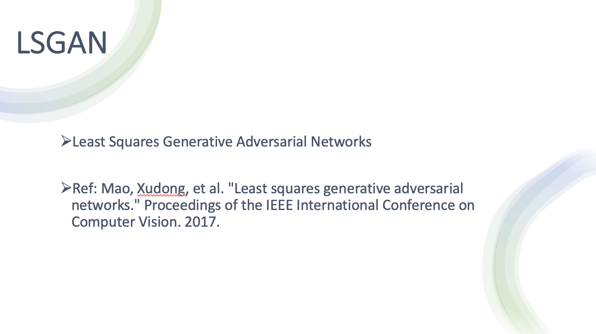
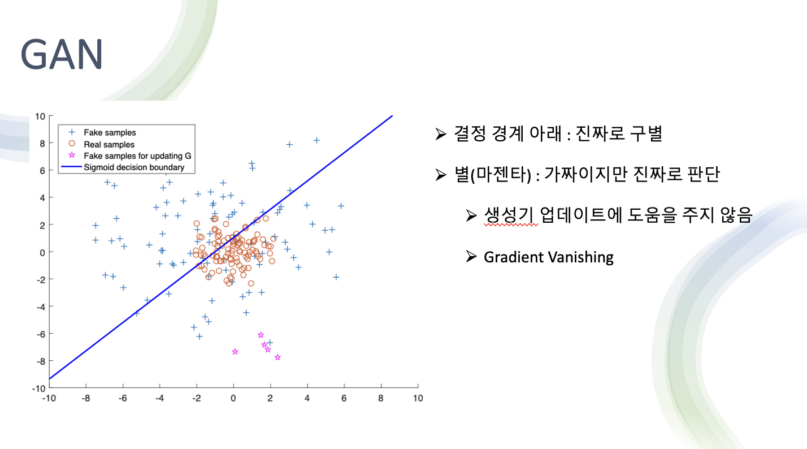
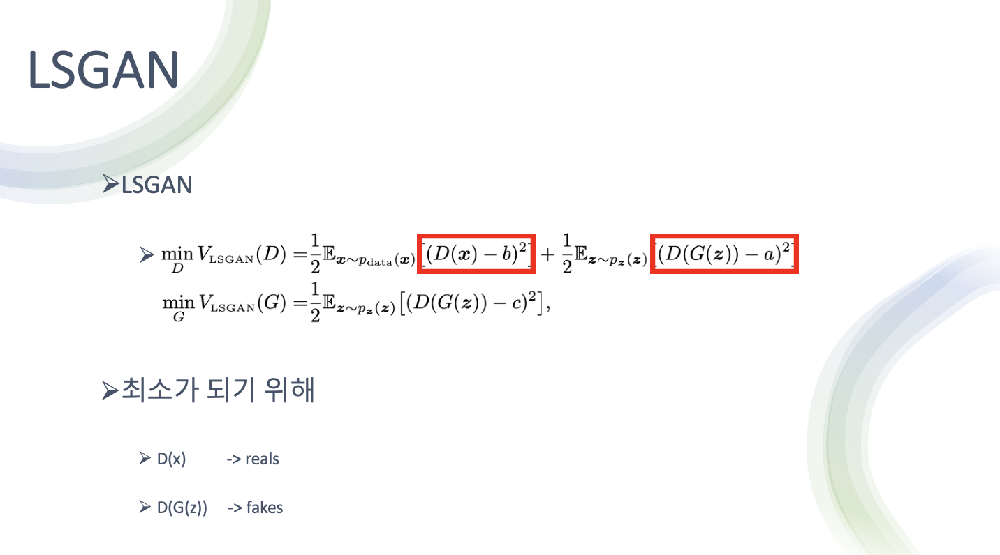
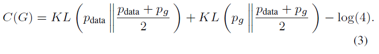
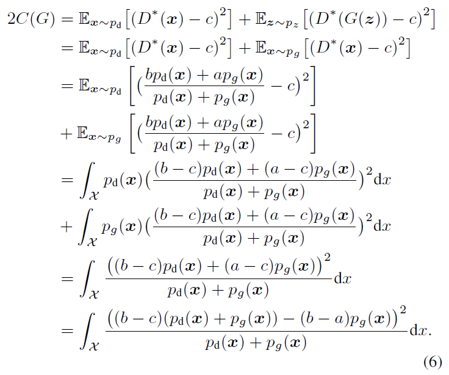
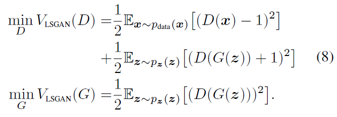
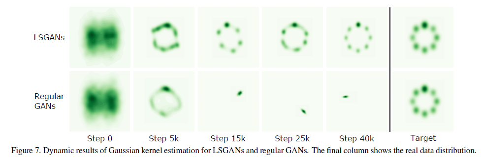
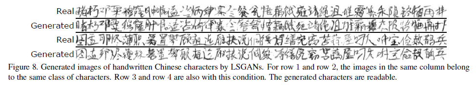

# Least Squares Generative Adversarial Network 이론

- 손실함수로 바이너리 크로스 엔트로피 로스를 사용 
- 바이너리 크로스 엔트로피를 사용해 minmax게임을 풀었다 
- 바이너리 크로스 엔트로피 로스는 입력에 대한 예측의 유사도
	- (얼마나 진짜와 유사한가, 유사할수 있도록 얼마를 조절하면 되는가 에 대한 정보)

- 코드상에서 바이너리 크로스 엔트로피라 명시 
- Discriminator와 Adversarial (G가 노이즈를 받아 G에서 나온 출력을 D가 받는 일련의 과정을 묶은 것) 둘 다 바이너리 크로스 엔트로피로 손실을 측정한 후 Optimization을 수행(Gradient를 최적화 한다)

- LSGAN은 바이너리 크로스 엔트로피를 사용하는 것이 아닌 Least Square를 사용

- 기존 GAN에서 Sigmoid cross entropy loss(= binary cross entropy loss) 를 사용 
- 입력에 대해 예측을 수행했을 때 얼마나 진짜와 비슷한가
- 그런데 이 BCE를 사용하면 Gradient vanishing문제 발생

- 위 그래프가 BCE Error를 썼을 때 양상 
- 빨간 동그라미가 진짜 데이터 분포 
- 파란색 + 가 G가 만들어낸 Fake sample들

- 마젠타 : fake sample인데 결정경계를 기준으로 아래가 진짜 위가 가짜로 판단 
	- D입장에서는 마젠타 색상이 결정경계 아래에 있기 때문에 가짜지만 진짜라고 판단
	- 즉 이미 진짜라고 판단 했기 때문에 G 업데이트에 도움을 주지 않는다 

- 하지만 실제로는 Real 과 가깝게 이동을 할 필요가 있음 
- 이런 필요가 있음에도 불구하고 업데이트에 이미 진짜로 판단 중이기 때문에 도움을 주지 않는다 (Gradient Vanishing)

- LSGAN의 해결법 
	- 손실함수를 Least square로 바꿈 
	- MSE와 비슷하게 실제와 가짜의 차이를 거리로 측정 

- 이 방법으로 가짜 데이터의 거리를 측정 하고 그 거리를 낮추는 방향으로 학습 

- 설명을 그림으로 나타낸 것
- 빨간색 선이 결정경계 
	- 가짜 데이터가 멀리 떨어져 있을 수록 패널티 부여 
	- 손실함수는 이 패널티를 줄이기 위해 결정경계에 가깝게 데이터를 이동

- 결국 real data분포에 더 가깝게 fake data 생성 

- sigmoid cross entropy loss funciton과 least squares loss function 비교 
	- sigmoid cross entropy loss funciton은 어느 시점 이상으로 가게되면 0이 되어 버림 
	- 반면 least squares loss function는 딱 한점에서만 0이고 전부 Loss값 존재 그래서 최적화 할 때 한점으로 수렴할 수 있어서 안정적으로 학습할 수 있다 

- 식으로 보면 기존의 GAN은 위 식으로 minmax게임을 해결
- LSGAN은 약간 거리라는 개념이 들어가도록 변경해서 해결 

- a 가 fake label
- b 가 real label 

- 진짜 데이터에 대해서는 real label에 대해서 다루고 가짜 데이터에 대해서는 fake label에 대해서 다뤄 오차를 최소화하는게 판별기의 목적

- 생성기는 real data에 대한 정보는 필요가 없고 자기가 만드는 fake data에 대한 정보만 있으면 되서 아래처럼 생김

- 여기서 a를 그냥 fake label이라고 말하고 있지만 c는 생성기 입장에서 진짜라고 믿게 하고싶은 fake 라는 요소가 있어서 기호를 다르게 표시 

- D가 최소가 되기 위해서는 D가  판별한 값과 real data의 오차가 적어야 함 
- 또한 G가 생성한 가짜 이미지를 D가 판별 했을 때 a와 가까워 져야 함

- G는 진짜를 흉내내는 fake들 에 가깝게 가서 손실을 최소화 해야 함 

### Relation to Pearson x^2 Divergence

원래의 GAN 논문에서는, 저자들은 Equation 1을 Jensen-Shannon divergnce를 최소화하는 것으로 만든다.

우리는 LSGAN과 f-divergence 사이의 관계를 탐험한다 Equation 2의 확장은 다음과 같이 따른다.

고정된 G의 최적의 discriminator D는 다음과 같이 유도된다.

우리는 Equation 4의 V_LSGAN(G)를 재형성 할 수 있다.

### Parameters Selection

Equation 2에서 value a,b,c를 정의하기 위한 하나의 방법은 b-c=1, b-a=2의 조건을 만족시키는 것이다. 예를 들어, a=-1, b=1, c=0의 셋팅을 따르면 다음과 같은 목적함수를 얻을 수 있다.

또 다른 방법은 c=b로 셋팅함으로써 생성하는 샘플들을 최대한 실제로 만드는 것이다.

## Model Archiectures

VGG model에 의해 동기부여된 우리가 설계한 첫번째 모델은 Figure 3에서 보여진다. [25]에서의 아키첵쳐와 비교하여, 두개의 stride=1 deconvolutional layers는 top two deconvolutional layer 후에 추가된다. discriminator의 아키텍쳐는 least square loss function의 사용을 제외하고 [25]에서의 것과 동일하다. DCGAN을 따르면, ReLU activation과 LeakyReLU activation은 각각 generator와 discriminator에 사용되었다.

우리가 설계한 두번째 모델은 예를 들어 중국어 같은 많은 클래스를 가진 과제를 위한 것이다. 중국어를 위해, 우리는 여러개의 클래스 에서 GAN을 학습하는 것은 읽을 수 있는 문자를 생성하는데 가능하지 않다는 것을 발견했다. 이유는 입력은 여러개의 클래스가 있지만, 출력은 하나의 클래스를 갖기 때문이다. [9]에서 말한데로, 입력과 출력간의 결정적인 관계가 있어야 한다. 이러한 문제를 푸는 방법 중 하나는 conditional GAN을 사용하는 것이고 레이블 정보를 조건화 하는 것은 입력과 출력 사이의 결정적인 관계를 생성하기 때문이다. 하지만, 수만개의 클래스의 one-hot encoding 레이블 벡터에서 직접적으로 조건화하는 것은 메모리 비용과 계산량 측면에서 불가능하다. 우리는 레이블 벡터의 차원을 줄이기 위해서 선형 맵핑 레이어를 사용한다. generator를 위해, 레이블 벡터는 노이즈 입력 레이어로 concatenated 된다. discriminator를 위해, 레이블 벡터는 모든 convolutional layer와 fully-connected layer에 concatenate 된다. concatenated된 레이어들은 실험적으로 결정된다.

- DCGAN 해상도도 낮고 많이 부자연스러운 요소가 많음 

- LSGAN은 상대적으로 더 선명하고 DCGAN보다 더 나은 방 이미지를 생성함 

- 왜냐하면 DCGAN은 이미 진짜로 판단된 fake이미지에 대해서는 업데이트 할 수 있는 정보를 얻을 수 없지만 LSGAN은 진짜로 분류된 fake 이미지에 대해서도 결정경계에 더 가깝게 만들어 주기 위해, 진짜 분포와 비슷하게 만들기 위해 손실을 설계했기 때문에 진짜에 가까운 데이터를 생성하게 됨

- LSGAN이 생성한 다양한 이미지들

또 다른 실험은 [19]에서 설계된 Gaussian mixture distribution 데이터셋에서 평가하는 것이다. 우리는 LSGAN과 보통의 GAN을 generator와 discriminator 둘다 3개의 fully connected layer를 가지고 있는 간단한 네트워크 아키텍쳐를 사용하여 2D mixture of 8 Gaussian 데이터셋에서 학습했다. Figure 7은 Gaussian kernel density estimation의 동적인 결과를 보여준다. 우리는 보통의 GAN이 step 15k에서 시작해서 mode collapse를 겪는 것을 볼 수 있다. 이것들은 데이터 분포의 하나의 유효한 mode 주위의 샘플을 생성한다. 하지만 LSGAN은 Gaussian mixture distribution을 성공적으로 학습한다.

##  Handwritten Chinese Characters

우리는 또한 conditional LSGAN 모델을 3740개의 클래스를 포함하는 중국어 손글씨 데이터셋에서 학습했다. LSGAN은 성공적으로 읽을 수 있는 중국어를 생성하도록 학습했고, 몇개의 랜덤하게 선택된 문자들이 Figure 8에서 보여진다. 우리는 Figure 8로부터 두개의 주요한 관찰을 얻었다. 첫번째로, LSGAN에 의해 생성된 문자들은 읽을 수 있다는 것이다. 두번째로, 우리는 data augmentation과 같이 더 나아간 어플리케이션에 사용될 수 있는 레이블 벡터를 통해 생성된 이미지의 정확한 레이블을 얻을 수 있다.

