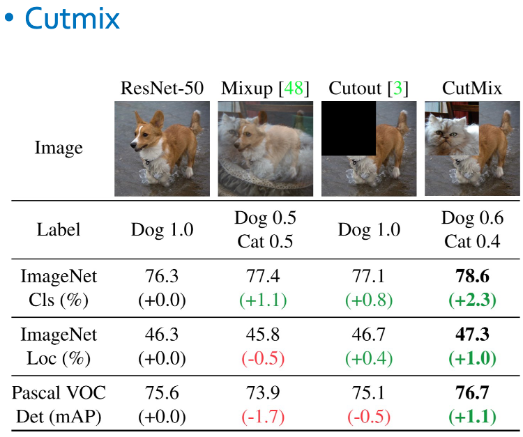
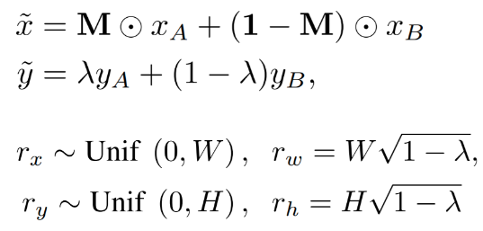

``` python
import os
import numpy as np
import random
import time
import math
import matplotlib.pyplot as plt
import tensorflow as tf
from tensorflow import keras
from tensorflow.keras.applications import *
from tensorflow.keras.layers import Conv2D, ReLU, MaxPooling2D, Dense, BatchNormalization, GlobalAveragePooling2D, Softmax


AUTOTUNE = tf.data.AUTOTUNE 
"""
- 데이를 읽어오는데 필요한 스레드의 개수를 Tensorflow가 자동으로 관리 

- AUTOTUNE을 사용하는 주된 이유는 데이터 입력 파이프라인의 성능을 최적화하기 위해서 이다.

- 이를 통해 데이터를 배치로 모으거나, 데이터를 변형(preprocessing)할 때 필요한 CPU자원을 
Tensorflow가 실행 시간에 결정하게 되어, 개발자가 수동으로 병렬처리에 필요한 자원을 설정하는 것보다 효율적으로 리소스를 관리할 수 있게함

- 이 변수를 설정한 후에는, Tensorflow의 Dataset 객체의 메소드인 .prefetch(), .map()등에 인자로 전달하여 사용할 수 있다. 

- 예를 들어, dataset.prefetch(AUTOTUNE)은 데이터셋이 학습하는 동안 다음 데이터 배치를 미리 준비하도록 Tensorflow에 지시하며, 이 과정에서 AUTOTUNE을 사용해 I/O 병목 현상을 줄이고, 학습속도를 향상시킬 수 있다.
"""
```

``` python
train_ds = keras.preprocessing.image_dataset_from_directory(
	directory = train_dir,
	shuffle = True,
	label_mode = 'categorical' # 레이블을 자동으로 원-핫 인코딩 해줌
	image_size = (RES, RES)
	batch_size = N_BATCH
)

"""
keras.preprocessing.image_dataset_from_directory를 이용하면 디렉토리 구조를 사용해 디렉토리 내부에 있는 이미지파일들을 이용해 tf.data.Dataset 객체를 만들 수 있다. 

이렇게 만들어진 데이터셋은 모델 학습에 직접 사용할 수 있는 형식으로, 이 함수는 주어진 경로의 디렉토리 구졸르 탐색하여 이미지 파일들을 로드하고, 그것들을 텐서로 변환한다. 또한 자동으로 라벨을 생성하는데, 이는 디렉토리 이름을 기반으로 하며, 각 디렉토리가 하나의 클래스를 나타낸다.
"""


# 시용법 
dataset = keras.preprocessing.image_dataset_from_directory(
    directory='path/to/images',  # 이미지들이 저장된 디렉토리의 경로
    batch_size=32,               # 배치 크기 설정
    image_size=(256, 256),       # 모든 이미지를 리사이즈할 크기
    shuffle=True,                # 데이터셋을 셔플할지 여부
    seed=123,                    # 셔플을 위한 시드 값
    validation_split=0.2,        # 검증을 위해 예약할 데이터의 비율
    subset='training',           # 'training' 또는 'validation' 설정
    label_mode='int'             # 라벨 형식, 'int' 또는 'binary' 또는 'categorical'
)
"""
주요 인자
- `directory`
	이미지들이 저장된 경로입니다. 각 클래스별로 폴더를 만들어 그 안에 해당 클래스의 이미지를 저장합니다.

- `batch_size` 
	한 번에 네트워크에 공급될 이미지의 수입니다.

- `image_size`
	모델에 입력될 이미지의 크기입니다. 모든 이미지는 이 크기로 조정됩니다.


- `shuffle`
	데이터를 셔플할지 여부입니다. 학습 시에는 일반적으로 `True`로 설정합니다.


- `seed`
	셔플하거나 데이터를 분할할 때 일관된 결과를 얻기 위한 시드 값입니다.


- `validation_split`
	전체 데이터에서 검증용으로 설정할 데이터의 비율입니다.


- `subset`
	데이터의 어떤 부분을 사용할지 결정합니다. 'training' 또는 'validation' 중 선택할 수 있습니다.


- `label_mode`
	라벨을 어떤 형식으로 생성할지 결정합니다. 'int'는 정수 라벨, 'binary'는 이진 라벨, 
	'categorical'은 원-핫 인코딩된 라벨을 생성합니다.
"""
```

``` python
classes = train_ds.class_names 

"""
class 이름을 저장하고 있는 list생성

위에서 설정한 keras.preprocessing.image_dataset_from_directory를 사용하여 생성된 데이터 셋에서 사용 가능

데이터셋을 구성하는 데 사용된 디렉토리의 이름을 기반으로 자동으로 생성된 클래스 목록을 담고있음

['buildings', 'forest', 'glacier', 'mountain', 'sea', 'street']
"""
```

``` python
train_ds = train_ds.prefetch(AUTOTUNE)

"""
prefetch 메소드는 모델 훈련 중에 GPU가 다음 배치를 기다리지 않도록, 미리 배치를 메모리에 로드.

AUTOTUNE 매개변수를 사용하려면 Tensorflow가 실행 시점에 데이터 로딩을 위해 사용할 최적의 스레드 수를 동적으로 결정하기 때문에 결과적으로 데이터 로딩시의 병목 현상을 줄여 훈련 속도가 향상될 수 있다.
"""
```

``` python
images, labels = train_ds.take(5)

"""
`tf.data.Dataset` API의 일부로 위 코드는 처음 5개의 배치를 추출해 images와 labels에 각각 할당
(batch_size = 32라고 가정하면 160장 추출)
"""
```

``` python
from tensorflow.keras.applications import MobileNetV3Small


mobilenetv3 = MobileNetV3Small(weights = 'imagenet', 
							   include_top = False, 
							   input_shape = (RES, RES, 3))

"""
from tensorflow.keras.applications.mobilenet_v3 import preprocess_input 함수는 MobileNetV3모델에 이미지를 입력하기 전 적절한 전처리를 수행하는 함수.
각 모델에는 해당 모델의 학습에 사용되었던 것과 동일한 방식으로 입력 데이터를 전처리하는 코유 함수가 있다.

MobileNetV3Small 클래스의 인스턴스를 생성한다. 

- weights = 'imagenet': 모델의 가중치로 ImageNet 데이터셋으로 사전 훈련된 가중치 사용.

- include_top = False : 모델의 상단에 있는 Dense Layer 를 포함하지 않음. 
						이 옵션은 주로 모델을 커스텀 데이터셋에 맞춰 fine-tuning할 때 사용된다.
"""
```

``` python
from tensorflow.keras.applications.mobilenet_v3 import preprocess_input
"""
from tensorflow.keras.applications.mobilenet_v3 import preprocess_input 함수는 MobileNetV3모델에 이미지를 입력하기 전 적절한 전처리를 수행하는 함수.
각 모델에는 해당 모델의 학습에 사용되었던 것과 동일한 방식으로 입력 데이터를 전처리하는 코유 함수가 있다.
"""
def create_model():
	inputs = keras.Input(shape = (RES, RES, 3))
	x = preprocess_input(inputs) 
	x = mobilenetv3(x)
	x = GlobalAveragePool2D()(x)
	x = Dense(units = N_CLASS)(x)
	x = BatchNormalization()(x)
	outputs = Softmax()(x)
	model = keras.Model(inputs = inputs, outputs = outputs)
	return model


"""
- x = preprocess_input(inputs) 
# preprocess_input 함수를 사용하여 이미지 데이터를 전처리 
# 이는 모델이 학습될 때 사용된 방식과 동일하게 데이터를 정규화하여 모델의 성능을 최적화하는데 도움이 된다.

- x = mobilenetv3(x)
# 사전 훈련된 MobileNetV3Small 모델을 사용하여 입력 데이터를 통과

- x = GlobalAveragePool2D()(x)
# feature map의 평균을 구하여 각 맵에 대해 단일 값을 추출
# 이는 모델이 이미지의 공간적 차원을 압축하면서 중요한 정보는 보존하는데 도움이 된다.

- x = BatchNormalization()(x)
# BatchNorm을 적용하여 이전 층의 출력을 정규화 
# 이 과정은 훈련 중 내부 공변량 변화 문제를 완화하고, 학습 속도를 향상시키는 데 도움이 된다.


- GlobalAveragePool2D
conv 신경망에서 feature map을 하나의 벡터로 압축하는 방법 중 하나로
이 연산은 각 feature map내의 평균을 계산하여, 각 맵에 대해 하나의 숫자(평균) 만을 출력한다.
이렇게 하면 각 특징 맵에서 공간적 차원을 제거하고, 각 맵의 글로벌 평균을 유지하게 된다. 
과적합 방지에도 도움됨


- BatchNormalization
신경망에서 학습 과정을 가속화하고 안정화하는데 도움이 되는 기술.
이 층은 네트워크에서 각 배치에 대해 입력을 정규화하는 작업을 수행한다. 정규화는 입력의 평균을 0으로 만들고, 표준편차를 1로 만드는 과정을 말한다. 

이 기법은 신경망이 각 레이어를 통과할 때 입력 데이터의 분포가 변하는 내부 공변량 변화 문제를 해결하기 위해 도입 되었다. 이 변화를 줄이면, 학습률을 높게 설정할 수 있고, 가중치 초기화에 덜 민감하며, 종종 정규화 효과도 나타나서 과적합을 줄이는 데 도움이 된다. 

BatchNorm층은 각 배치에서 평균과 분산을 계산하고, 이를 사용하여 정규화 과정을 수행한다. 
그 다음, 학습 가능한 파라미터를 사용하여 각각의 정규화된 데이터를 스케일링과 시프팅하여 네트워크가 필요한 경우 원래의 데이터 분포로 돌아갈 수 있게 한다.
"""
```

``` python
model.compile(
	keras.optimizers.Adam(learning_rate=LR), # m1 MAC 에서 느리게 실행됨
	loss = keras.losses.sparse_categorical_crossentropy,
	metrics=['accuracy'])

model.fit(train_ds, 
		  epochs=N_EPOCH,
		  validation_data=val_ds)
```


# 모델 성능 올리기 위한 Data augmentation

``` python
def aug(image, label):
	image = tf.image.random_crop(image, [RES, RES, 3]) # 원본 이미지 보다 크게 Resize
	image = tf.image.random.flip_left_right(image)
	return image, label

"""
- tf.image.random.crop 함수는 입력 이미지를 무작위로 크롭
이를 통해 모델이 이미지의 특정 부분에 의존하지 않고 전체 이미지의 다양한 영역에서 특징을 학습할 수 있도록 도움

- tf.image.random_flip_left_right 함수는 이미지를 수평으로 무작위로 뒤집는다.
- 이 과정은 이미지를 좌우 대칭으로 변환하여, 모델이 좌우 방향에 대해 불변성을 갖도록 만든다.
"""
```

``` python
train_ds = train_ds.unbatch().map(
								  aug, 
								  num_parallel_calls = AUTOTUNE).batch(N_BATCH, drop_remainder = True).prefetch(AUTOTUNE)


"""
train_ds.unbatch()
- unbatch 메서드는 배치된 데이터셋을 개별 데이터 샘플로 해체한다.

.map(aug, num_parallel_calls = AUTOTUE)
- map 메서드는 데이터셋의 각 항목에 함수를 적용한다. 여기서 aug 함수를 사용하여 데이터 증강을 적용
- num_parallel_calls=AUTOTUNE 은 데이터 처리를 위해 여러 쓰레드를 사용하고, Tensorflow가 자동으로 필요한 쓰레드 수를 동적으로 결정하도록 설정한다. 이렇게 함으로써 데이터 로딩과 전처리가 학습 과정을 지연시키지 않도록 최적화한다.

.batch(N_BATCH, drop_remainder=True)
- batch 메서는 개별 데이터 샘플을 다시 배치 형태로 묶는다. N_BATCH는 한 배치에 포함될 샘플의 수를 결정한다. 
- drop_remainder=True 옵션은 마지막 배치가 N_BATCH보다 작을 경우 이를 버린다. 이는 모델이 일정한 배치 크기로만 작동해야 할 때 유용하며, 일부 모델 아키텍쳐에서는 필수적일 수 있다.

.prefetch(AUTOTUNE)
- prefetch 메서드는 학습 중에 GPU가 데이터를 기다리지 않도록 다음 배치를 미리 준비한다.
- AUTOTUNE은 Tensorflow에게 이 작업에 필요한 리소스 양을 자동으로 결정하게 한다.
"""
```


# CutMix 알고리즘 구현 



``` python
def cutmix(images, labels):
	imgs = []; labs = []

	# N_BATCH 크기만큼의 반복문을 실행하여 각 배치의 이미지에 대해 CutMix를 적용
	for i in range(N_BATCH):
		# APPLY는 0과 1 사이에서 무작위 값을 추출하고, 이 값이 0.5이상인 경우에만 CutMix를 적용할지 결정하는 이진 플래그
		APPLY = tf.cast(tf.random.uniform(()) >= 0.5, tf.int32)
		
		# idx 는 무작위로 선택한 인덱스로, 현재 이미지와 섞을 다른 이미지를 결정
		idx = tf.random.uniform((), 0, N_BATCH, tf.int32) 

		W = RES
		H = RES

		# lam은 베타 분포에서 추출한 랜덤 변수로, 섞는 비율을 결정 
		# 'cut_w' 와 'cut_h'는 섞을 영역의 너비와 높이를 결정
		"""
		lam은 tf.random.uniform(()) 함수를 사용해서 0과 1사이의 균등 분포에서 랜덤한 값을 생성.
		이 값은 두 이미지를 합칠 때 각각의 이미지에서 얼마나 많은 영역을 차지할지를 결정
		"""
		lamda = tf.random.uniform(())

		"""
		**자르는 영역 비율 계산**
		cut_ratio는 lam값에 1을 뺀 후 제곱근을 취하여 계산. 
		이 값은 두번째 이미지에서 잘라낼 영역의 비율을 결정
		"""
		cut_ratio = tf.math.sqrt(1 - lamda)

		"""
		**자르는 영역의 너비와 높이 결정**
		cut_w와 cut_h는 전체 이미지의 너비와 높이에 cut_ratio를 곱한 값으로 결과를 정수로 변환하기
		전에 APPLY 플래그와 곱하여 CutMix를 적용하지 않는 경우 영역의 크기가 0이되도록 설정
		"""
		cut_w = tf.cast(W * cut_ratio, tf.int32) * APPLY
		cut_h = tf.cast(H * cut_ratio, tf.int32) * APPLY


		# cx와 cy는 섞을 영역의 중심 좌표를 무작위로 결정 
		"""
		**자르는 영역의 중심 좌표 (cx, cy) 결정** 
		cx와 cy는 각각 자르는 영역의 중심이 될 x, y좌표를 무작위로 결정한다. 
		여기서는 전체 이미지의 1/8 에서 7/8사이의 값으로 설정하여, 자르는 영역이 이미지의 가장자리에 
		너무 치우치지 않도록 한다.
		"""
		cx = tf.random.uniform((), int(W/8), int(7/8*W), tf.int32)
		cy = tf.random.uniform((), int(H/8), int(7/8*H), tf.int32)

		# xmin, ymin, xmax, ymax는 섞을 영역의 사각형 좌표를 계산 
		"""
		**자르는 영역의 실제 좌표(xmin, ymin, xmax, ymax) 계산**
		cx와 cy를 중심으로 하여, 계산된 cut_w와 cut_h를 이용하여 자르는 영역의 실제 좌표를 계산
		
		tf.clip_by_value 함수는 좌표가 이미지 범위를 벗어나지 않도록 함
		
		`tf.clip_by_value` 함수의 세 가지 주요 인자
		- `t`: 클리핑(clipping)될 텐서.
		- `clip_value_min`: 클리핑할 최소값.
		- `clip_value_max`: 클리핑할 최대값.
		"""
		xmin = tf.clip_by_value(cx - cut_w // 2, 0, W)
		ymin = tf.clip_by_value(cy - cut_h // 2, 0, H)
		xmax = tf.clip_by_value(cx + cut_w // 2, 0, W)
		ymax = tf.clip_by_value(cy + cut_h // 2, 0, H)


	
		
```


