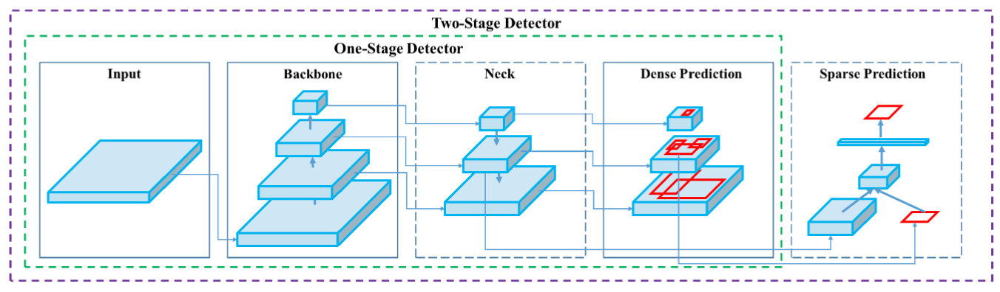
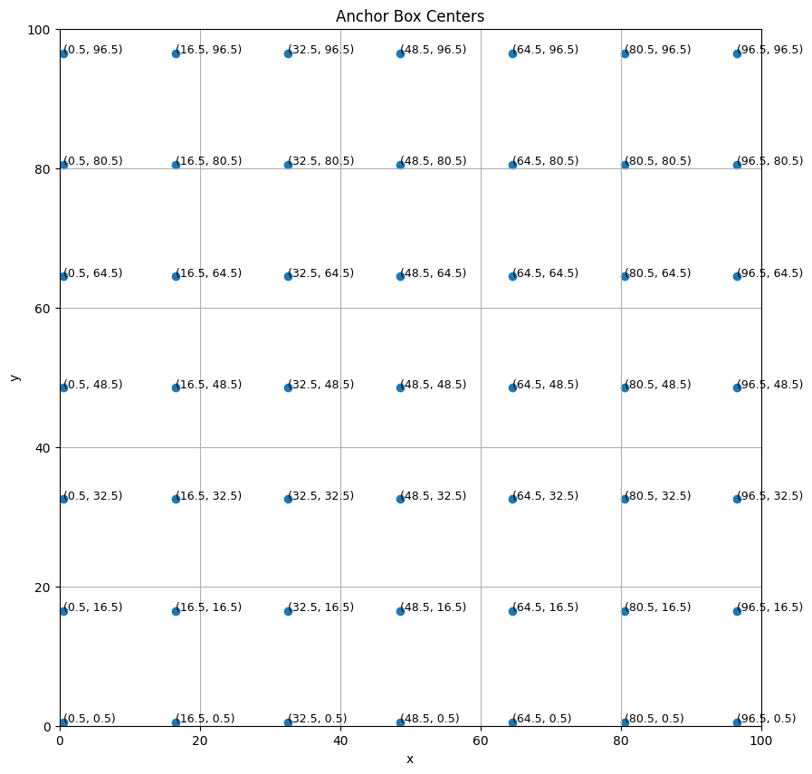

``` python
# Hyper parameter 설정 
num_classes = 80
batch_size = 2

learning_rates = [2.5e-06, 0.000625, 0.00125, 0.0025, 0.00025, 2.5e-05]
learning_rate_boundaries = [125, 250, 500, 240000, 360000]

learning_rate_fn = tf.optimizers.schedules.PieceWiseConstantDecay(
	boundaries = learning_rate_boundaries, values = learning_rates
)

"""
tf.optimizers.schedules.PieceWiseConstantDecay는 텐서플로우에서 사용되는 학습률 스케줄링 함수로 학습 과정 중에 특정 단계에서 학습률(learning rate)을 조정하는데 사용

- boundaries: 이 리스트는 학습률이 변결될 훈련 스텝 또는(에폭)의 경계를 설정. 예를들어 learning_rate_boundaries = [125, 250, 500, 2400000, 360000] 는 학습 과정에서 스텝 125, 250, 500, 240000, 360000 에서 학습률이 변경되어야 함을 의미 

- values: 이 리스트는 각 경계 지점에서 사용될 새로운 학습률의 값을 제공. 이 리스트의 길이는 boundaries보다 하나 더 길어야 한다. 첫번째 값은 시작 학습률을 나타내고, 이후의 값들은 각 경계 지점 이후에 사용될 학습률이다.

스케줄링 방식을 사용하면 모델의 학습이 특정 단계에서 더 잘 수렴하도록 학습률을 조정할 수 있다. 
초기에는 높은 학습률로 시작하여 빠른 학습을 추구하고, 학습이 진행됨에 따라 학습률을 점차 낮추어 보다 세밀한 최적화를 진행할 수 있다. 이런 접근 방식은 과적합을 방지하고, 모델의 일반화 성능을 향상시키는데 도움이 될 수 있다.
"""
```

``` python
(train_dataset, val_dataset), dataset_info = tfds.load(
	"coco/2017", split=["train", "validation"], with_info = True, data_dir = './'
)

"""
with_info : 데이터셋에 대한 추가 정보 ex) 클래스 레이블, 데이터셋 크기 등 을 함께 로드

tfds.core.DatasetInfo( 
	name='coco', 
	full_name='coco/2017/1.1.0', 
	description= '''

	homepage='(http://cocodataset.org/#home)', 
	data_path='/data/coco/2017/1.1.0', 
	file_format=tfrecord, 
	download_size=25.20 GiB, 
	dataset_size=24.98 GiB, 
	features=FeaturesDict({ 
		'image': Image(shape=(None, None, 3), dtype=uint8), 
		'image/filename': Text(shape=(), dtype=string), 
		'image/id': int64, 
		'objects': Sequence({ 
			'area': int64, 
			'bbox': BBoxFeature(shape=(4,), 
			dtype=float32), 
			'id': int64, 
			'is_crowd': bool, 
			'label': ClassLabel(shape=(), dtype=int64, num_classes=80), 
		}), 
	}), 
	supervised_keys=None, 
	disable_shuffling=False, 
	splits={ 
		'test': <SplitInfo num_examples=40670, num_shards=64>, 
		'train': <SplitInfo num_examples=118287, num_shards=256>, 
		'validation': <SplitInfo num_examples=5000, num_shards=8>,
	})
"""
```

### Data 확인
``` python
for data in train_dataset.take(1):
	image = np.array(data['image'], dtype = np.uint8)
	plt.figure(figsize = (8, 8))
	plt.axis('off')
	plt.imshow(image)
	ax = plt.gca()

	boxes = data['objects']['bbox']
	image_h = image.shape[0]
	image_w = image.shape[1]

	boxes = tf.stack(
		[
		 boxes[:, 0] * image_h,
		 boxes[:, 1] * image_w,
		 boxes[:, 2] * image_h,
		 boxes[:, 3] * image_w
		], axis = -1
	)

	for box in boxes:
		ymin, xmin = box[:2]
		h, w = box[2:] - box[:2]
		patch = plt.Rectangle(
			[xmin, ymin], w, h, fill = False, 
										edgecolor = [1, 0, 0], linewidth = 2
		)
		ax.add_patch(patch)
	plt.show()

"""
plt.axis('off') : 보이는 모든 x, y, 레이블, 눈금 등을 숨김

ax = plt.gca() : 현재 활성돠된 축을 가져온다.

boxes = tf.stack([...], axis = -1) : 각 경계 상자의 좌표를 이미지의 크기에 맞게 조정 
이는 경계상자가 상태적인 값으로 저장되어 있기 때문에 필요

edgecolor = [1, 0, 0] : 빨간색 테두리 사용
linewidth = 2 : 두께 지정 
"""
```


### Data Augmentation
``` python
"""
행렬과 같은 tensor의 경우 행->열 순으로 되어 있기 때문에 (y좌표, x좌표) 순서로 저장되어 있다.
(x좌표, y좌표) 순서가 더 직관적으로 이해하기 쉬우므로 저장된 x, y좌표의 순서를 바꾸는 작업

함수의 입력은 (N, 4) shape의 bounding box 정보이며, bounding box좌표 정보는 양쪽 모서리의 
x, y 좌표값으로 되어있다고 가정

[0] [1] [2] [3]
 y   x   y   x

[1] [0] [3] [2]
 x   y   x   y
"""
def swap_xy(boxes):
	return tf.stack([boxes[:, 1], boxes[:, 0], boxes[:, 3], boxes[:, 2]], 
																	axis = -1)
```

``` python
"""
bounding box의 위치 정보에 대한 format을 변경하는 함수 
(xmin, ymin, xmax, ymax) 형태의 bounding box format을 (x, y, w, h)로 바꿔서 반환

이 때 x, y는 bounding box의 center 좌표를 의미 
함수의 입력은 (N, 4)와 같이 2차원 이상의 tensor
"""

def convert_to_xywh(boxes):
	return tf.concat(
		[(boxes[..., :2] + boxes[..., 2:])/2.0, boxes[..., 2:] - boxes[..., :2]],
		  axis = -1
	)
"""
(xmin, ymin + xmax, ymax) / 2 = 중심점(x, y)

xmax, ymax - xmin, ymin = w, h 길이
"""
```

``` python
"""
bounding box의 위치 정보에 대한 format을 변경하는 함수 
(x, y, w, h) 형태의 bounding box format을 (xmin, ymin, xmax, ymax)로 바꿔서 변환

이 때 x, y는 bounding box의 center 좌표를 의미 
함수의 입력은 (N, 4)와 같이 2차원 이상의 tensor
"""
def convert_to_corners(boxes):
	return tf.concat(
		[boxes[..., :2] - boxes[..., 2:] / 2.0, 
						 boxes[..., :2] + boxes[..., 2:] / 2.0], axis = -1)

"""
boxes[N, 0] = x_center
boxes[N, 1] = y_center
boxes[N, 2] = width
boxes[N, 3] = height

x - w/2 = xmin
y - h/2 = ymin

x + w/2 = xmax
y + w/2 = ymax
"""
```

``` python
"""
Image resizing 함수 

짧은 변을 min_side와 같게 resize 
만약 긴 변의 길이가 max_side보다 클 경우에는 긴 변이 max_side와 같아지도록 다시 resize 

image size(가로, 세로 모두)가 stride의 배수가 아닐 경우 stride의 배수가 되도록 오른쪽과 아래쪽에
0을 채움(zero padding)

함수의 입력값 
- image : 3차원 tensor로 이루어진 image의 pixel 값(h, w, c)
- min_side : resize에 사용할 짧은 변의 길이 
- max_side : resize에 사용할 긴 변의 길이
- stride : 1번 입력인 image의 1 pixel이 실제 원본 image에서 몇 pixel에 해당되는지


함수의 반환값
- resize 및 padding된 image의 pixel값 
- padding 하기 전의 image size
- padding 하기 전 image와 원본 image의 확대/축소 비율(resize 후/resize 전)
"""

'''ex) 1200x1600 pixel image'''
def resize_and_pad_image(image, min_side=800.0, max_side=1333.0, stride=128.0):

	# 입력 이미지의 높이와 너비를 구하고, 이를 부동 소수점 타입으로 변환
	'''image_shape: [1200.0, 1600.0]'''
	image_shape = tf.cast(tf.shape(image)[:2], dtype = tf.float32)
	
	# 이미지의 가장 작은 차원을 min_side에 맟추기 위한 비율을 계산
	'''ratio: 800.0 / 1200.0 = 0.6667'''
	ratio = min_side / tf.redice_min(image_shape)

	# resize된 이미지의 가장 큰 차원이 max_side를 초과하는지 확인 
	# 만약 초과한다면 비율을 재조정 해 가장 큰 차원이 max_side가 되도록 설정
	'''ratio * 1600.0 = 0.6667 * 1600.0 = 1066.72 < 1333.0 ratio 는 변경되지 않음'''
	if ratio * tf.reduce_max(image_shape) > max_side:
		ratio = max_side / tf.reduce_max(image_shape)

	# resize된 이미지 크기 계산
	''' image_shape : 0.6667 * [1200.0, 1600.0] = [800.004, 1066.72]'''
	image_shape = ratio * image_shape

	# 이미지를 새로운 크기로 리사이즈 
	# tf.cast(image_shape, dtype = tf.int32) 는 resize될 크기를 정수형으로 변환
	# 이미지의 크기는 정수값 이여야 하기 떄문
	''' [800, 1067] '''
	image = tf.image.resize(image, tf.cast(image_shape, dtype = tf.int32))

	# 이미지의 각 차원을 stride로 나눈 후, 그 결과를 올림하여 각 차원이 stride의 배수가 되도록 설정
	''' 
	stride: 128.0
	tf.math.ceil(image_shape / stride) : [800.004, 128.0, 1066.72 / 128.0] 
	= [7, 9]

	padded_image_shape = [7 * 128, 9 * 128] = [896, 1152]
	'''
	padded_image_shape = tf.cast(
		tf.math.ceil(image_shape / stride) * stride, dtype = tf.int32	
	)

	# tf.image.pad_to_bounding_box는 이미지에 패딩 추가
	# 이 함수는 이미지의 위쪽과 왼쪽에 지정된 픽셀만큼 패딩을 추가하고, 이미지를 지정된 대상 크기 
	# (padded_image_shape)로 조정
	''' 최종 이미지 크기 : [896, 1152] (여기서 이미지는 위쪽과 왼쪽에 패딩이 추가됨)'''
	image = tf.image.pad_to_bounding_box(
		image, 0, 0, padded_image_shape[0], padded_image_shape[1]
	)
	'''
	tf.image.pad_to_bounding_box(
		image, offset_height, offset_width, target_height, target_width
	)

	- offset_height : 이미지의 위쪽에서부터 얼마나 떨어진 지점부터 패딩을 시작할지를 지정
					  이 값이 0이면 이미지의 맨 위부터 패딩을 시작
	
	- offset_width : 이미지의 왼쪽에서부터 얼마나 떨어진 지점부터 패딩을 시자할지 지정
					 이 값이 0이면, 이미지의 맨 왼쪽부터 패딩 시작

	- target_height : 패딩된 이미지의 최종 높이
	
	- target_width : 패딩된 이미지의 최종 너비
	'''

	return image, image_shape, ratio
	'''
	반환값: 패딩된 이미지[896, 1152], [800.004, 1066.72], 0.6667
	'''
```

``` python
"""
Horizontal flip 함수
- 50%의 확률로 이미지를 좌우 반전 
- 이 때 bounding box의 좌표도 좌우반전에 맞게 변경 
- 입력 이미지는 3차원 텐서
- bounding box의 좌표는 (xmin, ymin, xmax, ymax)로 구성되어 있고, 각각의 좌표는 0 ~ 1사이 값
- 함수의 반환값은 image의 pixel 값, bounding box의 좌표
"""

def random_flip_horizontal(image, boxes):
	if tf.random.uniform(()) > 0.5:
		image = tf.image.flip_left_right(image)
		boxes = tf.stack(
			[1 - boxes[:, 2], boxes[:, 1]. 1 - boxes[:, 0], boxes[:, 3], 
																	axis = 1])
"""
[0] [1] [2] [3]
 x   y   x   y
 
boxes[:, 1] (ymin), boxes[:, 3] (ymax) // 수평방향으로 뒤집기 때문에 건들필요 없음 

boxes[:, 2] (xmax) 
boxes[:, 0] (xmin)

new xmin = 1 - xmax (1 - boxes[:, 2])
new xmax = 1 - xmin (1 - boxes[:, 0])

ex) [0.1, 0.2, 0.4, 0.6] -> [0.6, 0.2, 0.9, 0.6]

new xmin = 1 - 0.4 = 0.6
new xmax = 1 - 0.1 = 0.9

ymin = 0.2
ymax = 0.6


random_flip_horizontal 함수는 이미지와 해당 이미지 내의 객체들의 bounding boxes를 무작위로 
수평 방향으로 뒤집는 역할을 한다. 이 과정에서 중요한 부분은 이미지를 뒤집은 후에 bboxes의 좌표도 
적절히 조정해야 한다는 것이다.

이미지를 수평으로 뒤집을 때, 상자의 수직 위치(y좌표)는 변하지 않지만, 수평 위치(x좌표)는 반대 방향으로 
이동하므로 xmin과, xmax의 값을 적절히 조정
"""

```

``` python
"""
Augmentation 함수 만들기 
- tf.data(dataset)에 map으로 적용할 수 있도록 함수를 작성 
- dataset의 itemp을 입력으로 받음
- 위에서 작성한 random_flip_horizontal 함수를 먼저 적용하고, 다음으로 resize_and_pad_image 
함수를 적용 
- 0 ~ 1 사이 값으로 normalized된 bounding box좌표를 실제 image size에 맞도록 조정
- bounding box 좌표를 (xmin, ymin, xmax, ymax) -> (x, y, w, h) 형태로 변경
- 함수의 반환 값은 image의 pixel값, bounding box의 좌표, class id
"""

def preprocess_data(sample):
	image = sample["image"]
	bbox = swap_xy(sample["objects"]["bbox"])
	class_id = tf.cast(sample["objects"]["label"], dtype = tf.int32)

	image, bbox = random_flip_horizontal(image, bbox)
	image, image_shape, _ = resize_and_pad_image(image)

	bbox = tf.stack([
		bbox[:, 0] * image_shape[1],
		bbox[:, 1] * image_shape[0],
		bbox[:, 2] * image_shape[1],
		bbox[:, 3] * image_shape[0]],
		axis = -1
	)
	bbox = convert_to_xywh(bbox)
	return image, bbox, class_id
```

### Anchor Box 정보 만들기 
``` python
_compute_dims : 각 level 별로 anchor box의 (w, h)를 계산해 반환
_get_anchors : 각 level 별로 anchor box의 (x, y, w, h)를 계산해 반환
			   이때 return shape은 (height * width * 9, 4)
get_anchors : _get_anchors의 level별 anchor box정보를 모두 합쳐서 최종 결과를 반환


- AnchorBox class를 만들고, get_anchors method를 call 하면 모든 anchor box의 
(x, y, w, h) 좌표를 반환 

- P3 ~ P7까지의 모든 level의 anchor box의 (x, y, w, h) 좌표가 반환되어야 함
- 계산의 편의성을 위해 먼저 각 level의 anchor box를 (height, width, 9, 4)의 shape을 갖는 
tensor로 만든다. 여기서 height, width는 각 level의 feature mpa size를 의미하며, 9는 각 
level의 anchor box 갯수이며 4는 (x, y, w, h)를 의미한다. 

- 최종적으로 반환되는 값은 (5 * height * width * 9, 4)의 형태가 되며 맨 앞의 5는 level의 갯수(P3, P4, P5, P6, P7)을 의미한다.


# class 내부의 method 

__init__method 
* anchor box정보 계산을 위한 기본 값 setting


_compute_dims method 
* _compute_dims 는 모든 level(P3 ~ P7)에 대해 각 level 별로 anchor box의 (w, h)를 계산하여 반환하는 역할 수행 
* anchor_dims_all list에 해당 정보가 저장되며 list의 원소는 각각 (1,1,9,2)의 shape을 갖는다.


_get_anchors method
* _get_anchors method는 각 level별로 anchor box의 (x, y, w, h)를 계산해 반환
* 반환값의 shape은 (height * width * 9, 4)


get_anchors method 
* get_anchors method는 _get_anchors를 통해 level별 anchor box의 정보를 받아 이를 모두 합쳐
  최종 결과를 반환
* 반환값의 shape은 (5 * height * widht * 9, 4)
```


### 컴퓨터 게임의 예시
상상해보세요, 당신이 컴퓨터 게임을 만들고 있다고 합니다. 이 게임에는 다양한 크기의 물체들이 화면에 나타납니다. 예를 들어, 작은 고양이, 중간 크기의 나무, 큰 건물 등이 있을 수 있죠. 이제, 이 게임에서 모든 물체를 찾아내는 컴퓨터 프로그램을 만들려고 합니다.

### 컨볼루션 연산과 이미지
이 프로그램에서는 컨볼루션(convolution)이라는 수학적 연산을 사용합니다. 컨볼루션은 이미지를 여러 크기로 줄이는 데 도움을 줍니다. 예를 들어, 원래의 큰 이미지에서 시작해서 조금씩 작은 이미지들을 만듭니다. 이 작은 이미지들은 큰 이미지의 중요한 부분을 요약한 것이라고 생각할 수 있습니다.

### 앵커 박스의 역할
앵커 박스는 이 작은 이미지들에 나타나는 물체들의 위치를 예측하는 데 사용됩니다. 각 이미지 크기에 대해 다양한 크기와 형태의 앵커 박스를 만듭니다. 이 앵커 박스들은 게임 화면의 여러 위치에 물체가 있을 수 있는 가능성을 표시합니다.

### 수식과 함께하는 설명
이제, 컨볼루션 연산을 통해 이미지가 줄어들 때 앵커 박스가 어떻게 변하는지 살펴보겠습니다.

1. **초기 이미지 크기**: 가정해봅시다, 우리의 초기 이미지 크기가 `800x800` 픽셀입니다.

2. **컨볼루션 후의 이미지 크기**: 컨볼루션 연산을 거치면, 이미지는 작아집니다. 예를 들어, 첫 번째 연산 후 이미지 크기가 `400x400` 픽셀이 되었다고 합시다.

3. **앵커 박스의 위치 조정**: 원래 이미지에 있던 앵커 박스도 새로운 작은 이미지에 맞게 조정됩니다. 예를 들어, 원래 이미지의 중간에 있던 앵커 박스는 이제 작은 이미지의 중간에 위치하게 됩니다.

   - 수식: `새 앵커 박스 위치 = 원래 앵커 박스 위치 x (새 이미지 크기 / 원래 이미지 크기)`

4. **여러 단계에서 반복**: 이 과정은 여러 단계의 컨볼루션 연산에서 반복됩니다. 각 단계마다 이미지는 더 작아지고, 앵커 박스도 그에 맞게 조정됩니다.

결론적으로, 앵커 박스는 컨볼루션 연산을 통해 줄어든 여러 크기의 이미지들에 대해 물체의 위치를 예측하는 데 사용됩니다. 이를 통해 컴퓨터 프로그램은 다양한 크기의 물체들을 효과적으로 찾아낼 수 있습니다.

``` python
class AnchorBox:
	def __init__(self):
		self.aspect_ratios = [0.5, 1.0, 2.0]
		"""
		앵커 박스의 가로 세로 비율을 정의. 여기서는 세가지 비율(0.5, 1.0, 2.0)을 사용.
		0.5는 세로가 가로보다 2배 긴 박스, 1.0은 정사각형 박스 2.0은 가로가 세로보다 2배 긴 박스
		"""
		
		self.scales = [2 ** x for x in [0, 1/3, 2/3]]
		"""
		앵커박스의 크기 스케일을 지정. 여기서는 각각 1, 2^(1/3), 2^(2/3)인 세 가지 스케일을 사용.
		이 스케일들은 앵커박스의 크기를 다양하게 조절해, 작은 객체부터 큰 객체까지 다양한 크기의 객체를
		탐지할 수 있게 해준다.
		"""

		self._num_anchors = len(self.aspect_ratios) * len(self.scales)
		"""
		하나의 그리드 셀에 대해 생성될 앵커박스의 총 개수를 타나냄 
		모든 비율(aspect_ratios)와 크기(scale)조합을 고려해 계산됨

		Grid Cell
		- 이미지를 객체 감지를 위해 처리할 때, 전체 이미지를 여러 작은 정사각형 영역으로 나눈다.
		  이러한 정사각형 영역을 그리드 셀 이라고 한다. 
		- 예를 들어, 8x8, 16x16과 같이 이미지를 작은 단위의 셀로 나누어 각 셀 내에서 객체를 
		  탐지하는 것을 생각해 볼 수 있다.

		앵커박스와 그리드 셀 
		- 각 그리드 셀에는 여러개의 Anchor Boxes가 배치된다. 앵커박스는 그리드 셀 내에서 객체가 
		  존재할 수 있는 잠재적인 위치와 크기를 나타낸다. 
		- 앵커 박스는 다양한 비율(aspect ratios)과 크기(scales)를 가질 수 있어, 각 셀마다 여러
		  형태의 박스가 생성된다. 

		AnchorBox 클래스에서의 그리드 셀 
		- AnchorBox 클래스에서는 각 그리드 셀에 대해 생성될 앵커 박스의 총 개수를 _num_anchors
		  변수를 통해 계산된다. 
		- 이 개수는 그리드 셀 당 사용할 수 있는 앵커박스의 조합 수로, 모든 가능한 비율과 크기 조합의
		  개수이다.
		ex)
		- 만약 aspect_ratios 가 [0.5, 1.0, 2.0]이고 scales가 [1, 2^(1/3), 2^(2/3)]
		  라면, 각 그리드 셀마다 3(비율) x 3(크기) = 9개의 앙커박스가 생성된다. 
		- 이렇게 각 셀마다 다양한 앵커 박스를 배치함으로써, 모델은 이미지 내 다양한 크기와 형태의 객체
		  를 탐지할 수 있게 된다.
		"""
		
		self._strides = [2 ** i for i in range(3, 8)]
		"""
		앵커 박스를 생성할 때 사용할 이미지의 stride를 정의. (앵커박스의 중심점)
		stride는 앵커 박스 간의 간격을 결정하며 여기서는 2^3 부터 2^7까지 다양한 간격을 사용(픽셀)

		각 스트라이드 값은 앵커박스의 중심점들이 이미지 상에서 얼마나 떨어져 있어야 하는지를 나타냄
		예를 들어 stride가 8이면, 앵커박스의 중심점들은 서로 8필셀 간격으로 배치

		각 중심점들은 하나의 앵커박스의 중심을 표시하며 이 중심점을 기준으로 앵커박스의 실제 크기와 
		모양이 결정. 앵커박스는 각각의 점을 중심으로 aspect ratio(비율)와 scale(크기)에 따라 정의
		
		예를들어 
		앵커 박스의 비율이 1:1(정사각형)이고, 크기가 16x16픽셀 이라면, 각 중심점을 중심으로 
		16x16 픽셀 크기의 정사각형이 형성됨
		"""
		
		self._areas = [x ** 2 for x in [32.0, 64.0, 128.0, 256.0, 512.0]]
		"""
		각 앵커 박스의 면적을 정의. 면적은 앵커 박스의 크기를 결정하는 데 사용되며, 다양한 크기의 
		면적을 설정하여 다양한 크기의 객체를 탐지할 수 있다.

		중요!
		면적 값들이 직접적으로 앵커 박스의 실제 픽셀 크기를 나타내는 것이 아니라, 
		앵커 박스 크기를 결정하는 기준점으로 사용된다.

		앵커 박스 면적의 의미 
		- self._areas 에 정의된 면적 값들은 앵커 박스의 크기를 나타내는 기준값으로 사용된다. 
		예를 들어, 면적이 32^2 인 앵커 박스는 이 면적을 기준으로 여러 가지 비율과 스케일에 따라 실제 
		크기가 조정된다. 
		- 면적 값이 클수록 앵커 박스는 물리적으로 더 큰 영역을 커버한다. 이는 이미지 상의 큰 객체를 
		탐지하기 위한 것이다. 

		실제 앵커 박스크기의 결정
		- 실제 앵커 박스의 크기는 이 면적 값과 함께 aspect_ratios 와 scales를 고려하여 결정된다.
		비율과 스케일에 따라 같은 면적을 가진 앵커 박스도 다른 크기와 형태를 가질 수 있다.			
		"""
		
		self._anchor_dims = self._compute_dims()
		"""
		_compute_dims() 메소드를 호출해 각 앵커 박스의 실제 차원(높이와 너비)을 계산한 결과를 저장
		"""

"""
__init__메소드 에서는 Anchor Box의 비율, 크기, strides, 면적등을 초기화 하며 이 초기 설정은 다양한 크기와 비율의 앵커 박스를 생성하는데 필수적이며, 객체 감지 모델이 이미지에서 다양한 크기와 형태의 객체를 탐지하는데 사용
"""
```


## self.\_strides =  \[2 ** i for i in range(3, 8)]


위 이미지에서는 100x100 픽셀 크기의 이미지에 다양한 stride를 사용하여 앵커박스의 중심점을 나타내는 점들을 표시한 이미지
- 검정색 점(8 픽셀 stride): 이미지에 빈번하게 배치되어 있으며, 작은 객체 탐지에 유리 
- 파란색 점(16 픽셀 stride): 중간 간격으로 배치되어 있어 중간 크기의 객체 탐지에 적합 
- 빨간색 점(32 픽셀 stride): 매우 넓게 배치되어 있어 큰 객체 탐지에 적합
이렇게 서로 다른 색상의 점들을 통해 각 stride에 따른 앵커박스의 배치를 쉽게 구별할 수 있다. 
다양한 stride를 사용함 으로써, 객체 감지 모델은 이미지의 다양한 영역과 크기의 객체를 효과적으로 탐지 가능

self.\_strides = \[2 ** i for i in range(3, 8)]
위 코드는 2^3(8), 2^4(16), 2^5(32), 2^6(64), 2^7(128)의 strides 값을 생성 


## self.\_areas = \[x ** 2 for x in \[32.0, 64.0, 128.0, 256.0, 512.0]]

- 앵커 박스의 너비와 높이의 관계
비율 $R$이 $W \over H$ 로 정의되므로, 너비 W는 H x R이 된다. 

- 앵커 박스의 면적
앵커 박스의 면적 A는 너비와 높이의 곱, 즉 W x H 이다. 비율을 고려하여 면적을 너비와 높이로 표현하면
$A = H \times R \times H$ 또는 $A = H^2 \times R$ 이 된다.

- 앵커 박스의 높이 계산 
앵커 박스의 높이를 구하기 위해서는 면적 식 $A = H^2 \times R$을 높이 $H$에 대해 푼다.
$H = \sqrt{A\over R}$

- 앵커 박스의 너비 계산
높이를 알고 있으므로, 너비는 $W = H \times R$을 통해 계산 가능


- 앵커박스 크기 계산 방법 
앵커 박스의 면적 A와 가로 세로 비율 R이 주어졌을 때, 앵커 박스의 너비 W와 높이 H는 다음과 같다. 

1. 앵커박스의 높이 계산 :
	$H = \sqrt{A \over R}$
여기서 A는 앵커 박스의 면적, R는 가로 세로 비율 

2. 앵커박스의 너비 계산: 
$W = H \times R$     또는     $W = {A \over H}$

3. 예시
예를 들어, 면적이 1024 픽셀 제곱이고, 비율이 0.5(가로가 세로의 2배)인 앵커 박스의 경우
	1. 높이 H는 $\sqrt{1024 \over 0.5}$ $=$ $\sqrt{2048}$ $\approx$ 45.25 pixel
	2. 너비 W는 45.25 $\times$ 0.5 = 22.63 pixel


실제 계산 
aspect_ratios : \[0.5, 1.0, 2.0]
scales : \[1, 2^(1/3), 2^(2/3)]

### 면적 및 기본 크기 계산 
면적 : 32^2 = 1024 픽셀
기본 너비와 높이(aspec_ratio가 1.0일 때) : $\sqrt{1024}$ = 32 픽셀(정사각형이므로 너비와 높이가 같다)

### 각 조합에 대한 앵커 박스 크기 계산 
- aspect_ratios : [0.5, 1.0, 2.0]
- scales : [1, 2^(1/3), 2^(2/3)]

aspect_ratios는 너비를 높이로 나눈 값. 따라서 주어진 면적과 aspect_ratio를 사용해 너비와 높이 계산 가능 


1. aspect_ratio = 0.5 (H > W)
	- 기본 높이 : $\sqrt{1024 / 0.5}$ =45.25 픽셀
	- 기본 너비 : 1024 / 45.25 = 22.64 픽셀
	- 각 scale에 대해: 
		- Scale 1: 너비 = 22.63 픽셀, 높이 = 45.25픽셀
		- Scale 2^(1/3): 너비 = 22.63 * 2^(1/3) 픽셀, 높이 = 45.25 * 2^(1/3)픽셀
		- Scale 2^(2/3): 너비 = 22.63 * 2^(2/3) 픽셀, 높이 = 45.25 * 2^(2/3)픽셀

2. aspect_ratio = 1.0 (정사각형) (H = W)
	- 기본 높이 : 32 픽셀 
	- 각 scale에 대해:
		- Scale 1: 너비 = 32픽셀, 높이 = 32픽셀
		- Scale 2^(1/3) : 너비 = 32  * 2^(1/3) 픽셀, 높이 = 32 * 2^(1/3)픽셀
		- Scale 2^(2/3) : 너비 = 32  * 2^(2/3) 픽셀, 높이 = 32 * 2^(2/3)픽셀

3. aspect_ration = 2.0 (H < W)
	- 기본 높이 : $\sqrt{1024/2.0}$ = 22.63픽셀 
	- 기본 너비 : 1024 / 22.63 = 45.25픽셀 
	- 각 scale에 대해:
		- Scale 1 : 너비 = 45.25 픽셀, 높이 = 22..63픽셀
		- Scale 2^(1/3) : 너비 = 45.25 * 2^(1/3), 높이 22.63 * 2^(1/3)
		- Scale 2^(2/3) : 너비 = 45.25 * 2^(2/3), 높이 22.63 * 2^(2/3)


모든 객체 감지 시스템에서는 가장 작은 앵커 박스 크기가 있으며, 이 크기보다 작은 객체는 탐지하기 어렵다.
이는 앵커 박스 기반의 객체 감지 시스템의 한계 중 하나

### 작은 객체의 탐지 문제
- **최소 앵커 박스 크기**: 각 모델에는 설정된 최소 앵커 박스 크기가 있다. 이 크기는 모델이 탐지할 수 있는 가장 작은 객체의 크기를 결정한다.
- **작은 객체 미탐지**: 이 최소 크기보다 작은 객체들은 탐지되기 어렵다. 작은 객체는 픽셀 수가 적고, 디테일이 부족하기 때문에 모델이 충분한 정보를 추출하기 어려울 수 있다.

### 해결 방안
- **다양한 스케일과 비율의 조합**: 다양한 크기와 비율의 앵커 박스를 사용하여, 가능한 한 많은 크기의 객체를 탐지하도록 할 수 있다.
- **이미지의 사전 처리**: 이미지를 확대하는 등 사전 처리를 통해 작은 객체들이 탐지 가능한 크기로 변환될 수 있다.
- **고해상도 이미지 사용**: 더 높은 해상도의 이미지를 사용하면 작은 객체도 더 많은 픽셀로 표현되므로 탐지 가능성이 증가한다.
- **특화된 모델 설계**: 작은 객체 탐지에 특화된 모델을 사용하는 것도 하나의 방법이다. 이러한 모델은 작은 객체의 특징을 더 잘 포착할 수 있도록 설계된다.


``` python
class AnchorBox:
	def __init__(self):
		self.aspect_ratios = [0.5, 1.0, 2.0] # 가로 세로 비율
		self.scales = [2 ** x for x in [0, 1/3, 2/3]] # 앵커 박스 크기
		self._num_anchors = len(self.aspect_ratios) * len(self.scale) # Cell 당9개
		
		self._strides = [2 ** i for i in range(3, 8)] # 앵커 박스 중심점 간의 간격
		
		# 앵커 박스 크기를 결정하는 기준(aspect_ratios와 scale을 사용해 anchor box 크기 결정)
		self._areas = [x ** 2 for x in [32.0, 64.0, 128.0, 256.0, 512.0]] 

		self._anchor_dims = self._compute_dims()

	# 앵커박스의 크기(너비와 높이)를 계산
	def _compute_dims(self):
		anchor_dims_all = []
		
		# self._area에 정의된 각 면적에 대해 반복. 이 면적들은 앵커박스의 크기를 결정하는 기준
		for area in self._areas:
			anchor_dims = []
			
			# 각 먼적에 대해, self.aspect_ratios에 정의된 모든 비율을 사용해 앵커 박스의 
			# 높이와 너비 계산 
			for ratio in self.aspect_ratios:
				anchor_height = tf.math.sqrt(area / ratio)
				anchor_width = area / anchor_height
				"""
				ex) 
				높이 = sqrt(1024 / 1.0) = 32
				너비 = 1024 / 32 = 32 
				"""
				
				dims = tf.reshape(
					tf.stack([anchor_width, anchor_height], axis = -1), [1, 1, 2]
				)
				"""
				tf.stack([32, 32], axis = -1) 은 [32, 32] 형태의 1차원 텐서
				tf.reshape(...,[1, 1, 2])는 이를 [1, 1, 2] 형태의 3차원 텐서로 변형
				실제 데이터는 [[[32, 32]]] 과 같이 보임
				"""
				
				# self.scales에 정의된 각 스케일에 대해, 기본 차원 dims를 스케일링하여 다른 
				# 크기의 앵커 박스 차원을 생성
				# 여기서 scale * dims 는 각 스케일에 따라 기본 차원을 조정 
				for scale in self.scales:
					anchor_dims.append(scale * dims)
				"""
				scale 1.0 : [[[32, 32]]]
				scale 2^(1/3) : 2^(1/3) * [[[32, 32]]] = [[[40.28, 40.28]]]
				scale 2^(2/3) : 2^(2/3) * [[[32, 32]]] = [[[50.78, 50.78]]]

				최총 anchor_dims 
				[[[[32, 32]]], [[[40.28, 40.28]]], [[[50.78, 50.78]]]]
				"""
			
			# 모든 스케일과 비율에 대해 계산된 앵커 박스 차원들을 anchor_dims_all 리스트에 추가
			# tf.stack을 사용해 계산된 모든 차원들을 하나의 텐서로 결합
			anchor_dims_all.append(tf.stack(anchor_dims, axis = -2))
			"""
			[[[[32, 32]], [[40.28, 40.28]], [[50.78, 50.78]]]]
			"""

		# 최종적으로 모든 면적, 비율, 스케일에 따라 앵커 박스의 다양한 차원을 계산하여, 
		# 객체 감지 모델이 이이미지 내의 다양한 크기와 형태의 객체를 탐지할 수 있도록 한다.
		return anchor_dims_all
```

``` python
class AnchorBox:
	def __init__(self):
		self.aspect_ratios = [0.5, 1.0, 2.0] # 가로 세로 비율
		self.scales = [2 ** x for x in [0, 1/3, 2/3]] # 크기

		self._num_anchors = len(self.aspect_ratios) * len(self.scale) # Cell 당9개
		self._strides = [2 ** i for i in range(3, 8)] # 앵커 박스 중심점 간의 간격
		
		# 앵커 박스 크기를 결정하는 기준(aspect_ratios와 scale을 사용해 anchor box 크기 결정)
		self._areas = [x ** 2 for x in [32.0, 64.0, 128.0, 512.0]] 

		# 최종적으로 모든 면적, 비율, 스케일에 따라 앵커 박스의 다양한 차원을 계산할 함수
		self._anchor_dims = self._compute_dims()

	# 앵커박스의 크기(너비와 높이)를 계산
	def _compute_dims(self):
		anchor_dims_all = []
		
		# self._area에 정의된 각 면적에 대해 반복. 이 면적들은 앵커박스의 크기를 결정하는 기준
		for area in self._areas:
			anchor_dims = []
			
			# 각 먼적에 대해, self.aspect_ratios에 정의된 모든 비율을 사용해 앵커 박스의 
			# 높이와 너비 계산 
			for ratio in self.aspect_ratios:
				anchor_height = tf.math.sqrt(area / ratio)
				anchor_width = area / anchor_height
				dims = tf.reshape(
					tf.stack([anchor_width, anchor_height], axis = -1), [1, 1, 2]
				)
				
				# self.scales에 정의된 각 스케일에 대해, 기본 차원 dims를 스케일링하여 다른 
				# 크기의 앵커 박스 차원을 생성
				# 여기서 scale * dims 는 각 스케일에 따라 기본 차원을 조정 
				for scale in self.scales:
					anchor_dims.append(scale * dims)
			
			# 모든 스케일과 비율에 대해 계산된 앵커 박스 차원들을 anchor_dims_all 리스트에 추가
			# tf.stack을 사용해 계산된 모든 차원들을 하나의 텐서로 결합
			anchor_dims_all.append(tf.stack(anchor_dims, axis = -2))

		# 최종적으로 모든 면적, 비율, 스케일에 따라 앵커 박스의 다양한 차원을 계산하여, 
		# 객체 감지 모델이 이이미지 내의 다양한 크기와 형태의 객체를 탐지할 수 있도록 한다.
		return anchor_dims_all


	def _get_anchors(self, feature_height, feature_width, level):
		
		rx = tf.range(feature_width, dtype = tf.float32) + 0.5 # 픽셀의 중심점 찾기
		ry = tf.range(featrue_height, dtype = tf.float32) + 0.5
		"""
		tf.range(feature_width, dtype = tf.float32) + 0.5 부분은 앵커 박스의 중심점 
		좌표를 결정하는데 사용된다. 여기서 중심점이란 각 셀(cell)의 중앙지점을 의미한다.

		중심점 좌표의 계산 방식 
		tf.range(feature_width)는 0부터 feature_width - 1 까지의 정수 시퀀스를 생성한다.
		이 시퀀스는 feature map의 각 셀의 가로축 좌표를 나타낸다. 
		예를 들어 feature width가 4라면 이는 [0, 1, 2, 3]으로 표현된다. 

		+ 0.5 추가 
		각 셀의 좌표에 0.5를 더하는 것은 각 셀의 중심을 가리키도록 좌표를 조정하는 것
		예를 들어 셀의 너비가 1픽셀이라고 할 때, 셀의 왼쪽 끝이 0이라면, 셀의 중앙은 0 + 0.5 = 0.5
		마찬가지로 다음 셀의 중앙은 1 + 0.5 = 1.5 가 된다. 
		이렇게 각 셀의 중앙을 나타내는 좌표를 얻기 위해 0.5를 더하는것

		/2 사용과 차이점 
		/2 를 사용하는 것은 전체 이미지나 객체의 중심점을 찾을 때 사용하는 방법.
		예를 들어 전체 너비가 100픽셀이라면 이미지의 중심점은 100 / 2 = 50
		그러나 여기서의 목적은 각 셀의 중심점을 찾는 것이므로, 각 셀의 시작점 0, 1, 2, ...에 0.5
		를 더해 준다.

		결론적으로, 이 방식은 feature map 상에서 각 셀의 중심점 좌표를 정확하게 찾기 위한것이다.
		"""

		centers = tf.stack(tf.meshgrid(rx, ry), 
								   axis = -1) * self._strides[level - 3]
								   
		"""
		tf.meshgrid는 rx와 ry를 이용해 2D그리드 좌표를 생성한다.
		tf.stack[..., axis = -1] 를 통해 x좌표와 y좌표를 결합 
		이 그리드에 self._strides[level - 3] 을 곱해 실제 feature map 상에서의 중심점 좌표로
		스케일링한다.

		메쉬그리드란? 
		- 메쉬그리드는 2차원 그리드(격자)상의 좌표를 생성하는 방법으로 np.meshgrid 함수는 두 벡터 
		(예: rx, ry)를 입력으로 받아, 모든 조합의 (x, y)좌표를 반환.
		- 예를 들어 rx = [0.5, 1.5, 2.5] 와 ry = [0.5, 1.5]인 경우, 메쉬그리드는 
		(0.5, 0.5), (1.5, 0.5), (2.5, 0.5), (0.5, 1.5), (1.5, 1.5), (2.5, 1.5)의
		모든 조합을 생성한다. 

		strides와 level - 3의 의미 
		- self._strides[level - 3]는 각 레벨에 대한 스트라이드 값을 가져온다. 
		  level - 3은 _strides리스트의 인덱스를 맞추기 위한 것이다. 
		  예를들어 level이 3인경우, _strides[0](즉, 첫번째 스트라이드 값)을 사용하려는 것이다.
		- 스트라이드 값은 앵커 박스 중심점 간의 간격을 결정한다. 이 값에 따라, 각 셀의 중심점이 얼마나
		  떨어져 있을지 결정된다. 

		스케일링: 중심점 좌표의 조정
		- centers 변수는 생성된 메쉬그리드 좌표에 스트라이드 값을 곱하여 실제 feature map상에서의
		  중심점 좌표를 조정한다.
		- 즉 각 셀의 중심점 좌표는 rx와 ry를 통해 초기 설정되고, 이후 해당 레벨의 스트라이드에 따라 
		  스케일링(확장)되어 실제 좌표가 된다.
		"""

		centers = tf.expand_dims(centers, axis = -2)
		centers = tf.tile(centers, [1, 1, self._num_anchors, 1]) #(70, 100, 9, 2)

```


centers = tf.stack(tf.meshgrid(rx, ry), axis = -1) * self._strides[level - 3]
``` python

# conv parameter
image_size = (100, 100) 
kernel_size = 3 
filters = 128 
padding = 'same'
stride = 1

# 가정: RGB 이미지 
input_image = tf.keras.layers.Input(shape=(image_size[0], image_size[1], 3)) 

conv_layer = tf.keras.layers.Conv2D(filters=filters, 
									kernel_size=kernel_size, 
									strides=stride, padding=padding, 
									activation='relu')(input_image) 
									
model = tf.keras.Model(inputs=input_image, outputs=conv_layer)
```
1. conv 파라미터 
	- kernel_size : 커널(필터)의 크기, 여기서는 3x3
	- filters : 필터 수 여기서는 128
	- padding : same 이기 때문에 입출력 크기가 동일 
	- stride : 필터가 이동하는 간격, 여기서는 1 
	
2. Feature Map 크기 
	- padding = 'same' 과 stride = 1을 가정하면, feature map의 크기는 입력 이미지의 크기와 동일하게 유지. 따라서 100x100 입력에 대해 feature map 도 100x100 사이즈 
	
3. Stride와 Cell의 중심점
	- Stride가 16이라고 가정하면, Feature map의 각 셀은 16 x 16 픽셀의 영역을 대표 
	- 각 셀의 중심점은 셀의 시작점에서 오른쪽으로 8픽셀 아래로 8픽셀 이동한 지점에 위치 
	- 이를 전체 feature map에 적용하면, 중심점들은 16 픽셀 간격으로 균일하게 배치




- 위 그림은 100 x 100 픽셀 크기의 feature map에 16픽셀 간격의 stride로 앵커 박스의 중심점 표시
- 각 점은 feature map상에서 앵커 박스가 위치할 중심점을 나타냄
- 여기서 각 점은 0.5픽셀의 오피셋을 가진 후 16픽셀 간격으로 배치

0.5 픽셀의 오프셋을 가진다는 것은 각 셀의 중심이 셀의 시작점(왼쪽 상단 꼭짓점) 에서 0.5 픽셀 만큼
오른쪽과 아래쪽으로 이동한 지점에 위치한다는 의미. 

각 셀은 16픽셀의 스트라이드를 가지고 있으며, 셀의 중심점은 다음과 같이 계산 
- 셀의 시작점이 (0.0) 이라면, 셀의 중심은 (0.5, 0.5)
- 다음 셀의 시작점이 (16, 0)이라면, 그 셀의 중심은 (16.5, 0.5)
- 이러한 패턴은 feature map의 모든 셀에 대해 반복

# 그래서 + 0.5 하는 이유

- 픽셀의 중심점 해석 : +0.5를 추가하면 픽셀의 중심점을 기준으로 위치를 계산. 이는 픽셀의 왼쪽 상단 모서리
가 아닌, 픽셀의 실제 중심을 사용한다는 의미 

- 보다 정확한 위치 정보 : 객체 탐지와 같은 작업에서는 객체의 정확한 위치를 찾는 것이 중요한데 픽셀의 중심을 사용하면 보다 정확한 위치 정보를 얻을 수 있음 

- 보다 정확한 객체 위치 파악 : 이미지의 끝부분에 있는 객체의 경우, 픽셀의 왼쪽 상단 모서리를 기준으로 위치를 계산하면, 객체의 실제 중심에서 약간 벗어난 위치가 될 수 있으므로 + 0.5를 추가함으로써 픽셀의 실제 중심점에 더 가까운 위치를 계산할 수 있으므로, 객체의 정확한 위치를 파악하는데 도움이 된다.

### 0.5를 추가하지 않으면

- 픽셀 모서리 해석 : + 0.5를 추가하지 않으면, 픽셀의 왼쪽 상단 모서리를 기준으로 위치를 계산 
이는 픽셀의 경계를 기준으로 삼는 것으로, 피셀의 중심보다 덜 정확한 위치 정보를 제공 

- 정렬 및 격자 문제 : 이미지의 격자 구조상에서, 모서리 기준으로 작업할 때는 픽셀 간의 정렬이나 격자 형태가 중요. 대부분의 고급 이미지 처리 및 객체 탐지 작업에서는 중심점을 기준으로 하는 것이 더 유용


그러니까 끝부분 즉 0,0 또는 100, 100에 가있으면 그냥 끝부분이라 살짝 앞으로 당겨서 각 객체의 중심을 더 잘 찾을 수 있도록 한다.


Strides 가 4, 8, 16일 때 
