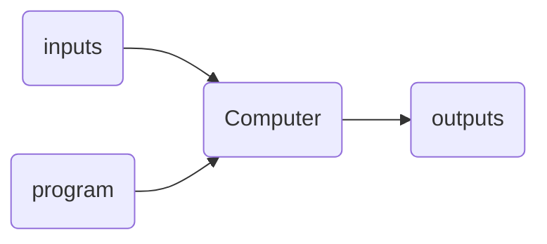
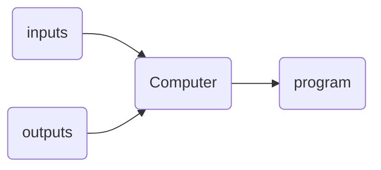
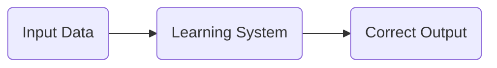
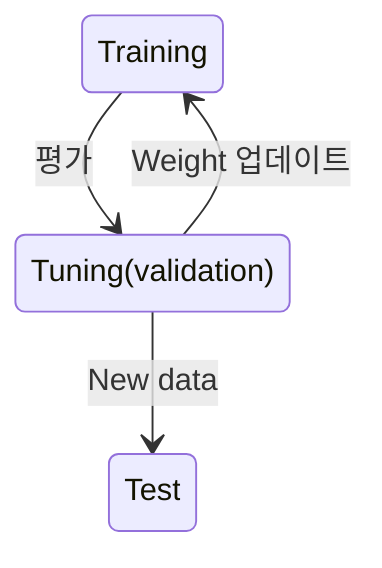
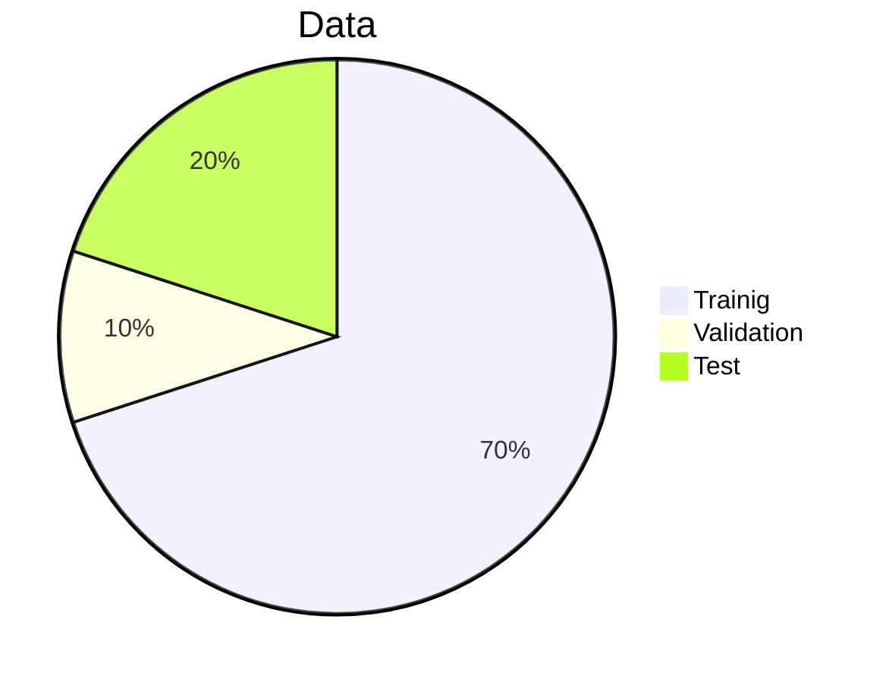
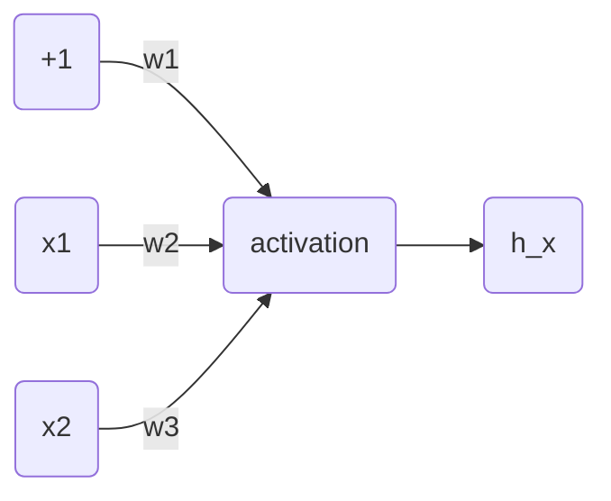

### AI, ML, DL

- Artificial Intelligence - Mimic Human Intelligence
- Machine Learing        - Data-driven Approach
- Deep Learning            - Deep Neural Networks

### History of AI 

- 1943        : Neural networks
- 1957~62 : Perceptron
- 1970~86 : Backpropagation, RBM, RNN
- 1979~98 : CNN, MNIST, LSTM, Bidirectional RNN
- 2006        : "Deep Learning", DBM
- 2009        : ImageNet + AlexNet
- 2014         : GANs
- 2016~17  : AlphaGo, AlphaZero
- 2017~19  : Transformers

### 규칙기반과 데이터기반 

- ex) 고양이 판별 
	- 규칙 (조건이 너무 많다)
		- 귀가 삼각형
		- 털이 많다
		- 꼬리가 길다
		- 다리가 4개다
		- ...

	- Machine Learning
		- 데이터 기반 
		- 알아서 학습 

일반적인 programming (Software 1.0)

기계학습 (Sofrware 2.0)

기계가 program을 직접 작성

### Machine Learning의 종류

- Supervised Learning (지도학습)
	- 입력 data와 정답을 이용한 학습 
	- 분류(classificartion), 회귀(regressing (예측)) 

- Unsupervised Learning (비지도학습)
	- 입력 data만을 이용한 학습
	- 군집화 (clustering), 압축(compression)

- Reinforcement Learning (강화학습)
	- Trial and error를 통한 학습
	- Action selection, Policy learning

### Training and Testing

##### 1. Training Stage:

##### 2. Testing Stage:

##### DATA 

- Training set, Validation set, Test set 

- (데이터 배분 예)

- <u>In any case, DO NOT USE the test set before the training is over</u>

- 자주하는 실수
	- MRI 판별 모델이라 가정할 때 
		- MRI 이미지를 전부 섞어서 같은 사람의 MRI사진이 Training, Validation, Test에 따로따로aa 들어가면 안됨
		- 한사람의 이미지는 한곳에서만 사용되야 함 
		- ex) 같은사람의 이미지는 Training에만 넣음

### Data is Important 

- 데이터는 많을수록 좋다 
- 하지만 데이터는 비싸다 

### Good Data vs Bad Data

1. Our data is unbiased?
	- 데이터가 한쪽으로 치우쳐져 있으면 안된다.
	- ex) 자율 주행 데이터로 사막데이터를 넣어놓고 러시아에서 테스트                                   - 제대로 동작 X

2. Our labels are perfect?
	- 라벨의 정답이 믿을만 한가 (사람마다 다른 라벨)
	- Human error 
	- 일관성 이슈

- 즉 좋은 데이터가 들어가야 좋은 출력이 나옴 
- garbage in garbage out

### Data-Centric AI

##### AI System = Code + Data

- 데이터의 양보다 질이 중요하다
Clean labels (Small data) $\gt$ Big data(Noisy labels) $\gt$ Small data(Noisy labels)

### Artificial Neural Network

- $\square$ 와 $\triangle$ 에 들어갈 정수는?
	- $3 \times \square + 2 \times \triangle = 1$
	- $1 \times \square + 4 \times \triangle = -3$
	- $5 \times \square + 5 \times \triangle = 0$
	- $8 \times \square + 3 \times \triangle = 5$

	- $\square = 1, \;\;\;\; \triangle = -1$

- (3, 2), (1, 4), (5, 5), (8, 3)은 input data, 1, -3, 0, 5 는 label
- $\square$와 $\triangle$를 weight라고 하며 이 weight(= Parameter, Kernel) 값을 기계가 스스로 학습을 통해 찾아내도록 하는 것이 neural network를 이용한 기계학습이 하는 일

### Neuron

###  뉴련과 사람의 학습

### Perceptron(Artificial Neural Network)

### Example of Logical AND

$h(x) = \sigma(-30 + 20x_1 + 20x_2)$

| $x_1$ | $x_2$ | $h(x)$ |
| ----- | ----- | ------ |
| 0     | 0     | 0      |
| 0     | 1     | 0      |
| 1     | 0     | 0      |
| 1     | 1     | 1       |

- 학습이란 이러한 weight 값(w1: -30, w2: 20, w3: 20)을 기계 스스로 찾을 수 있도록 해주는 과정

### Logical XNOR withr Perceptron

| $x_1$ | $x_2$ | $h(x)$ |
| ----- | ----- | ------ |
| 0     | 0     | 1      |
| 0     | 1     | 0      |
| 1     | 0     | 0      |
| 1     | 1     | 1       |
- Is it possible?

- We need more perceptrons and more layers

### Single-Layer Perceptron & Multi-Layer Perceptron(MLP)

### Deep Learning 
- Deep Neural Network을 이용한 Machine Learning 방법 
	- Deep Neural Network : Hidden layer수가 최소 2개 이상인 network

### Training Neural Networks 
- 최적의 weight를 어떻게 찾을까? : 잘 모르겠으니 일단 아무 값이나 넣고 시작하자 

- Neural Network이 얼마나 잘 하는지 or 얼마나 못하는지에 대한 <u>척도</u> 필요 
	- Loss Function / Cost Function

- 많이 쓰는 방법 중 한가지 
	- (Neural Network 의 출력과 실제 정답의 차이)$^2$
	- ex) 2가지 광고료 조합에 대해 Neural Network이 예측한 판매량 : (100, 80),            실제 판매량 : (105, 78)일 때,
	- $L = (105 - 100)^2 + (78 -  80)^2 = 29$      ($^2$ 은 양수로 만들기 위해 사용)

	- 이제 필요한 것은 Loss Function의 값이 줄도록 weight값을 조금씩 바꾸는 것
		- Weight를 어떻게 바꿔야 Loss Function 값이 줄어들까? => 미분!

### 미분 

### Gradient Descent

- Loss Function의 미분(Gradient)를 이용하여 weight를 update하는 방법
$$w_{new} = w_{old} - \eta \nabla_w L $$

- Weight update = $w_{new} - w_{old} = - \eta \nabla_w L$

$$- \eta \nabla_w L$$
- $-$      : Loss 를 감소시키는 방향 (Descent)
- $\eta$       : 보폭 (hyper parameter)
- $\nabla_w L$ : 미분값 (Gradient)

### Back Propagation

- Loss로부터 거꾸로 한 단계씩 미분 값을 구하고 이 값들을 chain rule에 의해 곱해가며 weight에 대한 gradient를 구하는 방법

										구하려 했던 미분값

### Key Components of Deep Learning

- Data
- Model
- Loss
- Algorithm

### Historical Review of Deep Learning

- 2012 - AlexNet (이미지 분류)
- 2013 - Playing Atari with Deep Reinforcement Learning
- 2014 - Encoder-Decoder Network with Attention
- 2014 - Adam Optimizer
- 2014 - Generative Adversatial Networks (GANs)
- 2015 - Residual Networks(ResNet)-진정한 deep learning의 길을 열다(사람보다 정확)
- 2016 - Alphago
- 2017 - Transformer(Attention is All You Need) - 번역 모델(매우 핫함)
- 2018 -  BERT and Fine-tuned NLP Models (Transformer based) - 비지도 학습
- 2019/2020 - GPT3
- 2019/2020 - Self - Supervised Learning (Computer Vision 에서의 비지도 학습)

