## Rate of Changes

#### - Average Rate of Change (평균 변화율)
 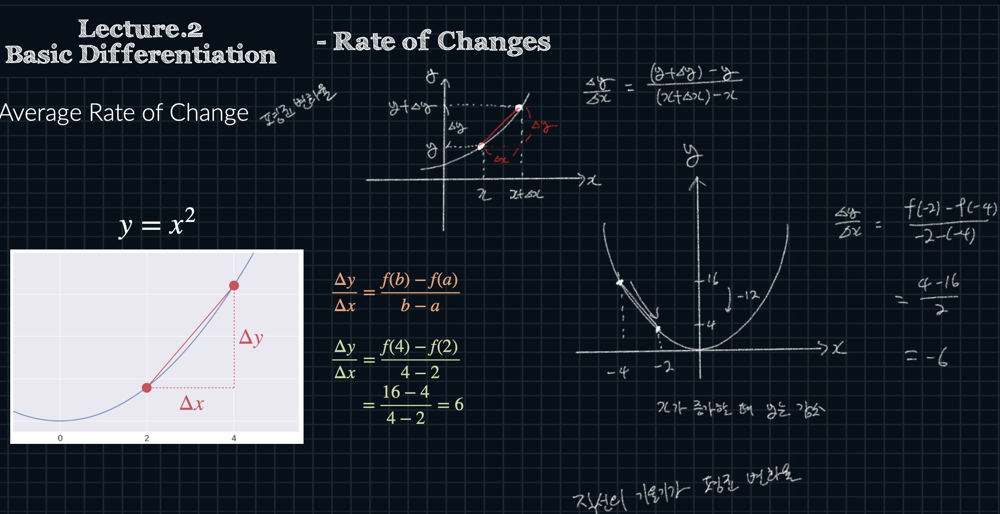
- 주어진 양 끝 점을 이은 직선의 기울기가 평균 변화율 
	- 평균 적으로 x 대비 y가 얼마나 변했는가
- $x$ 증가량 분의 $y$ 증가량 : ${(y+\Delta y) - y} \over {(x + \Delta x) - x}$ = $\Delta y \over \Delta x$  = ${f(b) - f(a)} \over b - a$

---
#### - Instantaneous Rate of Change (순간 변화율)
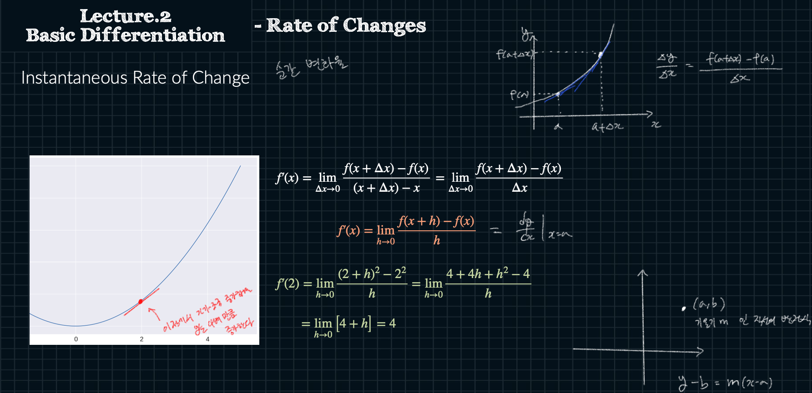
-  $\Delta y \over \Delta x$ = $f(a + \Delta x) - f(a) \over {\Delta x}$
- $f ^\prime (x) = \displaystyle \lim _{h\to0} {f(x + h) - f(x) \over h}$ = ${dy \over dx} |_{x=a}$ 
- 한 점에서의 순간적인 개념
- 특정 점에서의 함수 값이 아주 작은 변화에 어떻게 반응하는지를 나타낸다

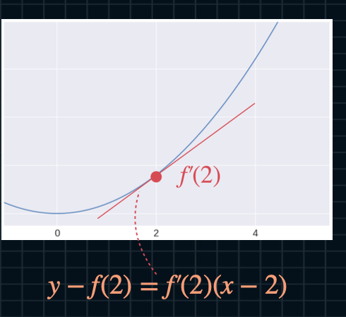

## Derivatives and Differentiation

#### - Derivatives (도함수)

- 미분 = 도함수를 구하는 과정
- 도함수 = 순간 변화율을 구해준다

## Diff. of Basic Functions

#### - Constant Functions
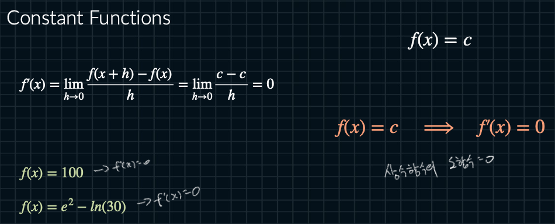
- 상수의 도함수 = 0

---
#### - Power Functions

- ### $f(x) = x^c$   --->   $f ^\prime (x) = c \cdot x^{(c-1)}$

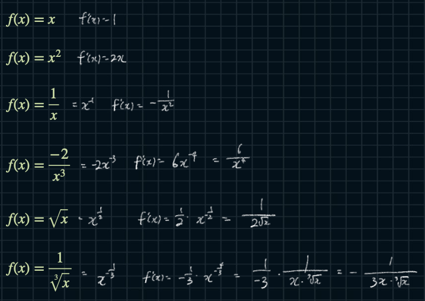

---
#### - Logarithmic Functions

- $f(x) = \log_a (x)$   ---->   $f ^ \prime (x) = {1 \over x \cdot ln(a)}$   
- $f(x) = \log _e (x) = ln(x)$

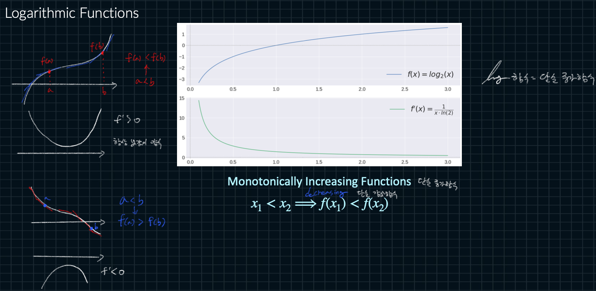
- Monotonically Increasing Functions : 단순 증가 함수 ex) log 함수
	- $x_1 < x_2 \Rightarrow f(x_1) < f(x_2)$
- Monotonically Decreasing Functions : 단순 감소 함수
	- $x_1 > x_2 \Rightarrow f(x_1) > f(x_2)$

---
#### - Inverse Function of Exponential (역함수)
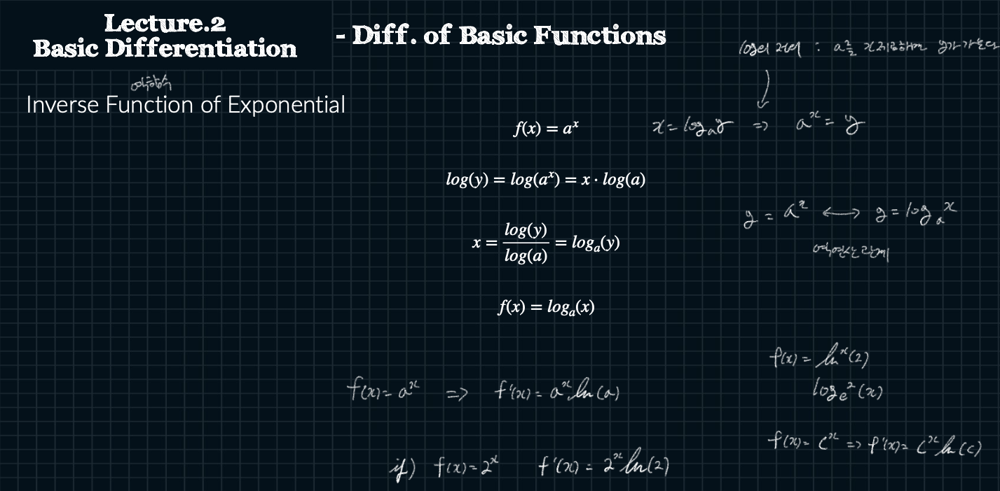
- log의 정의 : a 를 x 제곱하면 y가 된다
	- $x = \log _a y \;\;\; \Rightarrow \;\;\; a^x = y$ 
	- 서로 역 연산 관계

---
#### - Exponential Functions 

- $a > 1$          :   $ln(a) > 0$
- $0 < a < 1$  :  $ln(a) < 0$
---
- $f(x) = a^x \;\;\; \Rightarrow \;\;\; f ^\prime (x) = ln(a) \cdot a^x$

- $f(x) = ln^x (2) \;\;\; \Rightarrow \;\;\; f ^\prime (x) =  ln^x (2) ln(ln(2))$

- $f(x) = e^x \;\;\; \Rightarrow \;\;\; f ^\prime (x) = e^x lne ^e = e^x$

---
#### - Trigonometric Equalities

---
#### - Diff. of Sin Function

---
#### - Trigonometric Functions

---
#### - Piecewise-defined Functions
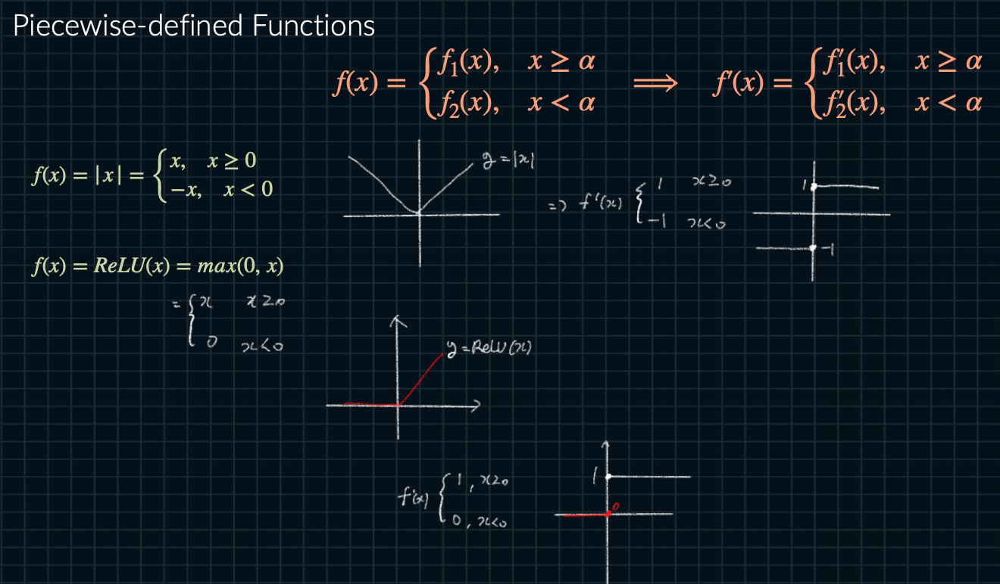

## Differentiation Rules

#### - Constant Multiple Rule
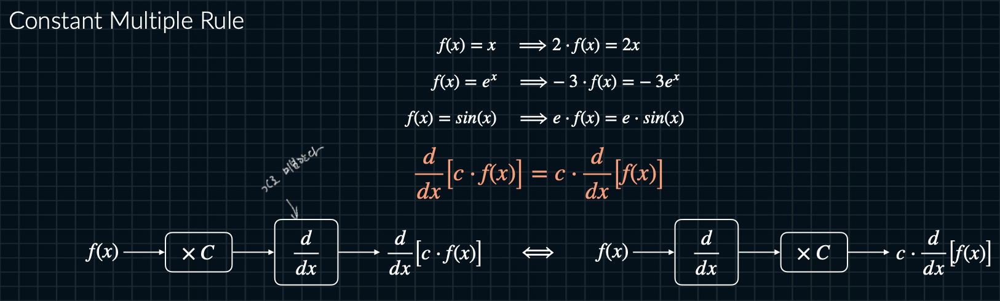

---
#### - Sum Rule

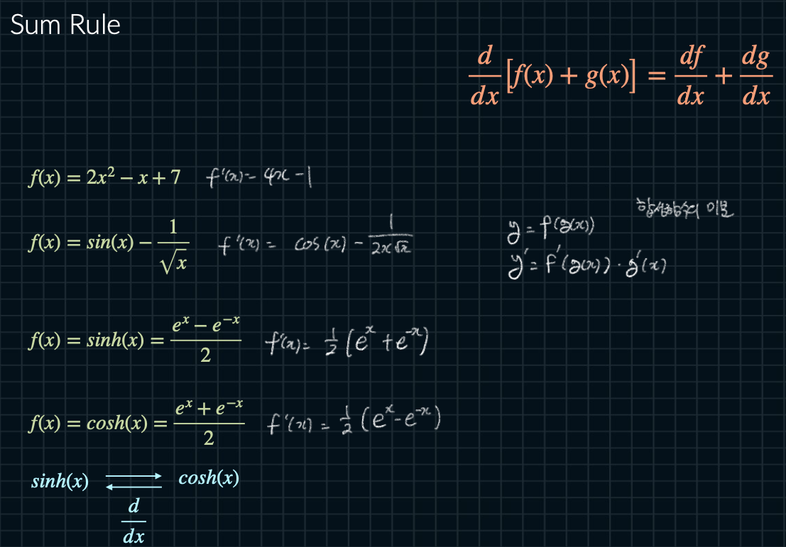

---
#### - Linearity of Diff.
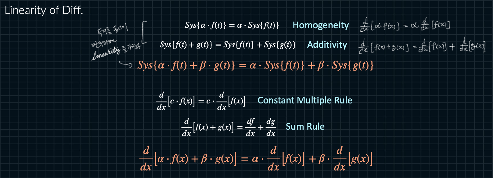
- Homogeneity + Additivity 두개를 동시에 만족하면 Linearity를 가진다 

---
#### - Time-invariance of Diff. (시간 불변성)

- 미분은 Linearity + Time-invariance 를 만족 = LTI system
- LTI(Linearity Time Invariance)

---
#### - LTI System and Diff.
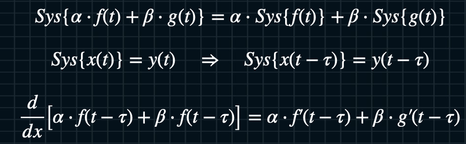

---
#### - Product Rule
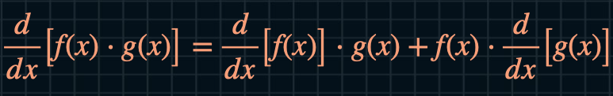
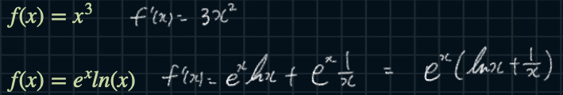
- 곱의 미분 : 미분 그냥 + 그냥 미분

- $f(x) = e^x ln(x) \;\; \Rightarrow \;\; f^\prime (x) = e^x ln(x) + e^x {1\over x} = e^x(ln(x) + {1 \over x})$

---
#### - Quotient Rule

- 분수 미분

- ${d \over dx}[{f(x) \over g(x)}] = {{{d \over dx} [f(x)] \cdot g(x) - f(x) \cdot {d \over dx} [g(x)]} \over (g(x))^2}$

## Composite Functions and Chain Rule 

#### - Composite Functions (합성함수)

---
#### - Chain Rule
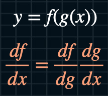

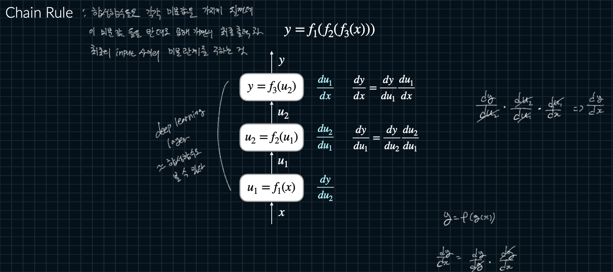
- Chain Rule : 합성함수들은 각각 미분값을 가지게 될껀데 이 미분값 들을 반대로     곱해 가면서 최종 출력과 최초의 input 사이의 미분 관계를 구하는 것

- 따라서 Deep Learning Layer 도 합성함수로 볼 수 있다

- back propagation에서는 출력 값에 대한 입력값의 미분을 입력받아 
   최종적으로 최종 출력 값(y)와 첫 입력 값(x)에 대한 미분을 알아낼 수 있다.

---
#### - Forward / Backward Calculations

---
#### - Exercise

---
#### - Modules of Backpropagation

---
#### - Merging Modules
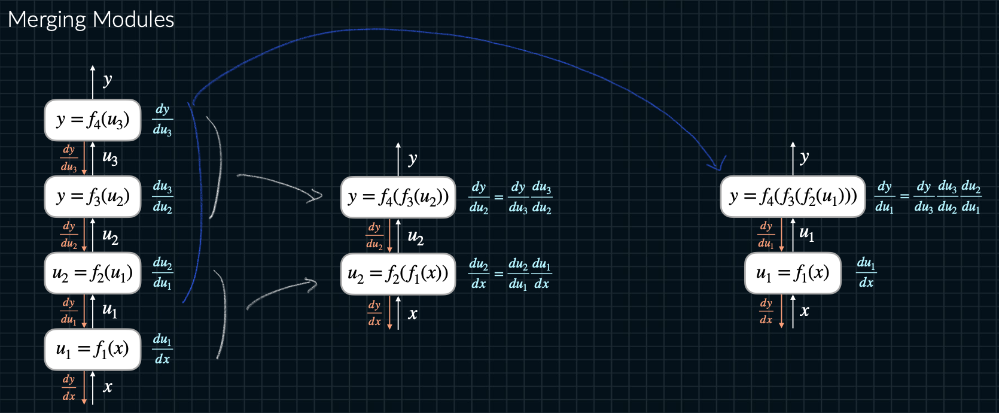

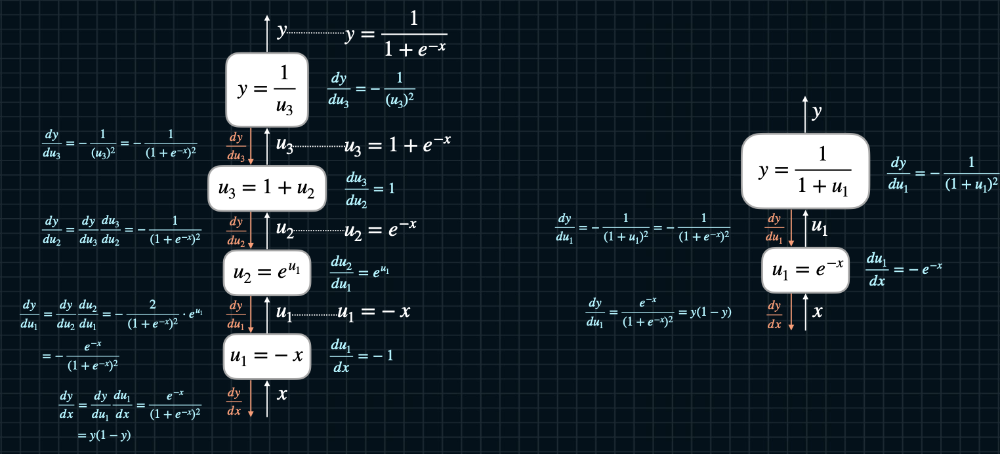

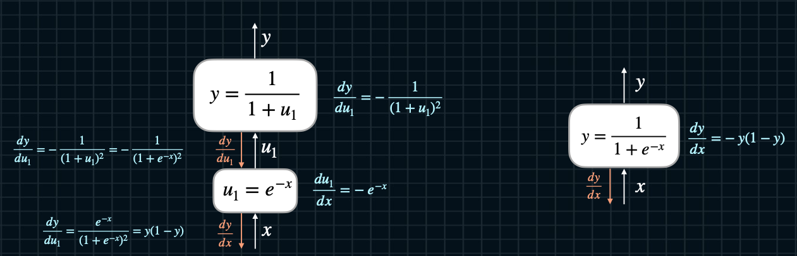

