## Multiple Input and Single Output (== Multivariate Function)

여러개 입력 -> 하나의 출력 
Affine Function이 대표적인 예

## Partial Derivatives

## Parameter Update

## General Multivariate Functions and Partial Derivatives
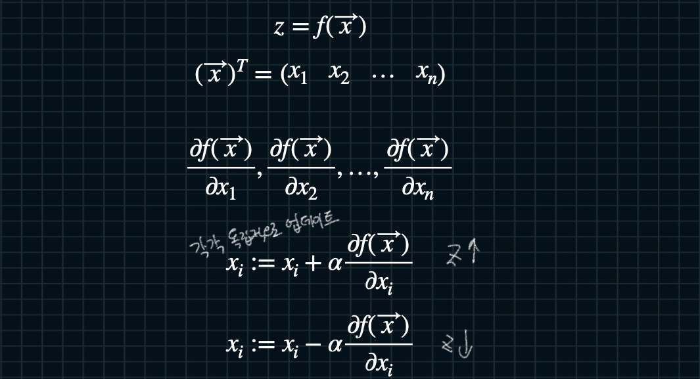

## General Multivariate Functions and Partial Derivatives Parameter Update

## Gradients 

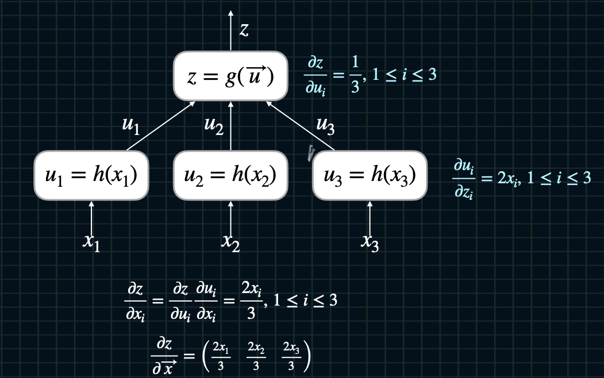

## Gradients and Jacobians

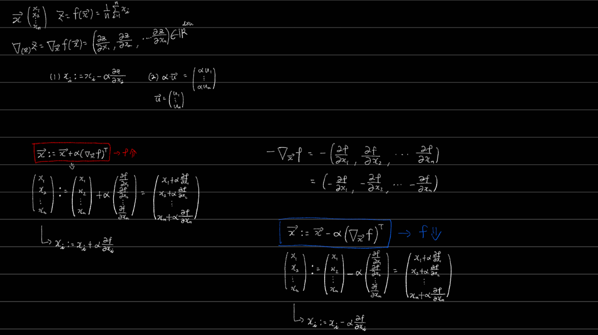

## Gradients and Parameter Update

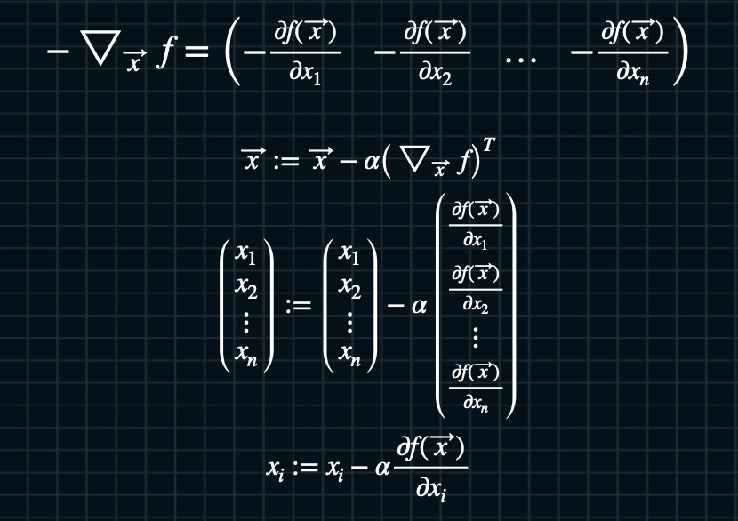

## Dot Product and Jacobians
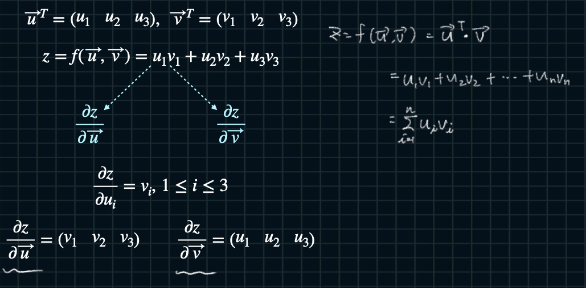
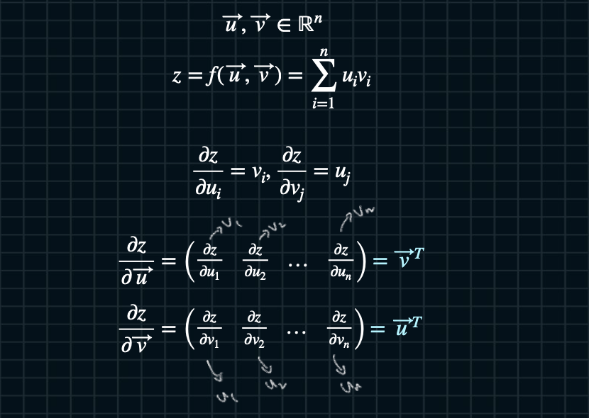

## Affine Functions and Jacobians

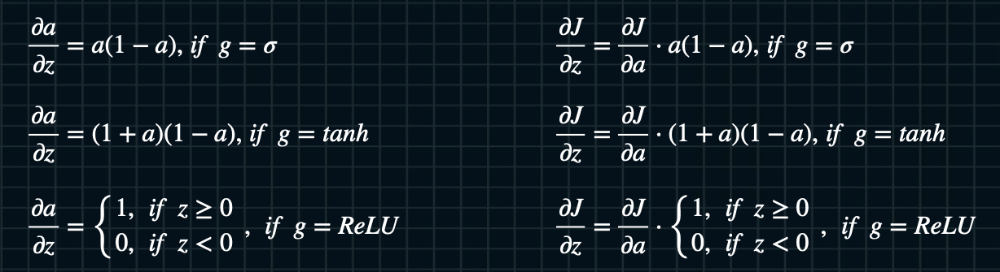

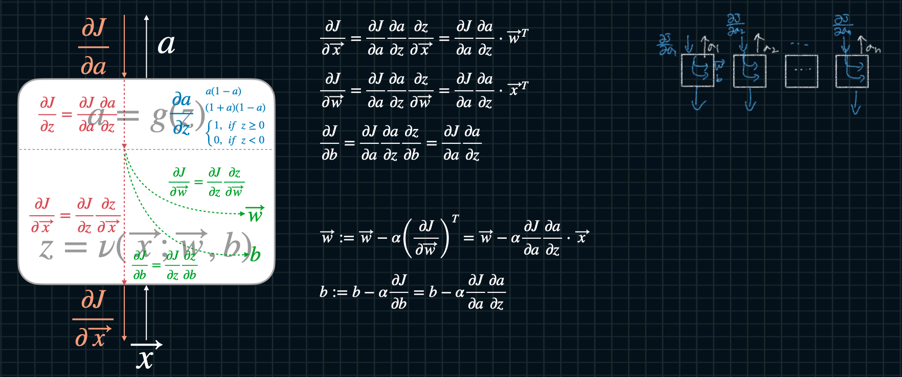

## Loss Functions and Multivariate Functions 

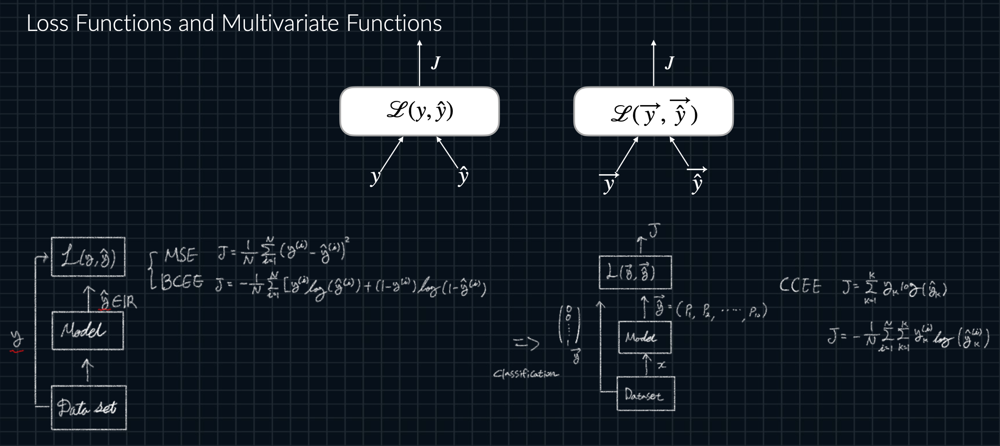

## Loss Functions and Backpropagation

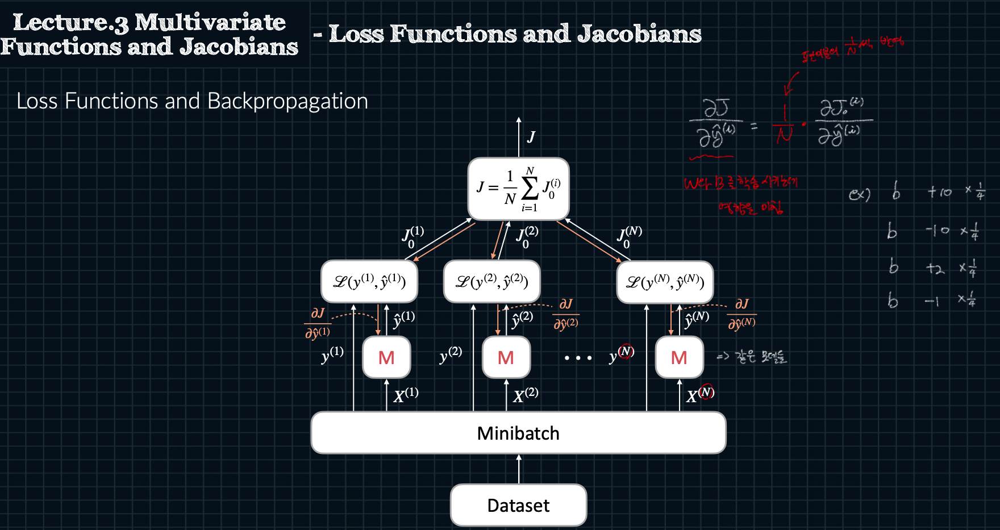

## Gradients for Mini-batch

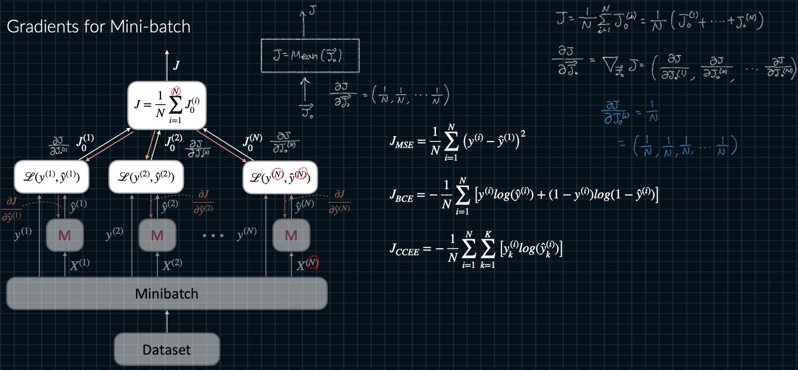

## MSE and Jacobians

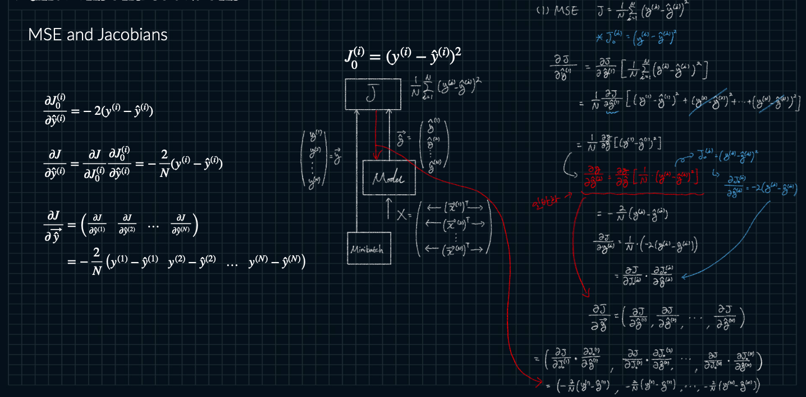

## BCEE and Jacobians 

## CCEE and Jacobians 

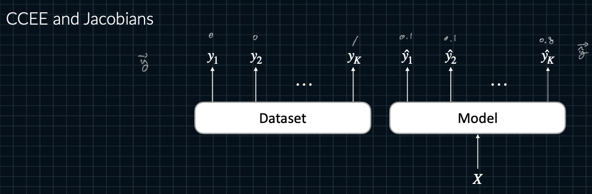

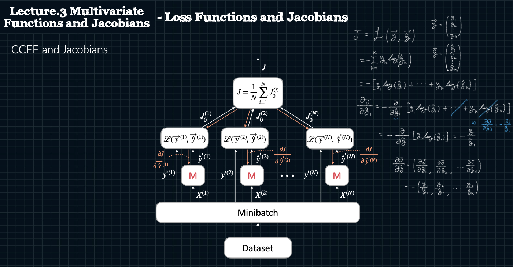

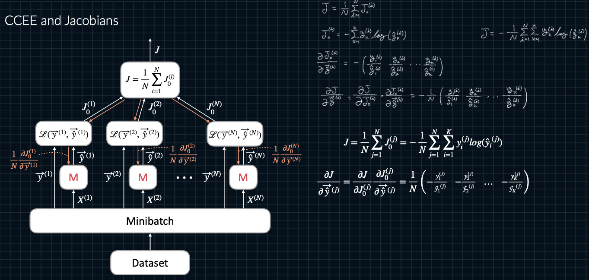

## Calculation of Softmax 

