## 삼각함수 기초

## Dots on a Circle

## Vector Functions 
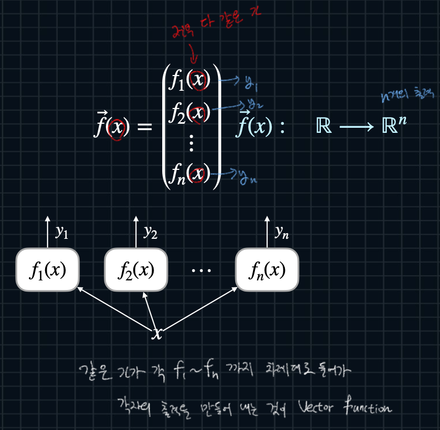

## Vector Functions with Multiple Inputs 

## General Vector Functions
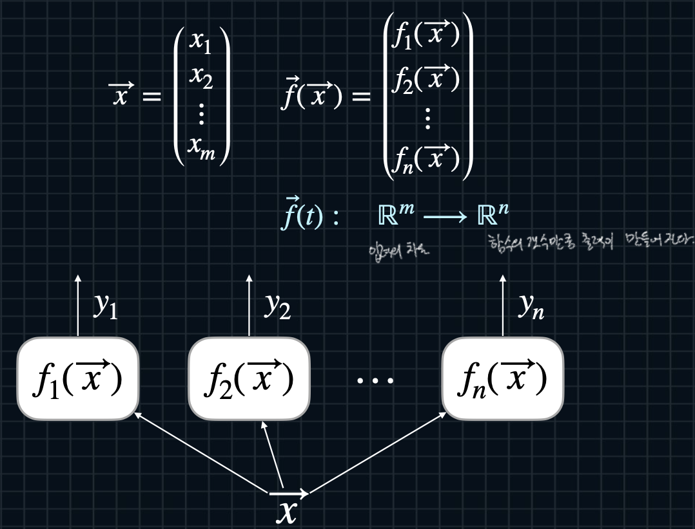

## Vector Functions and Scalar Inputs 
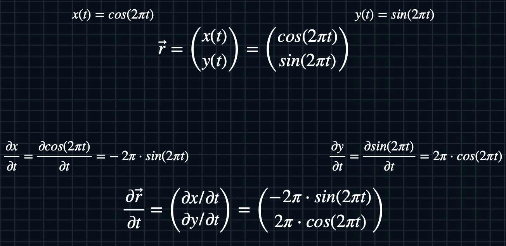
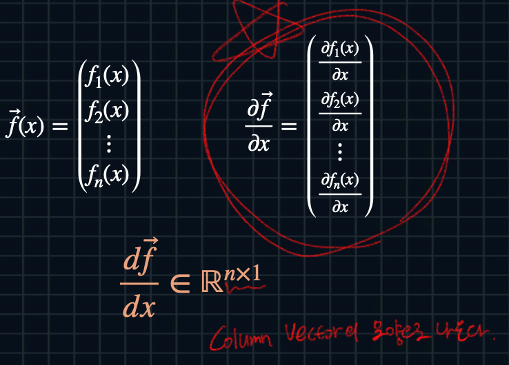

## Vector Functions and Vector Inputs

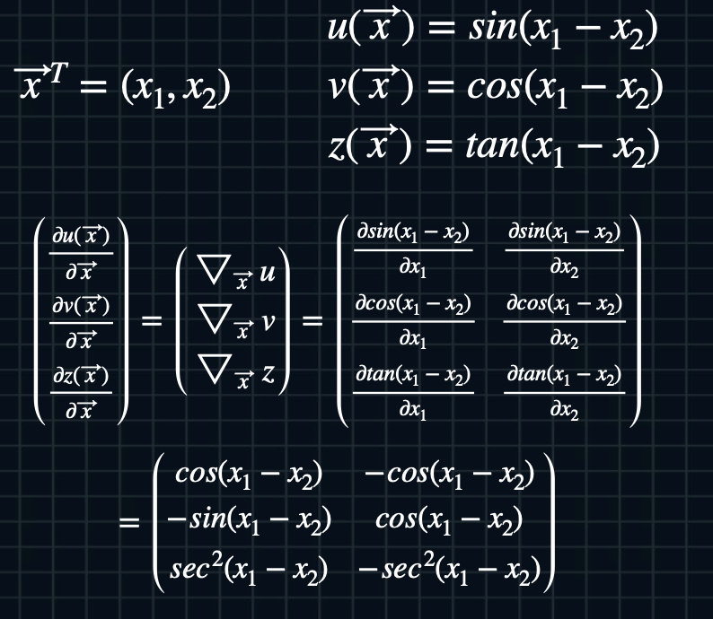
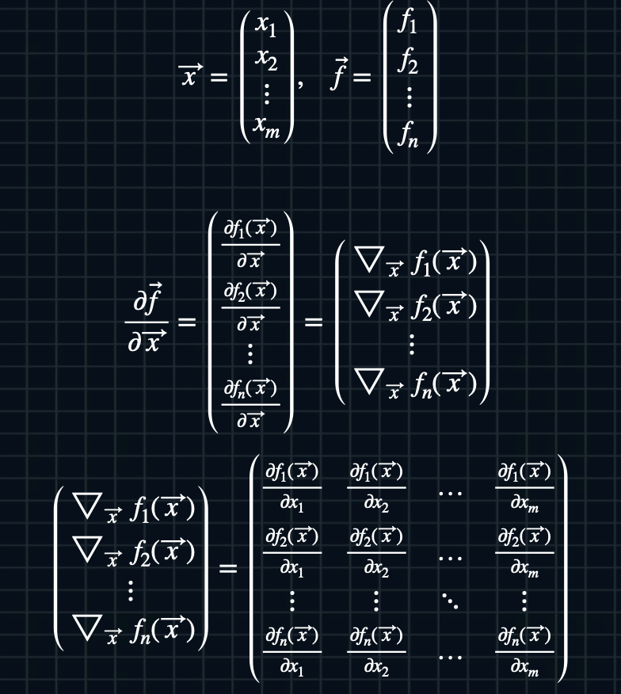

## Four Cases of Jacobians 
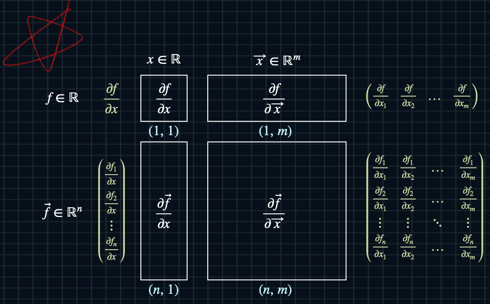

## One Sample and Neurons
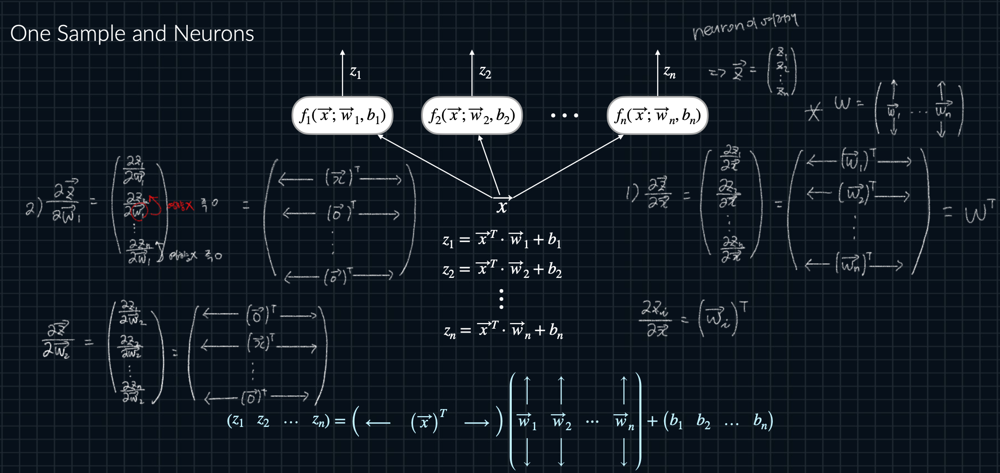
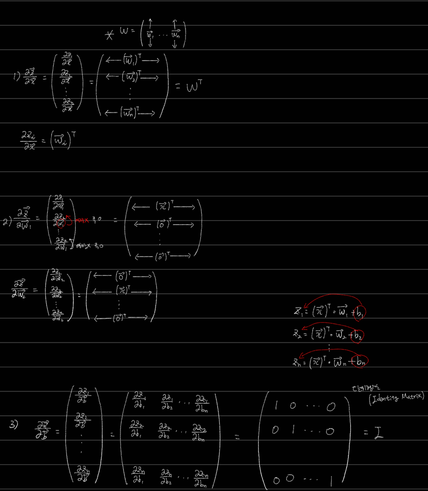

## Mini-batch and One Neurons
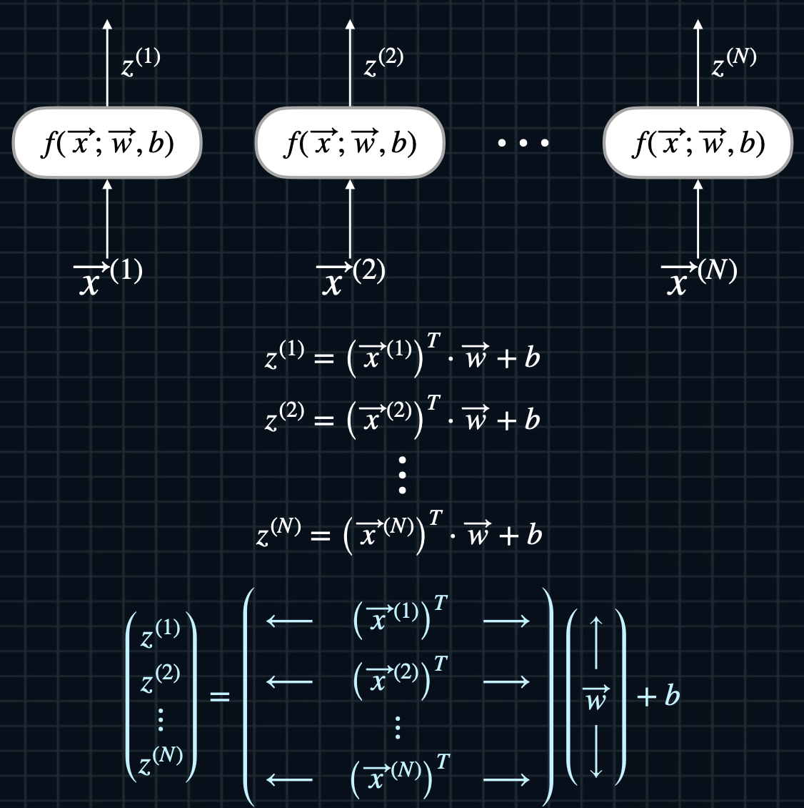

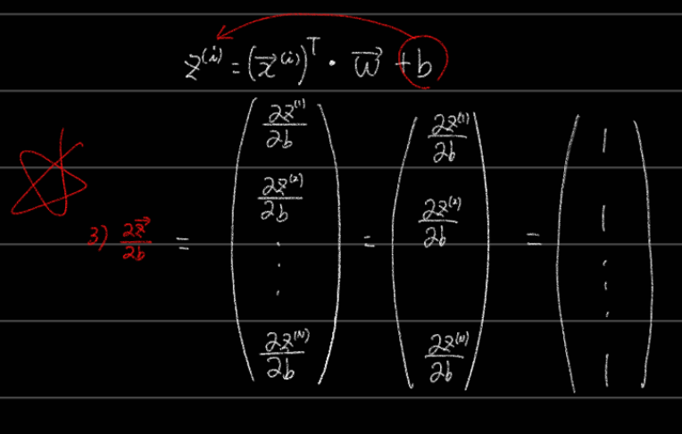
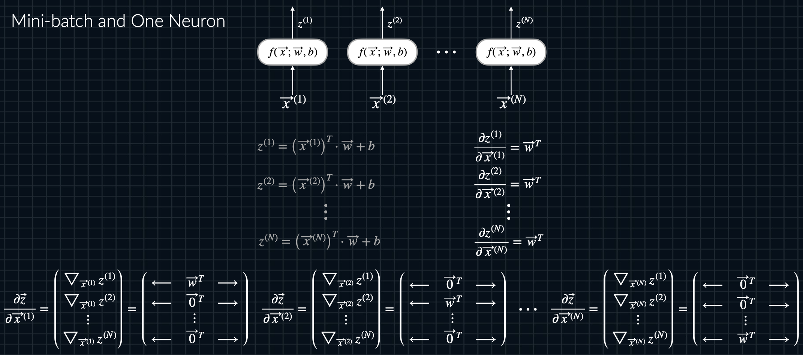

## Softmax as a Vector Function

## Gradients of Softmax
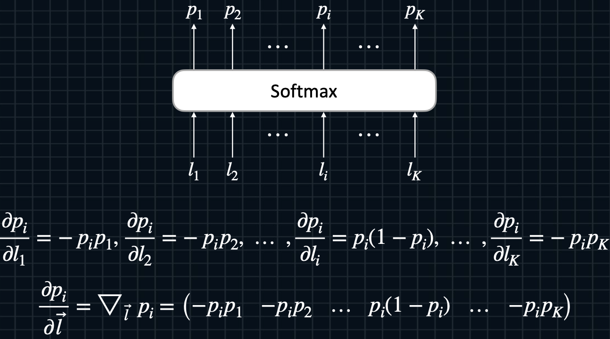

## Jacobians of Softmax 
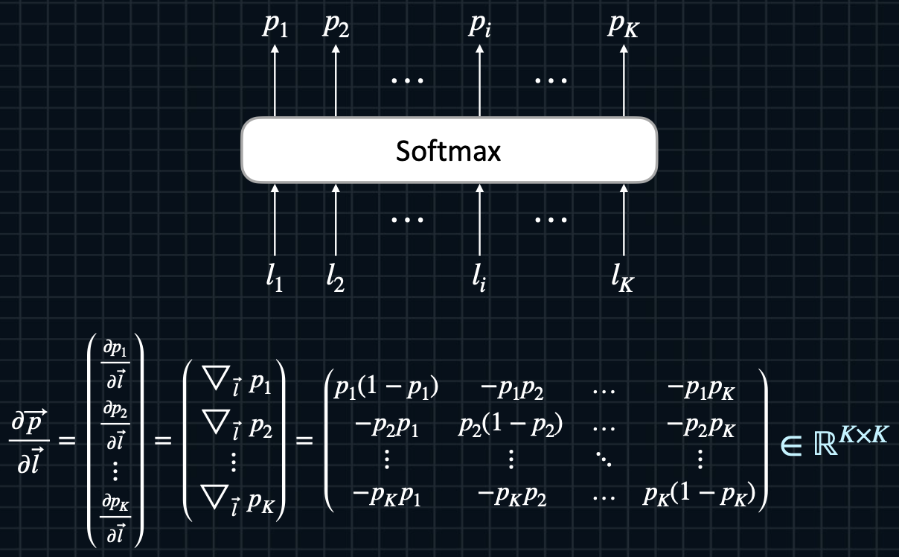

## Backpropagation of Softmax
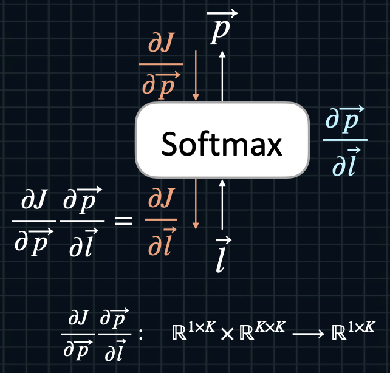

