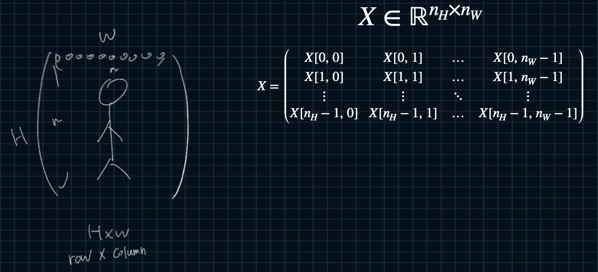
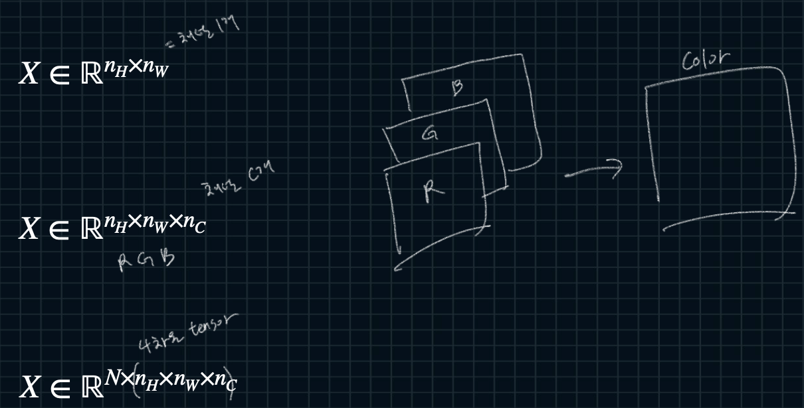
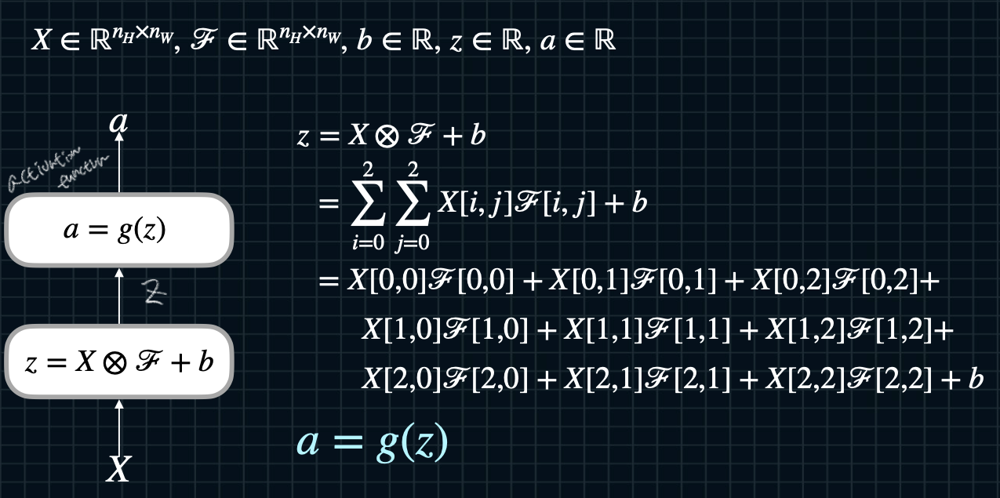
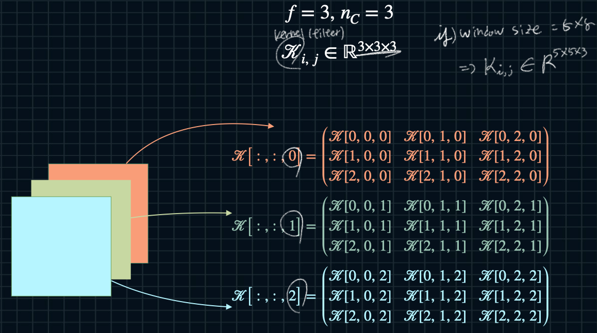
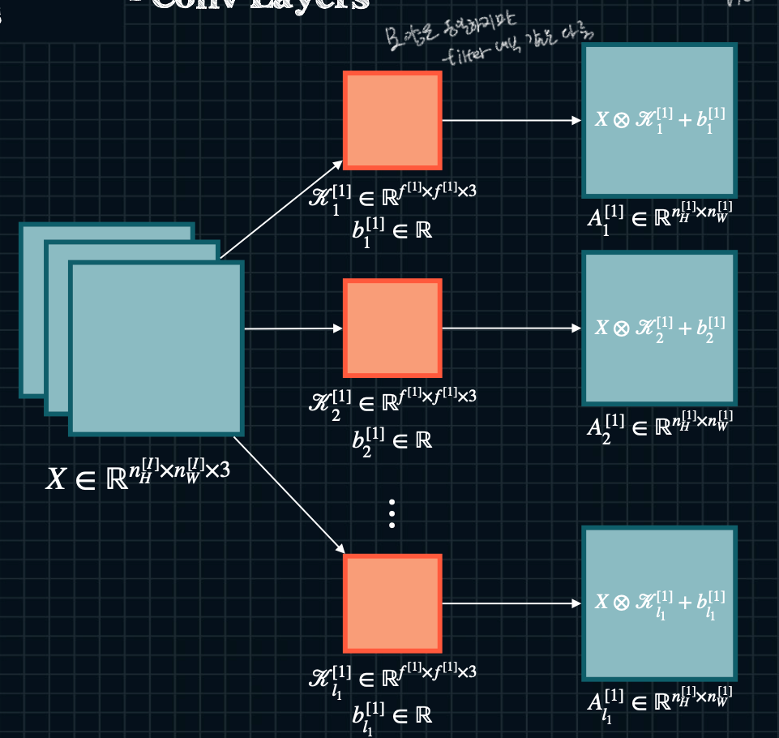
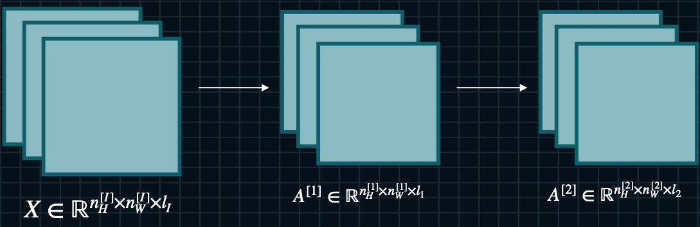

합성곱은 입력 데이터에 필터(또는 커널)를 적용하여 특징을 추출하는 과정입니다. 필터는 주로 작은 행렬로, 이 행렬을 전체 데이터에 슬라이딩하면서 각 부분과의 곱셈 결과를 합산합니다. 이를 통해 필터가 대응하는 특징(예: 특정 모양, 질감 등)이 어디에 위치하는지를 파악할 수 있게 됩니다.

출력은 "특징 맵(feature map)" 또는 "활성화 맵(activation map)"이라고 부르며, 이는 입력 데이터에 필터를 적용하여 얻은 결과를 시각화한 것입니다. 필터는 여러 개 사용될 수 있으므로, 한 층에서는 여러 개의 특징 맵이 생성될 수 있습니다.


### Image Tensors1

- input X = 1 channel 흑백 이미지
- 이미지는 픽셀단위로 연산


### Image Tensor2

- RGB 컬러 이미지는 3채널


## Correlation

### Classical Correlation
- Convolution 연산의 수학적인 의미는 신호(signal)를 **커널을 이용해 국소적으로 증폭 또는 감소**시켜서 정보를 추출 또는 필터링하는 것이다.

- CNN에서 사용하는 Convolution은 관용적 표현이고 사실 Cross-Correlation이라 부른다.  
    - Cross-Correlation은 신호처리 분야에서 한 신호가 다른 신호와 얼마나 닮았는지 정량화 하는데 사용한다고 한다.


- 커널은 정의역내에서 움직여도 변하지 않고 주어진 신호에 국소적으로 적용
    - 파란색이 신호
    - 빨간색은 신호
    - 검은색이 결과

- Correlation : 두 신호가 비슷한 정도를 뽑아내는 도구 
- Convolution : filter를 통과한 output을 계산

- 조그만 필터로 이미지를 좌우상하 convolution을 하면서 그 부분의 특징값들을 뽑아내게 됩니다.
- 입력에 가까울 수록 가장자리(edge), 곡선(curve)과 같은 저수준(low level) 특징을 학습합니다. 출력에 가까워 질 수록 질감(texture), 물체 일부분(object parts)과 같은 고수준(high level) 특징을 인식합니다.


- 1channel 흑백 사진의 경우
- 현재는 filter 와 image가 같은 사이즈
- Filter == Kernel


### Correlation with Bias

- filter는 weight 역할이라고 생각하면 편함


### Correlation with Activation

- 이미지가 filter와 correlation연산 후 bias를 더하게 되면 scalar 값 하나 출력
- 그 출력 데이터를 activation function의 입력으로 사용


### Correlation and Dot Product

- 이미지를 flatten 시키고 filter 또한 flatten 시켜  연산 


## Window Extraction

### Windows(1D)
- 달리는 자동차에서 창밖을 보는 것과 같다

- window size가 3일 때 [1 2 3] 4 5 6 7 -> 1 [2 3 4] 5 6 7 -> 1 2 [3 4 5] 6 7 로 window 이동


### Windows(2D)
- 1 channel 흑백 이미지에서의 window 이동


### Window Formularization

- window가 이미지를 이동하며 filter와 correlation연산 수행
- window size 와 filter(kernel) size는 동일


### Computation of Conv Layer1

- 1D 데이터에서 kernel이 이동하며 filter와 correlation 연산 후 output을 생성하는 과정


### Computation of Conv Layer2

- 차원은 그대로 유지
- size는 계속 작아진다


### Computation of Conv Layer3

- 1channel 3, 3 짜리 이미지 Conv2D 연산 과정
- Z 구하는 공식은 꼭 알아둘것

커널 크기가 (3, 3, 3)인 경우, 이 커널은 입력 이미지의 RGB 채널 각각에 대해 3x3 필터로 연산을 수행하고 그 결과를 모두 더하여 하나의 스칼라 값으로 출력됩니다.

커널이 RGB 이미지에 적용되는 방식은 다음과 같습니다:

1. 커널은 입력 이미지의 R, G, B 채널 각각에 대해 3x3 크기의 필터로 합성곱을 수행합니다. 이것은 곱셈 연산을 의미합니다.
    
2. 각 채널에서의 합성곱 결과는 해당 채널의 특징을 추출하는데 사용됩니다.
    
3. 이렇게 추출된 각 채널에서의 결과를 모두 더하여 하나의 스칼라 값을 생성합니다. 이 스칼라 값은 해당 커널이 입력 이미지에서 감지한 특징의 총합을 나타냅니다.
    

따라서 각 RGB 채널 간의 합성곱 결과를 더하여 최종적으로 하나의 스칼라 값이 생성되는 것이 맞습니다.


### Computation of Conv Layer4

- 1channel 이미지 Conv2D 연산 후 activation function 연산 수행 과정


### n-Channel Input 1

- 3 channel Color Image data 모습


### n-Channel Input2 

- filter size = 3 x 3 (filter도 여러개 겹쳐질 수 있지만 현재는 filter 1개 가정)
- window size = 3 x 3 x 3


### n-Channel Input3

- filter size가 3 x 3 x 3 일 때 3channel image에서의 연산


### Conv Layers1

- 3channel image와 3차원 kernel 의 correlation 연산을 수행하면 1차원 scalar값 출력


### Conv Layers2

- 3channel image가 겹쳐있는 여러 filter와 correlation연산을 수행
- 각각의 filter size = 3 x 3 x 3 이며 현재는 각기 다른 값을 가지고 있는 3개의 3차원 필터
- 3장의 1 channel 이미지 출력


### Conv Layers3

- 이미지와 filter의 channel 수는 같아야 함
- 더 많은 filter가 있을 때
- 출력 이미지 갯수는 필터의 갯수


### Conv Layers4

- 이미지가 filter를 지나고 그 출력 이미지가 다시 필터를 지나고를 반복
- 만약 filter가 10개 라면 10개의 이미지 출력


### Conv Layers5

- 필터를 거치고 난 후의 이미지만 보면 이렇게 됨
- 이미지들의 사이즈는 변하지만 차원은 변하지 않는다


### Cascaded Conv Layers

- Conv2D를 여러번 했을 경우 


### Minibatch in Conv Layers

- 여러장의 이미지가 있을 경우 이 갯수를 N개라 칭했을 때 출력 물의 갯수는 달라지지 않음


---
# 실습

# 5-1: Conv Layers

### Code. 5-1-1: Shapes of Conv Layers
``` python
import tensorflow as tf
from tensorflow.keras.layers import Conv2D

N, n_H, n_W, n_C = 1, 28, 28, 3
n_filter = 10 # filter 갯수
f_size = 3 # filter size 

images = tf.random.uniform(minval = 0, maxval = 1,
						  shape = ((N, n_H, n_W, n_C)))

conv = Conv2D(filters = n_filter, kernel_size = f_size)

y = conv(images)
W, B = conv.get_weights()

print(images.shape) 
# (1, 28, 28, 3) image 갯수, image 높이, image 넓이, image channel

print(W.shape)
# (3, 3, 3, 10) filter 높이, filter 넓이, filter 채널, filter 갯수
print(B.shape)
# (10,) bias vector (filger number)

# n_H - f + 1, n_W - f + 1
print(y.shape)
# (1, 26, 26, 10) image 갯수, image 높이, image 넓이, filter number
```
#output
(1, 28, 28, 3) 
(3, 3, 3, 10) 
(10,) 
(1, 26, 26, 10)


### Code.5-1-2: Correlation Calculation
``` python
import numpy as np
import tensorflow as tf
from tensorflow.keras.layers import Conv2D

N, n_H, n_W, n_C = 1, 5, 5, 3
n_filter = 1  # filter number
f_size = 3    # filter size

images = tf.random.uniform(minval = 0, maxval = 1,
						  shape = ((N, n_H, n_W, n_C)))

conv = Conv2D(filters = n_filter, kernel_size = f_size)

y_tf = conv(images)

# squeeze
# 이미지 갯수, 채널을 없애고 이미지 크기만을 출력
print("y(tensorflow):\n", y_tf.numpy().squeeze())
W, B = conv.get_weights()

images = images.numpy().squeeze()
W = W.squeeze()

y_man = np.zeros(shape = (n_H - f_size + 1, n_W - f_size + 1))

for i in range(n_H - f_size + 1):
	for j in range(n_W - f_size + 1):
		window = images[i:i+f_size, j:j+f_size, :]
		y_man[i,j] = np.sum(window * W) + B

print("y(manual):\n", y_man)


"""
output

y(tensorflow): 
[[-0.21994977 -1.2494121 -1.2107842 ] 
[-1.3574984 -1.0456573 -0.7627469 ] 
[-0.36140314 -0.9816696 -0.9732243 ) 

Y(manual): 
[[-0.21994974 -1.24941206 -1.21078432] 
[-1.35749829 -1.0456574 -0.76274681] 
[-0.36140314 -0.9816696 -0.97322422)
"""
```


# Code. 5-2: Conv Layer with Filters

### Code.5-2-1: Shape with Filters
``` python
import tensorflow as tf
from tensorflow.keras.layers import Conv2D

N, n_H, n_W, n_C 32, 28, 28, 3
n_filter = 5
k_size = 3   # kernel(filter) size

images = tf.random.uniform(minval = 0, maxval = 1,
						  shape = (N, n_H, n_W, n_C))

conv = Conv2D(filters = n_filter, kernel_size = k_size)

Y = conv(images)

W, B = conv.get_weights()

print("Input Image: {}".format(images.shape))
print("W/B: {}".format(W.shape, B.shape))
print("Output Image: {}".format(Y.shape))

""" 
# image갯수, 이미지 높이, 이미지 넓이, 채널 수
Input Image: (32, 28, 28, 3) 

# filter 높이, filter 넓이, filter channel, filter number
W/B: (3, 3, 3, 5) / (5,) 
			
# image갯수, 이미지 높이, 이미지 넓이, filter number
Output Image: (32, 26, 26, 5) 
"""
```


#### np.transpose
``` python
import numpy as np
										        # 0, 1, 2 번째 차원
images = np.random.randint(low = 0, high = 10, size = (2, 3, 4))

for c in range(4):
	print(images[:, :, c])
							# 2번째 차원을 0번째로
images = np.transpose(images, (2, 0, 1))
								  # 0번째 차원을 1번째로
								   # 1번째 차원을 2번째로

print('\n\n', images.shape  # (4, 2, 3)

for c in range(4):
	print(images[c, :, :])
```


### Code. 5-2-2: Computations with Filters
``` python
import numpy as np
import tensorflow as tf
from tensorflow.keras.layers import Conv2D

N, n_H, n_W, n_C = 1 ,5 ,5, 3
n_filter = 3
k_size = 4

images = tf.random.uniform(minval = 0, maxval = 1,
						  shape = (N, n_H, n_W, n_C))

# Forward Propagation(Tensorflow)
conv = Conv2D(filters = n_filter, kernel_size = k_size)
Y = conv(images)

# print(Y.numpy())
# print(Y.shape) #(1, 2, 2, 3) 3 -> R, G, B

#           R         G          B
# [[[[-0.60188156 0.9526543 -0.46114743]
#    [ 0.02425398 0.3703008 0.02022844)
#   [[ 0.00590422 0.5366116 -0.18528454]
#    [-0.33464622 0.42195326 -0.5980505 ))

# 보기 쉽게 변환
Y = np.transopose(Y.numpy().squeeze(), (2, 0, 1))
print("Y(tensorflow): \n", Y)
# [[[-0.60188156 0.02425398]     R
#   [ 0.00590422 -0.33464622)  

# [[ 0.9526543 0.3703008 ]       G
#  [ 0.5366116 0.42195326)

# [[-0.46114743 0.02022844]      B
#  [-0.18528454 -0.5980505 )]

W, B = conv.get_weights()


# Forward Propagation(Manual)
images = images.numpy().squeeze()

Y_man = np.zeros(shape = 
				(n_H - k_size + 1, n_W - k_size + 1, n_filter)

for c in range(n_filter):
	c_W = W[:, :, :, c]
	c_b = B[c]

	for h in range(n_H - k_size + 1):
		for w in range(n_W - k_size + 1):
			window = images[h:h+k_size, w:w + k_size, :]
			conv = np.sum(window * c_w) + c_b

			Y_man[h, w, c] = conv
			
print("\nY(Manual): \n", np.transpose(Y_man, (2, 0, 1)))


# Y(Manual): 
# [[[ 0.61560035 0.657022 ]       R
#	[ 0.70373631 0.8128469 ) 
				 
#  [[ 0.69731367 -0.00518593]     G
#   [ 0.2995002 0.83726323]

#  [[-1.25181627 -1.04879653]     B
#	[-1.03451526 -0.52161324)]
```


# 5-4: Models with Conv Layers

### Code.5-4-1: Models
``` python
import tensorflow as tf
from tensorflow.keras.models import Sequential
from tensorflow.keras.layers import Conv2D

n_neurons = [10, 20, 30]

model = Sequential()
model.add(Conv2D(filters = n_neurons[0], 
				 kernel_size = 3, 
				 activation = 'relu'))
				 
model.add(Conv2D(filters=n_neurons[1],
				kernel_size = 3,
				activation = 'relu'))

mddel.add(Conv2D(filters = n_neurons[2],
				kernel_size = 3,
				activation = 'relu'))

x = tf.random.normal(shape = (32, 28, 28, 3))
predictions = model(x)

print("Input: {}".format(x.shape))
print("Output: {}".format(predictions.shape))

for layer in model.layers:
	W, B = layer.get_weights()
	print("Weights: {}, Biases: {}".format(W.shape, B.shape))

print("============================")
trainable_variables = model.trainable_variables

for train_var in trainable_variables:
	print("Shape: {}".format(train_var.shape))


""" 
Input: (32, 28, 28, 3) 
Output: (32, 22, 22, 30) 
Weights: (3, 3, 3, 10), Biases: (10,) 
Weights: (3, 3, 10, 20), Biases: (20,) 
Weights: (3, 3, 20, 30), Biases: (30,) ============================ 
Shape: (3, 3, 3, 10) 
Shape: (10,) 
Shape: (3, 3, 10, 20) 
Shape: (20,) 
Shape: (3, 3, 20, 30) 
Shape: (30,)
"""
```


### Code.5-4-2: Models with Model sub-classing
``` python
import tensorflow as tf
from tensorflow.keras.models import Model
from tensorflow.keras.layers import Conv2D

n_neurons = [10, 20, 30]

class TestModel(Model):
	def __init__(self):
		super(TestModel, self).__init__()
		global n_neurons

		self.conv_layers = []
		for n_neuron in n_neurons:
			self.conv_layers.append(Conv2D(filters = n_neuron,
									kernel_size = 3,
									activation = 'relu'))
	
	def __call__(self, x):
		print("Input ", x.shape)

		print("\n===== Conv Layers =====\n")

		for conv_layer in self.conv_layers:
			x = conv_layer(x)
			W, B = conv_layer.get_weights()
			print("W/B: {}/{}".format(W.shape, B.shape))
			print("X: {}\n".format(x.shape))
			
		return x

model = TestModel()
x = tf.random.normal(shape = (32, 28, 28, 3))
predictions = model(x)

print("Input: {}".format(x.shape))
print("Output: {}".format(predictions.shape))

for layer in model.layers:
	W, B = layer.get_weights()
	print("Weights: {}, Biases: {}".format(W.shape, B.shape))

print("========================")
trainable_variables = mode.trainable_variables
for train_var in trainable_variables:
	print("Shape: {}".format(train_var.shape))
```


``` python
import tensorflow as tf
from tensorflow.keras.models import Model
from tensorflow.keras.layers import Conv2D

n_neurons = [10, 20, 30]

class TestModel(Model):
	def __init__(self):
		super(TestModel, self).__init__()
		global n_neurons

		self.conv1 = Conv2D(filters = n_neurons[0], 
							kernel_size = 3,
							activation = 'relu')
							
		self.conv2 = Conv2D(filters = n_neurons[1],
							kernel_size = 3,
							activation = 'relu')

		self.conv3 = Conv2D(filters = n_neurons[2],
							kernel_size = 3,
							activation = 'relu')

	def __call__(self, x):
		x = self.conv1(x)
		x = self.conv2(x)
		x = self.conv3(x)

		return x
```


