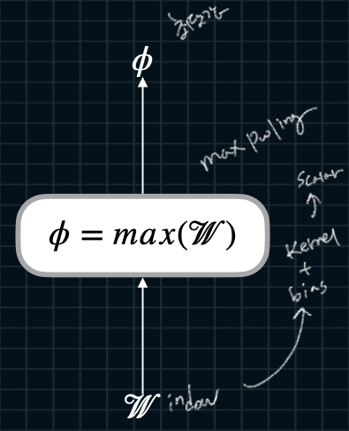

풀링은 합성곱으로 얻은 특징 맵의 크기를 줄이는(다운샘플링하는) 과정입니다. 풀링은 주로 최대 풀링(max pooling)과 평균 풀링(average pooling)이 사용됩니다. 최대 풀링은 특정 영역에서 가장 큰 값을 선택하고, 평균 풀링은 특정 영역의 평균값을 선택합니다.

풀링을 통해 얻는 주요 이점은 다음과 같습니다:

- 연산량 감소: 다운샘플링을 통해 데이터의 크기를 줄이므로, 이후 연산량이 감소합니다.
- 과적합 방지: 풀링을 통해 모델의 복잡도를 줄여 과적합을 방지할 수 있습니다.
- 공간적 인변성 확보: 소량의 위치 변화가 특징을 추출하는 데 큰 영향을 미치지 않도록 합니다.

출력은 "풀링 맵(pooling map)"이라고 부르며, 이는 특징 맵의 크기를 줄인 것입니다. 이 맵은 이전 층의 특징 맵보다 크기가 작지만, 중요한 정보는 보존되어 있습니다.


### Max Pooling



---
### Average Pooling


---

### Padding


---

### Stride


---
### I/O Shapes


---
# 실습


# 6-1 : Max/Avg Pooling

### Code.6-1-1 : Max Pooling
``` python

```

