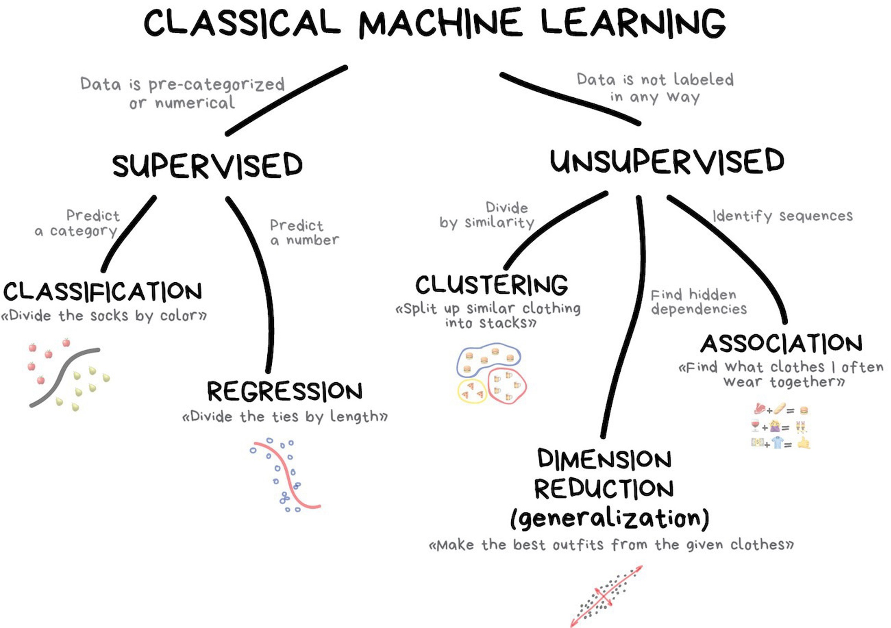
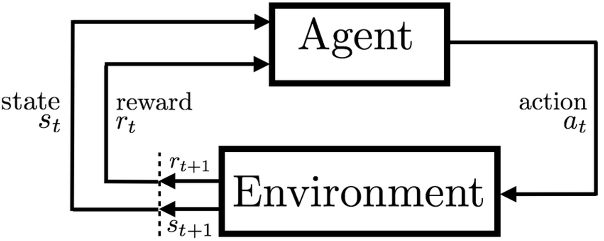
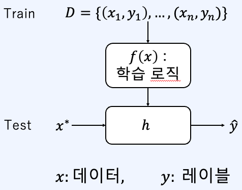

### 인공지능 (Artificial Intelligence): Engineering of Intelligent Machines or Programs.
- 지식 기반(Knowledge - based)
- 룰 기반 (Rule-based)

### 기계 학습(Machine Learning): Ability to Learn without being explicitly programmed - 1959, Arthur Samuel.
- 데이터의 "feature" 사이 "패턴(Pattern)"이나 "상관관계(correlation)"을 뽑아 냄.

### 표현 학습(Representation Learning)
- "Feature" 대신 "representation"을 학습함.

### 깊은 학습(Deep Learning): Learning based on DNN(표현 학습의 일종)
- 복합한 표현(Representation)이 단순한 표현(Presentation)으로 변환하여 문제를 품.
- Deep Neural Network(DNN, 깊은 심층망)의 2층 이상의 신경망으로 표현됨 .

---
# 기계 학습(ML)이란?

- 기계가 일일이 코드로 명시하지 않은 동작을 데이터로부터 학습할 수 있게 하는 방법 

# 기계 학습의 종류 

### 지도 학습(Supervised learning)
- 바람직한 결과(label)을 줌으로써 학습하는 방법 
- 레이블(label) O
- 직접적인 피드백 O
- 아웃풋과 피쳐를 예측
- Classification / Regression

### 비지도 학습(Unsupervised learning)
- 정답 정보(label) 없이 학습하는 방법 
- 레이블 X
- 피드백 X
- 데이터에서 숨겨진 구조 찾기 
- Clustering / Anomaly detection / Association / Dimension reduction

***그렇지만, 경계는 사실 엄밀하게 구분되어 있지 않다!***

### 준지도 학습(Semi-supervised learning)
- 레이블된 데이터와 레이블 되지 않은 데이터 모두 상요되는 학습
- 일반적으로, 다수의 레이블되지 않은 데이터와 레이블 된 골드 레이블(gold label)데이터로 구성

### 자기 지도 학습(Self-supervised learning)
- 다량의 레이블이 없는 원데이터로부터 데이터 부분들의 관계를 통해 레이블을 자동으로 생성하여 지도 학습에 이용
- Pretext task를 설정(i.e. 데이터의 일부분을 은닉하여 모델이 그 부분을 예측하도록 학습)하여 이를 학습한 후, downstream task로 전이 학습(transfer learning)하여 다른 테스크에 적용 
	- Pretext task: 데이터 내의 semantic한 정보를 이해할 수 있도록 새로 정의한 임의의 문제 

### 강화 학습(Reinforcement learning)
- 학습하는 시스템인 에이전트(Agent)는 환경(Environment)을 관찰해서 나온 상태(State)가 주어졌을 때, 정책(Policy)에 기반하여 행동(Action)을 실행하고 보상(Reward)을 받는다. 
- 가장 큰 누적 보상을 얻을 수 있는 최적화된 정책을 스스로 학습한다. 

---
### Classification (분류)
- 이산적(discrete)으로 구성된 레이블을 각각의 학습 데이터로부터 학습시키는 경우

### Regression (회귀)
- 연속적인 레이블을 각각의 학습 데이터로부터 학습시키는 경우 
ex) 주식 예측, 부동산 예측, 생체 신호, ...

