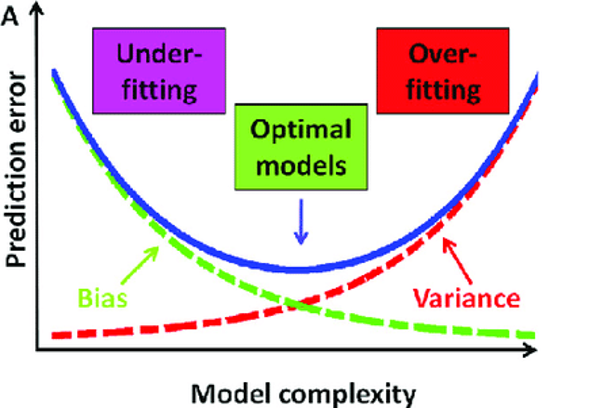

# 편향 분산 트레이드 오프(bias variance trade-off)

- ### 점 추정 (Point estimator)
	- 표본으로부터 모수의 값에 가까우리라 예상되는 하나의 값을 제시하는 어떤 함수 
	- i.e. 평균 

- ### 함수 추정 (function estimator)
	- 인풋과 아웃풋(x, y)의 관계에 대해 추정하는 것이라면? -> 함수 추정
	
	만약 $x$, $y$ 를 정확히 투영하는 함수 $f$ 가 있다면, 아래와 같을 것이고 ,$$y = f(x) + \epsilon$$이때, $\epsilon$ 는 $x$로 부터 추론 불가한 에러이다.

- ### 추정 값의 편향 (bias)
	- 모델의 예측 값들의 평균과 이상적인 모델의 예측값 (혹은 실제 값의 평균)과의 차이.
	- $h(x)$를 모델, $f(x)$ 를 실제 이상적인 예측 함수라고 하면, 
$$Bias[h(x)] = E[h(x)] - f(x)$$

- ### 추정 값의 분산 (variance)
	- 모델의 예측값과 모델의 예측 값들의 평균 사이의 차이. (표준편차의 제곱)
$$Var[h(x)] = E[(h(x)] - E[h(x)])^2]$$ 

- ### 노이즈 (noise)
	- 실제 값과 이상적인 모델간의 차이 (줄일 수 없는 에러)
$$Noise [h(x)] = E[(y - f(x))^2] = E[\epsilon ^2] = \sigma ^2$$

- ### 모델의 에러(error)란? 실제 값 y와  모델의 예측 값 h(x)의 차이!

- ### Bias-variance trade-off
$$E[(y-h(x))^2] = E[(h(x) - E[h(x)])^2] + (E[h(x)] - f(x))^2 + E[(y-f(x))^2]$$
- $E[(h(x) - E[h(x)])^2]$   : Variance
- $(E[h(x)] - f(x))^2$        : Bias$^2$ 
- $E[(y-f(x))^2]$              : Noise

