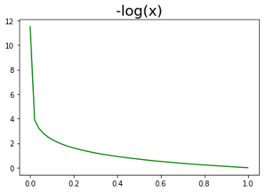
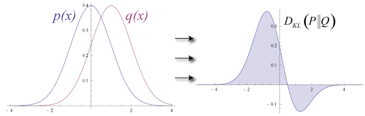
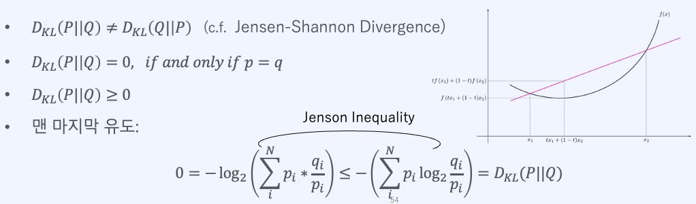
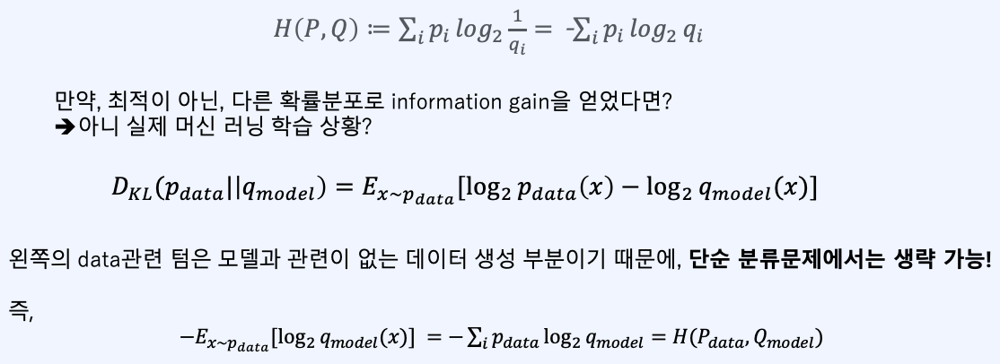

# 1. 정보이론 (엔트로피, KL 발산, 크로스 엔트로피)

- ### 정보(information)는?
	- 특정한 관찰에 의해 얼마만큼의 정보를 획득했는지 수치로 정량화한 값으로, 사건 A가 발생할 확률을 P(x)라 할 때, 정보량은 아래와 같다 

				$h(X) := -\log(P(X))$ (정보가 자주 일어나면 작아진다.)

- ### 엔트로피(Entropy) 
	- 이산 확률 변수의 평균 정보량을 의미 (클수록 정보량이 많다)

- ### 쿨백-라이블러 발산(KL-Divergence; KLD)
	- 두 확률 분포의 다른 정도를 나타내는 척도 
	- Relative entropy 라고도 한다

#### KL-Divergence의 성질

- ### 크로스 엔트로피(cross-entropy)

- Classification문제에서는 cross entropy loss를 많이 사용

---
# 2. Cross Entropy와 Maximum Likelihood Estimation

- ### 로지스틱 회귀로 이항 분류(binary classification)
	- Linear Regression: f(x) = $\theta_{1} x + \theta_{0}$
	- Logisitic Regression: f(x) = $1 \over 1 + e^{-x}$
		- Sigmoid 함수, logistic함수라고도 불린다.

- ### Sigmoid 함수
	- 연속 함수이며 대칭 함수(Symmetric)이다.
	- 미분이 매우 쉬워, gradient descent에 적합하다

