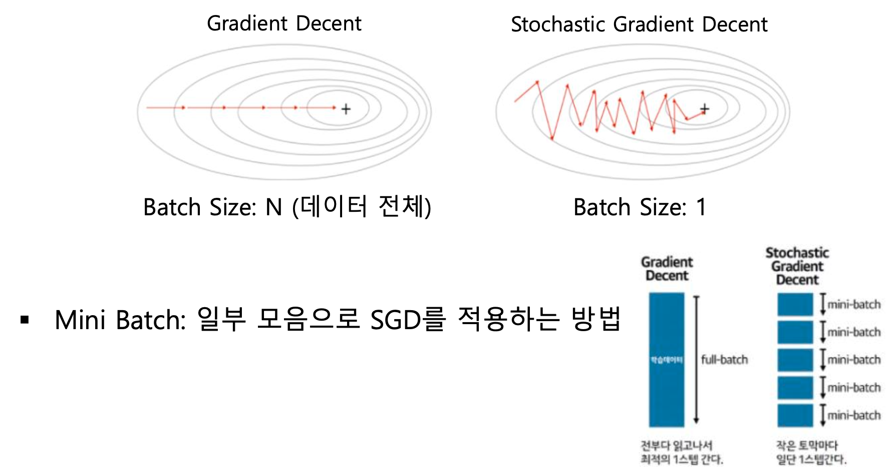
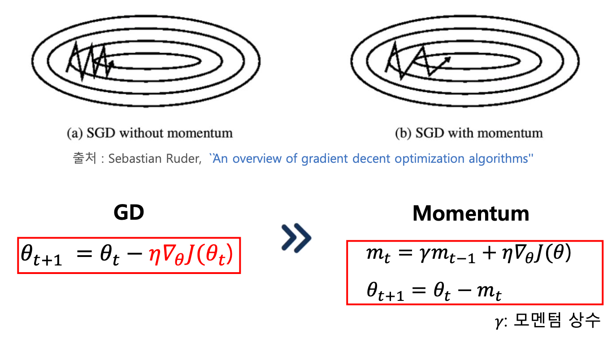
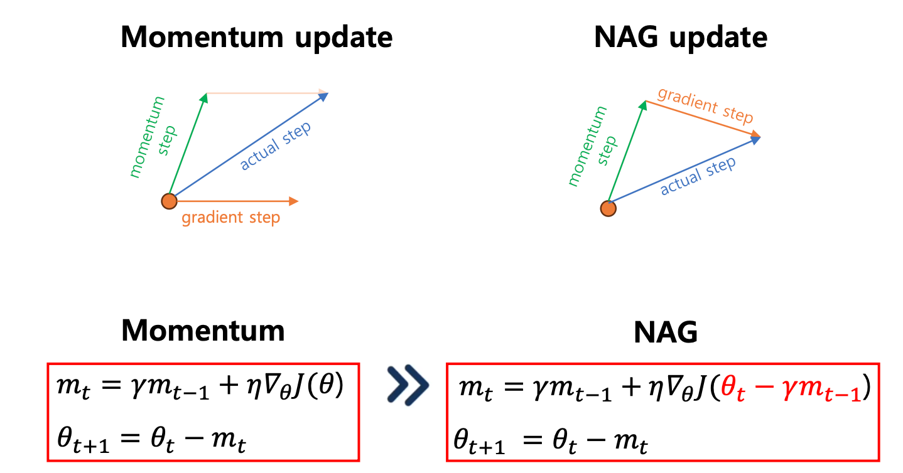
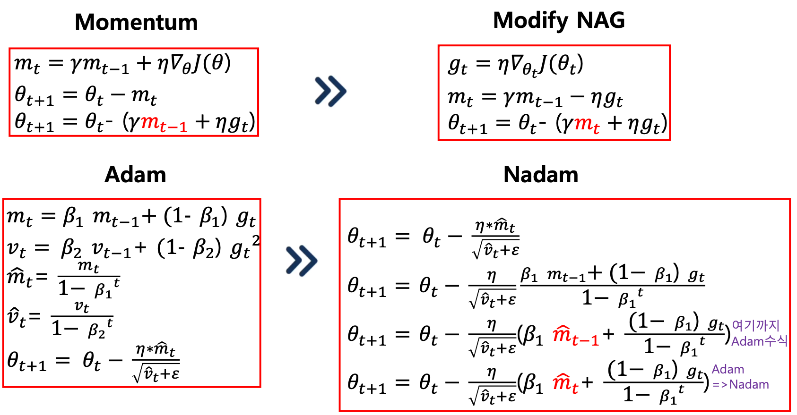

## Optimizer
- 비용함수를 최소화 시키는 최적의 모델 파라미터를 찾아주는 알고리즘 

## 다양한 Optimizer 
- 최적의 모델 파라미터로 가는 경로는 다양하기 때문에 Optimizer도 여러 알고리즘으로 개발 

---
## Gradient Decent Method - 경사하강법
- 최솟값에서 접선의 기울기에 해당하는 미분 계수는 0
	- ***여러번의 반복(iteration)을 통해 미분 계수가 0이 되는 지점을 찾는다.***

- 미분 계수 (Gradient)는 언제나 현재 위치에서 함수값이 커지는 방향을 가리키므로, ***미분 계수의 반대 방향으로 이동*** 하면 최솟값을 찾을 수 있음 
	- 즉 Gradient에  마이너스(-)를 취해 더한다.

## Stochastic Gradient Descent (SGD) - 확률적 경사하강법
#### - Batch: 경사 하강법에서 기울기를 계산하는데 사용하는 데이터의 갯수

#### - 확률적 경사하강법(Stochastic Gradient Descent, SGD)

## GD 와 SGD비교 

- #### Gradient Decent Method
	- 데이터 셋이 큰 경우 연산량이 매우 많음 
		- 수렴에 굉장히 많은 시간이 소요 

$$\theta_{t+1} = \theta_t - \eta \nabla_\theta J (\theta_t)$$

$\theta$ : parameter set of model (W, B)
$\nabla$ : Learning rate ($\alpha$)
$J(\theta)$ : Loss function

= $\vec{W} := \vec{W} - \alpha(\frac{\partial J_0}{\partial \vec{W}})$  = $\vec{W} := \vec{W} - \alpha(\frac{\partial J_0}{\partial a} \cdot \frac{\partial a}{\partial z} \frac{\partial z}{\partial \vec{W}})$

- #### (Stochastic Gradient Descent, SGD)
	- 모든 데이터가 아닌 ***일부 샘플 데이터만 사용*** 하여 경사하강법에 비해 연산시간이 빠름 
	- Local Minima에 취약

$$\theta_{t+1} = \theta_t + \eta \nabla_\theta J (\theta_t \;; \; x^{(i)} \; ; y^{()i})$$
$x$ : training data
$y$ : label
$i$ : index 

---
##  Momentum
- Momentum은 최적의 방향으로 ***SGD가 가속*** 하도록 도와주는 알고리즘 
- $\gamma \, m_{t-1}$ 항이 내리막에선 가속하고, 방향이 바뀔 때 파라미터 ***갱신량 감소***
- Local Minima는 잘 빠져나오지만 수렴이 어려움 

모멘텀 상수($\gamma$) : 0 < $\gamma$ < 1

## NAG(Nesterov Accelerated Gradient Descent)

- NAG는 ***멈춰야 할 시기에 더 나아가지 않고 제동*** 을 거는 방법
- Momentum 방식을 베이스로 현재 미분계수(gradient)가 아닌, momentum step 이후의 gradient를 통해 업데이트
- Momentum에 비해 빠르게 수렴 

- #####  Momentum : 내리막에서 가속 따라서 수렴 어려움
- ##### NAG : $(\theta_t - \gamma \, m_{t-1})$ break 추가

---
## RMSProp (Root Mean Square Propagation)

- Adagrad 에서 문제점을 개선하기 위해 $g_t$ 계산식에 ***지수 이동 평균을 적용*** 함 
	- 지수 이동 평균이란?
		- 최근 데이터에 가중치를 더 높게 주어 과거와 현재 데이터의 가중치를 ***지수적으로 감소시키며 평균을 계산*** 하는 방법
- Gradient 제곱의 지수 이동 평균을 기대 값이라 표현함 

---
## Adam (Adaptive Momentum Estimation)

- RMSProp + Momentum
- $\displaystyle \hat{m}_t$ 는 momentum 역할, $\hat{v}_t$ 는 파라미터에 서로 다른 lr를 적용하는 역할
- 대부분의 상황에서 준수한 성능을 보이기 떄문에 가장 많이 사용되는 Optimizer
- Adam의 저자는 $\beta_1$ = 0.9  $\beta_2$ = 0.999로 제안  (상황에 이 값들도 바꿔가며 학습 시켜야 함)

---
## Nadam (Nesterov Accelerated Adaptive Moment Estimation)

- RMSProp + NAG

